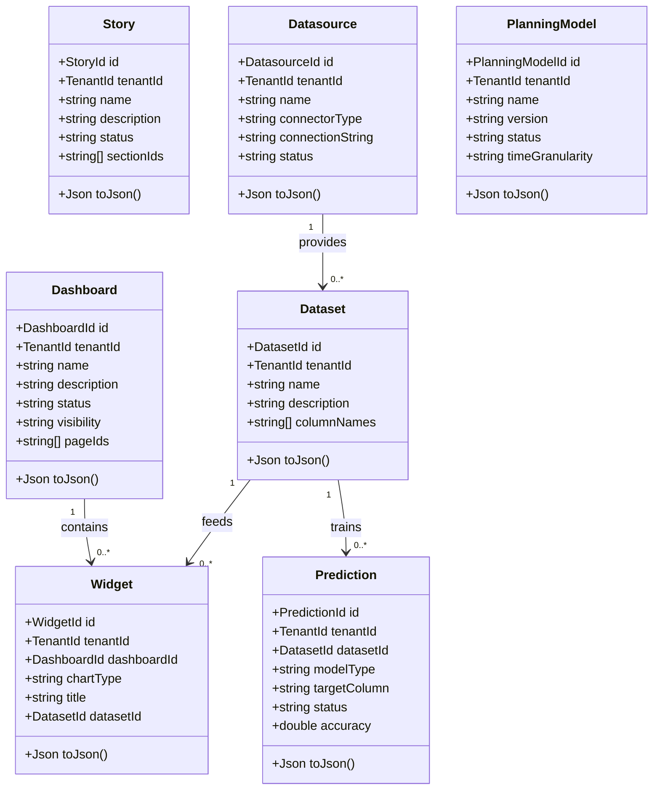
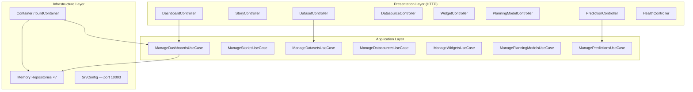
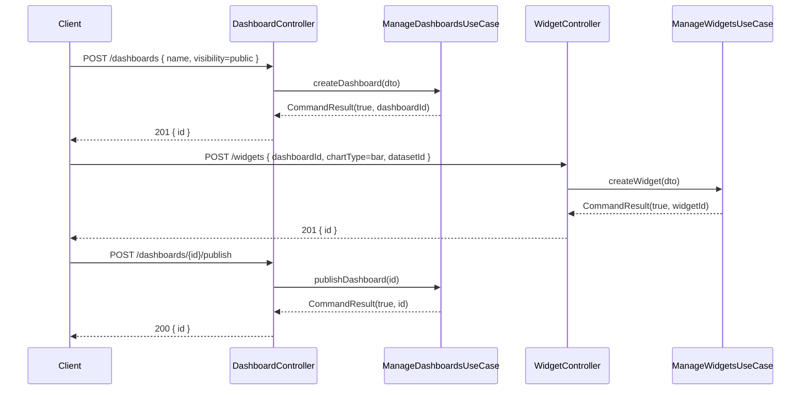
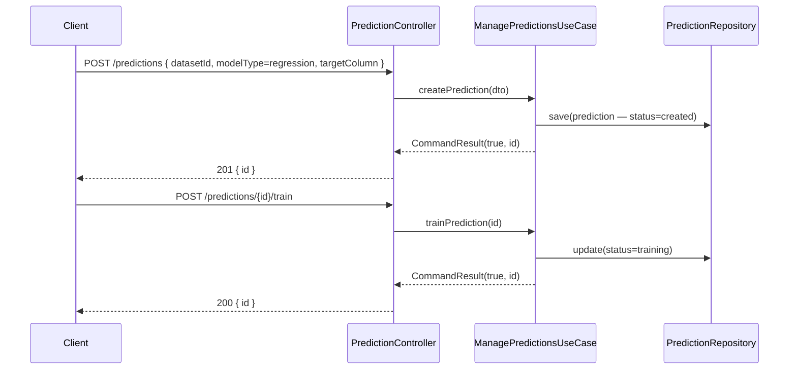

# UML — Analytics Service

## Class Diagram — Domain Entities

---

## Component Diagram

---

## Sequence Diagram — Create Dashboard with Widgets

---

## Sequence Diagram — Train Prediction Model

