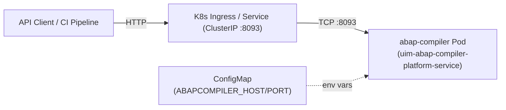

# NAFv4 Architecture Description — ABAP Compiler Service

> NATO Architecture Framework version 4 (NAFv4) viewpoints applied to the
> UIM ABAP Compiler Platform Service.

---

## C1 — Capability Taxonomy

| Capability | Sub-Capability | Description |
|---|---|---|
| **ABAP Source Management** | Program CRUD | Create, read, update, delete ABAP source artefacts |
| | Multi-tenancy | Each tenant's programs are isolated by `tenantId` |
| **ABAP Compilation** | Lexical Analysis | Tokenise ABAP 7.51 source (keywords, identifiers, literals, comments) |
| | Syntax Analysis | Parse tokenised source into statement tree (all ABAP programming models) |
| | Semantic Analysis | Validate block nesting, detect deprecated constructs |
| | Code Generation | Emit flat Intermediate Representation (IR) |
| **Job Tracking** | Compilation History | Every compile run is persisted as a `CompilationJob` with full diagnostics and IR |
| | Lifecycle States | pending → running → succeeded / failed / aborted |
| **REST API** | HTTP Interface | vibe.d HTTP server exposing CRUD + compile endpoints |
| **CLI** | Interactive REPL | Local `compile` / `check` commands against `.abap` files |
| **Observability** | Health Endpoint | `/api/v1/health` for liveness and readiness probes |

---

## C2 — Enterprise Vision

The ABAP Compiler Service realises the **UIM Platform** vision of exposing
SAP ABAP development capabilities as lightweight cloud-native microservices.
It enables cloud-first ABAP tooling outside of a full SAP NetWeaver / AS ABAP
installation, following the three-tier model described in the SAP ABAP
overview (Präsentations-, Applikations- und Datenbankschicht).

Strategic goals:
- Enable ABAP syntax validation in CI/CD pipelines without a connected SAP system
- Provide a language-server foundation for future ABAP IDE integrations
- Replace monolithic ABAP workbench tooling with composable microservices

---

## Ar3 — Architecture Roadmap

| Phase | Milestone | Deliverable |
|---|---|---|
| **Phase 1** (current) | Core compiler pipeline | Lexer + Parser + Semantic Analyser + IR generator |
| **Phase 2** | Symbol table | Cross-reference resolver for DATA / TYPES declarations |
| **Phase 3** | ABAP Dictionary integration | Type system aware of SAP data elements and domains |
| **Phase 4** | ABAP Objects type checker | Class hierarchy, interface conformance, visibility rules |
| **Phase 5** | Open SQL semantic validation | Table existence checks, SELECT field resolution |
| **Phase 6** | Bytecode emitter | ABAP Virtual Machine bytecode for sandboxed execution |

---

## Sv1 — Service Taxonomy

```
uim-abap-compiler-platform-service
├── Driving Ports (REST / CLI)
│   ├── POST   /api/v1/abap/compile          CompileController
│   ├── CRUD   /api/v1/abap/programs         ProgramController
│   ├── GET    /api/v1/abap/jobs             JobController
│   └── GET    /api/v1/health               HealthController
│   └── CLI    --cli [compile|check] <file>  AbapCliRunner
├── Application Services
│   ├── CompileUseCase         (4-stage pipeline)
│   ├── ManageProgramsUseCase  (CRUD)
│   └── ManageJobsUseCase      (query)
├── Domain Services
│   ├── AbapLexer              (tokeniser)
│   ├── AbapParser             (statement parser)
│   ├── SemanticAnalyser       (static checks)
│   └── CodeGenerator          (IR emitter)
└── Driven Ports (Persistence)
    ├── AbapProgramRepository      (interface)
    └── CompilationJobRepository   (interface)
        └── Memory implementations (current adapters)
```

---

## Sv2 — Service Specifications

### CompileUseCase

| Attribute | Value |
|---|---|
| **Input** | `CompileRequest { tenantId, programId, sourceCode? }` |
| **Output** | `CompileResponse { jobId, status, diagnostics[], generatedCode[], success }` |
| **Side effects** | Creates and updates a `CompilationJob` in `CompilationJobRepository` |
| **Error conditions** | Program not found, lexer/parser errors, unclosed blocks |
| **Non-functional** | Stateless between calls; pure domain logic in services |

### AbapLexer

| Attribute | Value |
|---|---|
| **Input** | Raw ABAP source string |
| **Output** | `Token[]` sequence |
| **Standard** | SAP ABAP 7.51 lexical rules |
| **Supported** | Keywords (78 built-in), identifiers with hyphens, literals, comments, operators |

### AbapParser

| Attribute | Value |
|---|---|
| **Input** | `Token[]` |
| **Output** | `ParseResult { ParsedStatement[], Diagnostic[] }` |
| **Algorithm** | Statement-level recursive descent; collects tokens until `.` period terminator |

### SemanticAnalyser

| Attribute | Value |
|---|---|
| **Input** | `ParsedStatement[]` |
| **Output** | `Diagnostic[]` |
| **Checks** | Block nesting (11 opener/closer pairs), deprecated PERFORM |

---

## Lr1 — Logical Resource Model

```
Tenant
  └── AbapProgram (1..*)
        ├── id, title, language, programType
        ├── sourceCode (full ABAP text)
        └── CompilationJob (0..*)
              ├── status (pending|running|succeeded|failed|aborted)
              ├── Diagnostic (0..*)
              │     └── severity, message, line, column, code
              └── generatedCode (IR lines, 0..*)
```

---

## NV1 — Node Types

| Node Type | Technology | Deployment |
|---|---|---|
| **Service Container** | D / vibe.d binary | Docker / Podman / Kubernetes Pod |
| **HTTP Load Balancer** | Kubernetes Service (ClusterIP) | k8s service.yaml |
| **Configuration** | Kubernetes ConfigMap | k8s configmap.yaml |
| **Storage** | In-memory (Phase 1) | Within service process |

---

## NV2 — Node Connectivity



---

## StV — Standards and Protocols

| Standard | Usage |
|---|---|
| SAP ABAP 7.51 keyword documentation | Lexer keyword set, parser grammar, semantic rules |
| HTTP/1.1 (RFC 7230) | REST API transport |
| JSON (RFC 7159) | Request / response serialisation |
| OCI Image Specification | Container image format (Docker + Podman) |
| Kubernetes API v1 / apps/v1 | Deployment, Service, ConfigMap manifests |
| Apache 2.0 License | Source code licence |

---

## Pm — Programme Management

| Attribute | Value |
|---|---|
| **Owner** | Ozan Nurettin Süel — UI Manufaktur |
| **Service name** | `abap-compiler` |
| **Binary** | `uim-abap-compiler-platform-service` |
| **Port** | 8093 |
| **API version** | v1 |
| **Language** | D (LDC 1.40.1) |
| **Framework** | vibe.d |
| **Licence** | Apache 2.0 |
| **Repository** | UIMSolutions/uim-platform |
