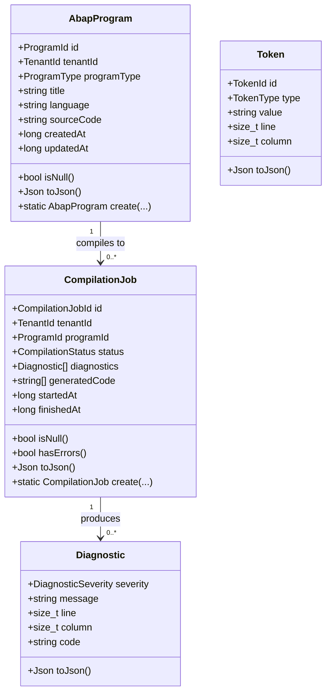
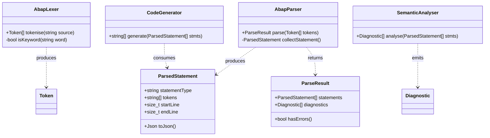
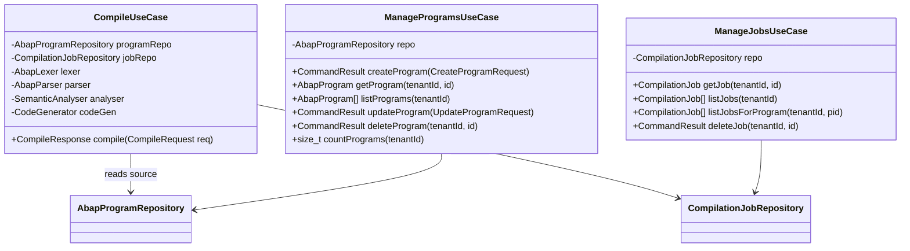
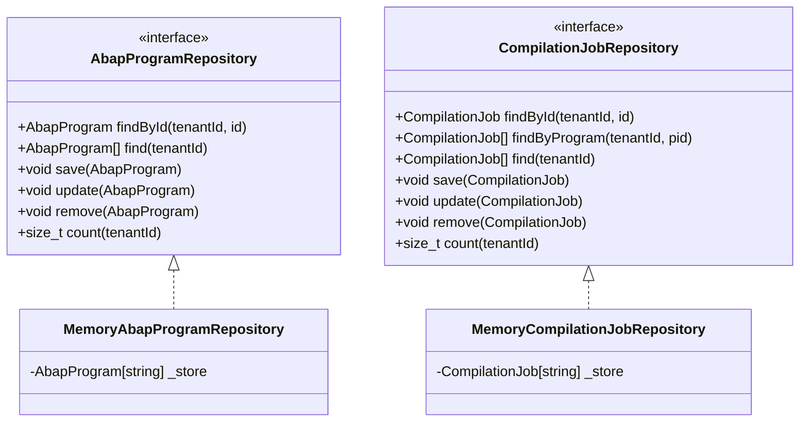
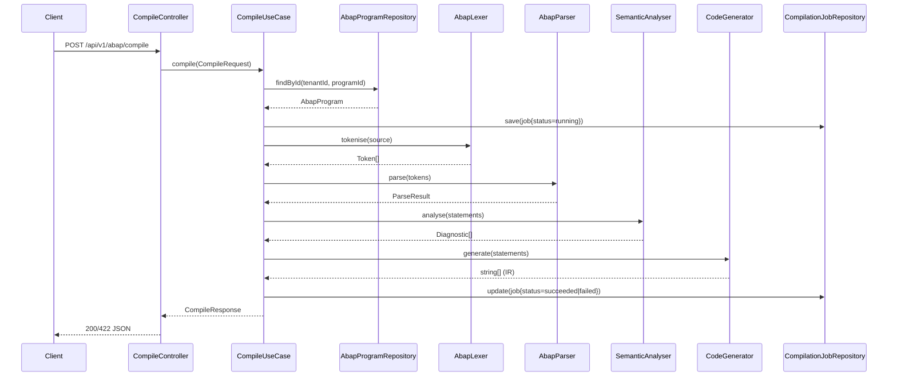
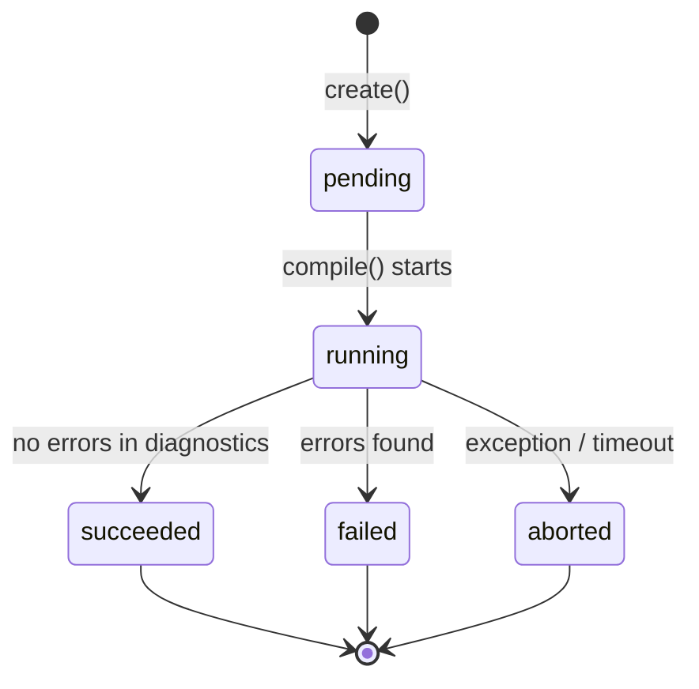
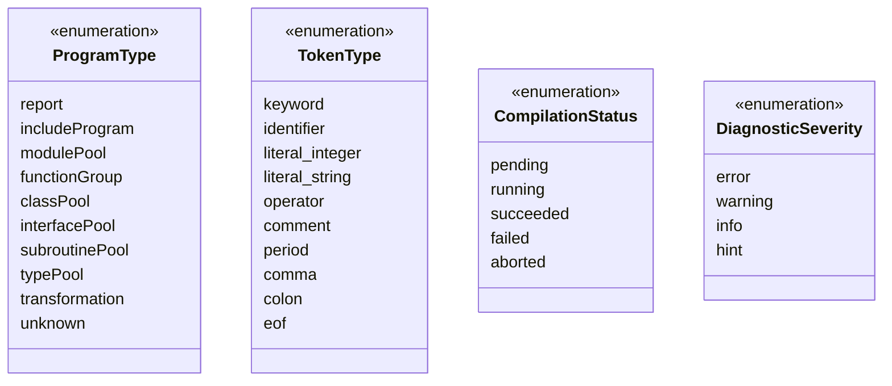

# UML — ABAP Compiler Service

## Class Diagram — Domain Entities



---

## Class Diagram — Domain Services



---

## Class Diagram — Application Layer



---

## Class Diagram — Ports (Hexagonal Interfaces)



---

## Component Diagram — Hexagonal Architecture

```mermaid
flowchart TB
    subgraph Driving["Driving Adapters (Left / Primary)"]
        HTTP["HTTP Controllers\n(ProgramController\nCompileController\nJobController\nHealthController)"]
        CLI["CLI (AbapCliRunner)"]
    end

    subgraph Application["Application Layer (Use Cases)"]
        UC1["CompileUseCase\n(Lex → Parse → Analyse → Generate)"]
        UC2["ManageProgramsUseCase"]
        UC3["ManageJobsUseCase"]
    end

    subgraph Domain["Domain (Pure Business Logic)"]
        Services["Domain Services\n(AbapLexer, AbapParser\nSemanticAnalyser, CodeGenerator)"]
        Entities["Entities\n(AbapProgram, Token\nDiagnostic, CompilationJob)"]
        Ports["Ports\n(AbapProgramRepository\nCompilationJobRepository)"]
    end

    subgraph Driven["Driven Adapters (Right / Secondary)"]
        Memory["In-Memory Repos\n(MemoryAbapProgramRepository\nMemoryCompilationJobRepository)"]
    end

    HTTP --> UC1
    HTTP --> UC2
    HTTP --> UC3
    CLI  --> UC1

    UC1 --> Services
    UC1 --> Ports
    UC2 --> Ports
    UC3 --> Ports

    Ports <|.. Memory
    Services --> Entities
```

---

## Sequence Diagram — Compile Request



---

## State Diagram — CompilationJob Lifecycle



---

## Enum Overview


