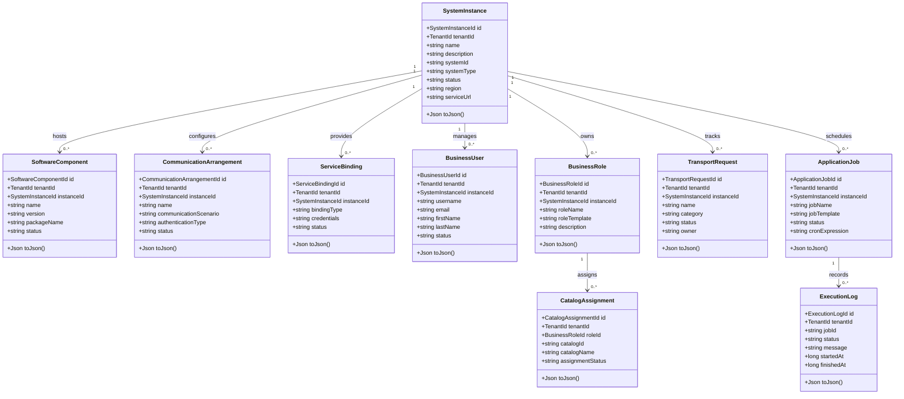
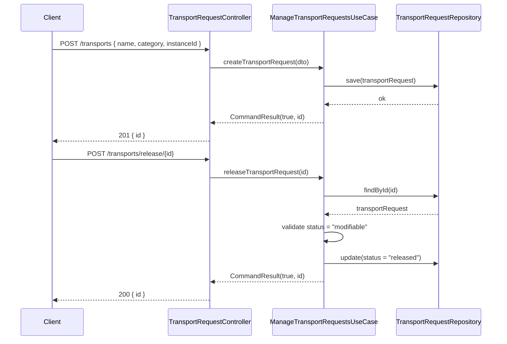
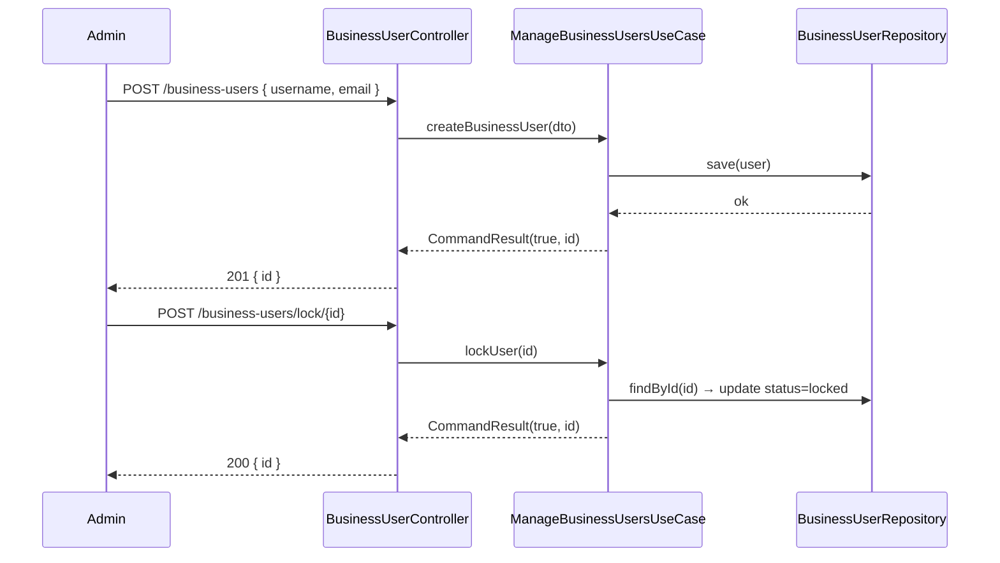

# UML — ABAP Environment Service

## Class Diagram — Domain Entities

---

## Component Diagram

```mermaid
flowchart TB
    subgraph Presentation["Presentation Layer (HTTP)"]
        C1[SystemInstanceController]
        C2[SoftwareComponentController]
        C3[CommunicationArrangementController]
        C4[ServiceBindingController]
        C5[BusinessUserController]
        C6[BusinessRoleController]
        C7[TransportRequestController]
        C8[CatalogAssignmentController]
        C9[ApplicationJobController]
        HC[HealthController]
    end
    subgraph Application["Application Layer"]
        UC1[ManageSystemInstancesUseCase]
        UC2[ManageSoftwareComponentsUseCase]
        UC3[ManageCommunicationArrangementsUseCase]
        UC4[ManageServiceBindingsUseCase]
        UC5[ManageBusinessUsersUseCase]
        UC6[ManageBusinessRolesUseCase]
        UC7[ManageTransportRequestsUseCase]
        UC8[ManageCatalogAssignmentsUseCase]
        UC9[ManageApplicationJobsUseCase]
    end
    subgraph Domain["Domain Layer"]
        E1[SystemInstance]
        E2[SoftwareComponent]
        E3[CommunicationArrangement]
        E4[ServiceBinding]
        E5[BusinessUser]
        E6[BusinessRole]
        E7[TransportRequest]
        E8[CatalogAssignment]
        E9[ApplicationJob]
        E10[ExecutionLog]
    end
    subgraph Infrastructure["Infrastructure Layer"]
        MEM[Memory Repositories ×10]
        CFG[SrvConfig — port 10000]
        CTR[Container / buildContainer]
    end

    C1 --> UC1
    C2 --> UC2
    C3 --> UC3
    C5 --> UC5
    C6 --> UC6
    C7 --> UC7
    C9 --> UC9

    UC1 --> E1
    UC5 --> E5
    UC6 --> E6
    UC9 --> E9

    MEM --> E1
    CTR --> UC1
    CTR --> MEM
```

---

## Sequence Diagram — Transport Request Release

---

## Sequence Diagram — Business User Lifecycle

