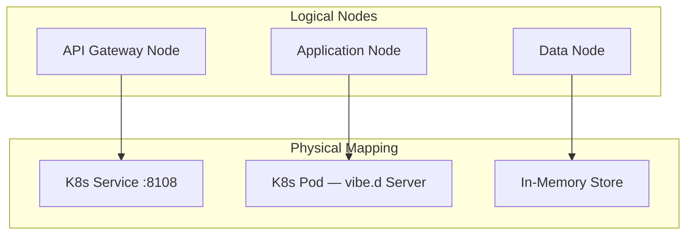
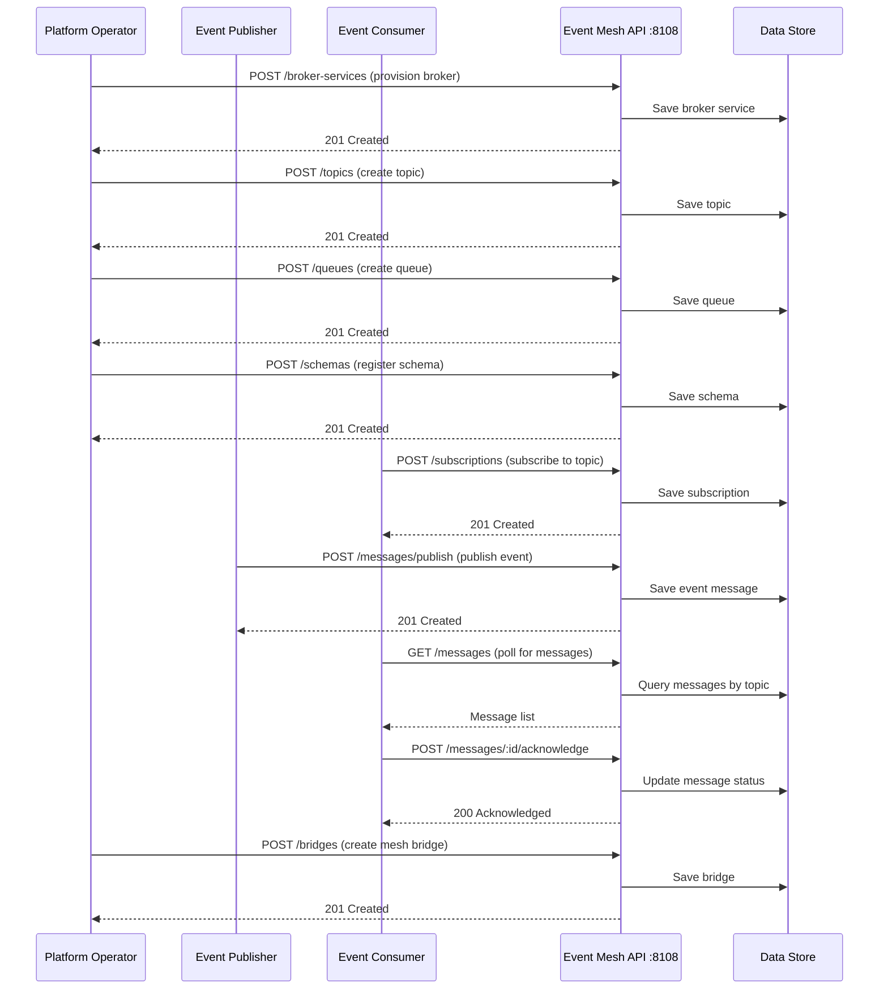
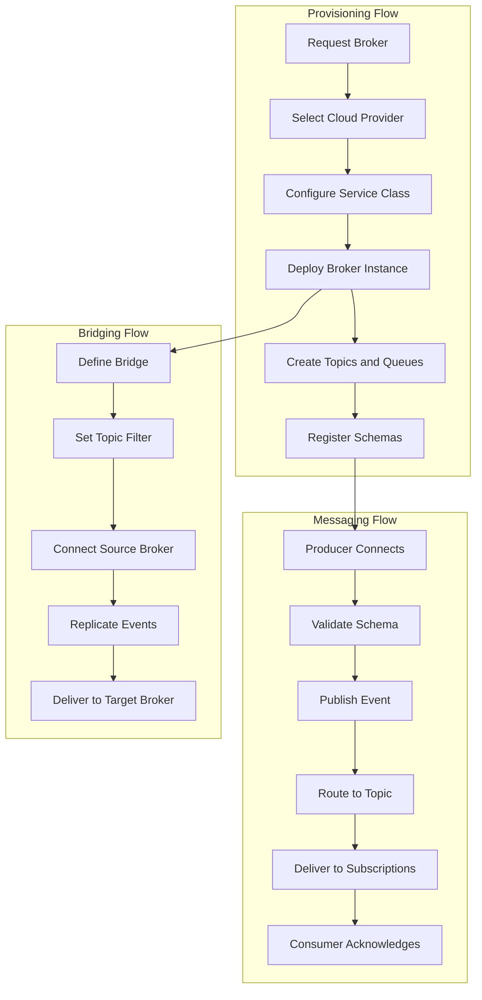
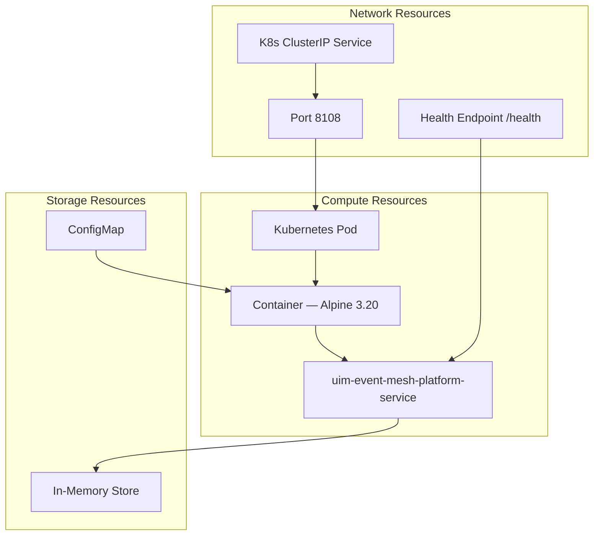
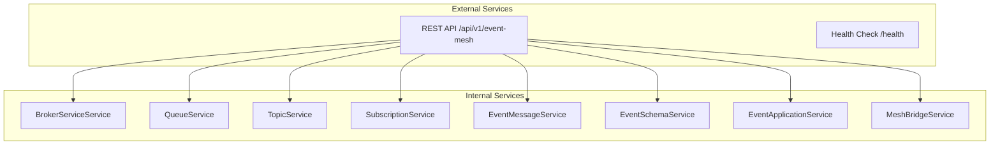

# NAF v4 Architecture Views — Event Mesh

NATO Architecture Framework v4 (NAFv4) views for the Event Mesh Service, modeled after SAP Integration Suite, Advanced Event Mesh.

## C1 — Capability Taxonomy

```mermaid
graph TB
    EM[Event Mesh]
    EM --> BSM[Broker Service Management]
    EM --> QMG[Queue Management]
    EM --> TMG[Topic Management]
    EM --> SUB[Subscription Management]
    EM --> MSG[Event Messaging]
    EM --> SCH[Schema Management]
    EM --> APM[Application Management]
    EM --> BRG[Mesh Bridge Management]

    BSM --> BSM1[Provision Brokers]
    BSM --> BSM2[Multi-Cloud Deployment]
    BSM --> BSM3[Broker Monitoring]
    BSM --> BSM4[Lifecycle Management]

    QMG --> QMG1[Create Queues]
    QMG --> QMG2[Configure Capacity]
    QMG --> QMG3[Set TTL Policies]
    QMG --> QMG4[Queue Monitoring]

    TMG --> TMG1[Define Topic Hierarchies]
    TMG --> TMG2[Topic Pattern Matching]
    TMG --> TMG3[Topic Lifecycle]
    TMG --> TMG4[Multi-Broker Topics]

    SUB --> SUB1[Subscribe Consumers]
    SUB --> SUB2[Filter Expressions]
    SUB --> SUB3[Delivery Guarantees]
    SUB --> SUB4[Subscription Monitoring]

    MSG --> MSG1[Publish Events]
    MSG --> MSG2[Route Messages]
    MSG --> MSG3[Acknowledge Delivery]
    MSG --> MSG4[Dead Letter Handling]

    SCH --> SCH1[Register Schemas]
    SCH --> SCH2[Version Management]
    SCH --> SCH3[Schema Validation]
    SCH --> SCH4[Format Support]

    APM --> APM1[Register Applications]
    APM --> APM2[Protocol Configuration]
    APM --> APM3[Connection Management]
    APM --> APM4[Application Monitoring]

    BRG --> BRG1[Cross-Region Bridges]
    BRG --> BRG2[Cross-Cloud Bridges]
    BRG --> BRG3[Topic Filtering]
    BRG --> BRG4[Bridge Monitoring]
```

## C2 — Enterprise Vision

The Event Mesh Service provides a comprehensive event-driven messaging platform for distributed systems. It enables:

1. **Broker Service Management** through provisioning of event broker instances across AWS, Azure, and GCP with lifecycle management, monitoring, and multi-region deployment
2. **Queue Management** through creation and configuration of message queues with capacity limits, time-to-live policies, and support for standard and priority queue types
3. **Topic Management** through definition of topic hierarchies, pattern-based routing, and topic lifecycle tracking across broker instances
4. **Subscription Management** through consumer subscriptions to topics with filtering expressions, delivery guarantees, and durable/non-durable subscription modes
5. **Event Messaging** through publish/subscribe event delivery, message routing, acknowledgment tracking, and dead letter queue handling
6. **Schema Management** (Event Portal) through schema registration in Avro, JSON Schema, and Protobuf formats with version control and compatibility validation
7. **Application Management** through registration of producer/consumer applications with support for AMQP, MQTT, REST, and WebSocket protocols
8. **Mesh Bridging** through cross-region and cross-cloud broker bridging with topic filtering, enabling hybrid and multi-cloud event topologies

## L1 — Node Types

## L2 — Logical Scenario

## L4 — Logical Activity

## P1 — Resource Types

## S1 — Service Taxonomy

## Sv1 — Service Interface

| Service | Method | Path | Description |
|---------|--------|------|-------------|
| Broker Services | GET | `/api/v1/event-mesh/broker-services` | List all broker services |
| Broker Services | POST | `/api/v1/event-mesh/broker-services` | Create broker service |
| Broker Services | GET | `/api/v1/event-mesh/broker-services/:id` | Get by ID |
| Broker Services | PUT | `/api/v1/event-mesh/broker-services/:id` | Update |
| Broker Services | DELETE | `/api/v1/event-mesh/broker-services/:id` | Delete |
| Queues | GET | `/api/v1/event-mesh/queues` | List all queues |
| Queues | POST | `/api/v1/event-mesh/queues` | Create queue |
| Queues | GET | `/api/v1/event-mesh/queues/:id` | Get by ID |
| Queues | PUT | `/api/v1/event-mesh/queues/:id` | Update |
| Queues | DELETE | `/api/v1/event-mesh/queues/:id` | Delete |
| Topics | GET | `/api/v1/event-mesh/topics` | List all topics |
| Topics | POST | `/api/v1/event-mesh/topics` | Create topic |
| Topics | GET | `/api/v1/event-mesh/topics/:id` | Get by ID |
| Topics | PUT | `/api/v1/event-mesh/topics/:id` | Update |
| Topics | DELETE | `/api/v1/event-mesh/topics/:id` | Delete |
| Subscriptions | GET | `/api/v1/event-mesh/subscriptions` | List all subscriptions |
| Subscriptions | POST | `/api/v1/event-mesh/subscriptions` | Create subscription |
| Subscriptions | GET | `/api/v1/event-mesh/subscriptions/:id` | Get by ID |
| Subscriptions | PUT | `/api/v1/event-mesh/subscriptions/:id` | Update |
| Subscriptions | DELETE | `/api/v1/event-mesh/subscriptions/:id` | Delete |
| Messages | POST | `/api/v1/event-mesh/messages/publish` | Publish event message |
| Messages | GET | `/api/v1/event-mesh/messages` | List all messages |
| Messages | GET | `/api/v1/event-mesh/messages/:id` | Get by ID |
| Messages | POST | `/api/v1/event-mesh/messages/:id/acknowledge` | Acknowledge |
| Messages | DELETE | `/api/v1/event-mesh/messages/:id` | Delete |
| Schemas | GET | `/api/v1/event-mesh/schemas` | List all schemas |
| Schemas | POST | `/api/v1/event-mesh/schemas` | Create schema |
| Schemas | GET | `/api/v1/event-mesh/schemas/:id` | Get by ID |
| Schemas | PUT | `/api/v1/event-mesh/schemas/:id` | Update |
| Schemas | DELETE | `/api/v1/event-mesh/schemas/:id` | Delete |
| Applications | GET | `/api/v1/event-mesh/applications` | List all applications |
| Applications | POST | `/api/v1/event-mesh/applications` | Create application |
| Applications | GET | `/api/v1/event-mesh/applications/:id` | Get by ID |
| Applications | PUT | `/api/v1/event-mesh/applications/:id` | Update |
| Applications | DELETE | `/api/v1/event-mesh/applications/:id` | Delete |
| Bridges | GET | `/api/v1/event-mesh/bridges` | List all mesh bridges |
| Bridges | POST | `/api/v1/event-mesh/bridges` | Create mesh bridge |
| Bridges | GET | `/api/v1/event-mesh/bridges/:id` | Get by ID |
| Bridges | PUT | `/api/v1/event-mesh/bridges/:id` | Update |
| Bridges | DELETE | `/api/v1/event-mesh/bridges/:id` | Delete |
| Health | GET | `/health` | Service health check |
