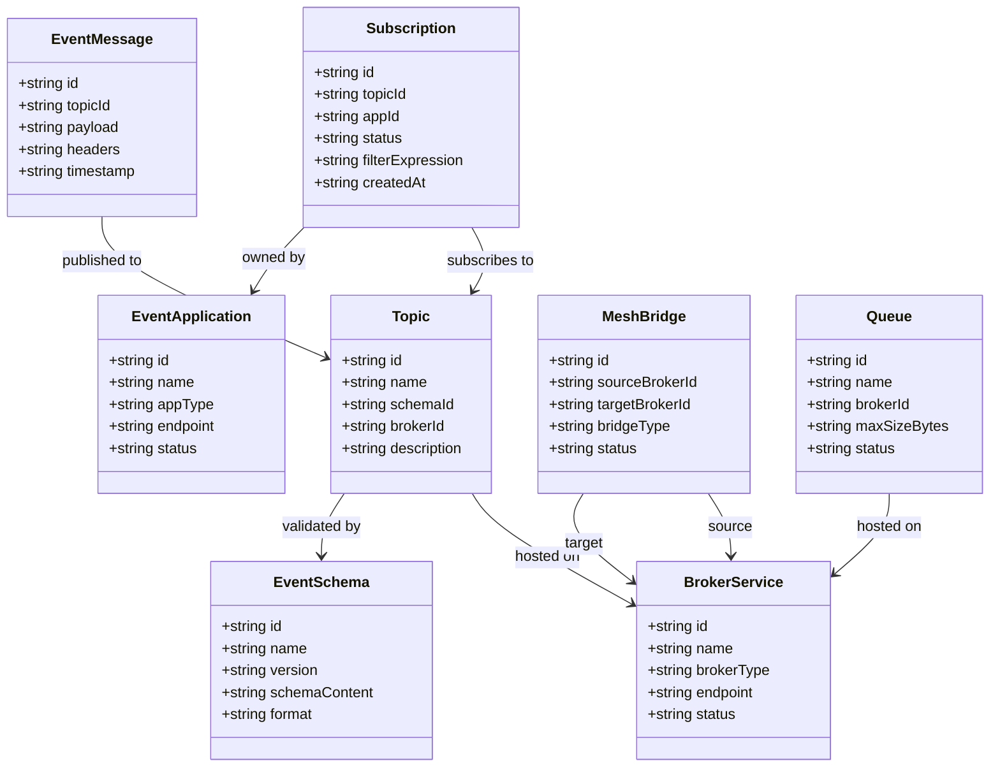
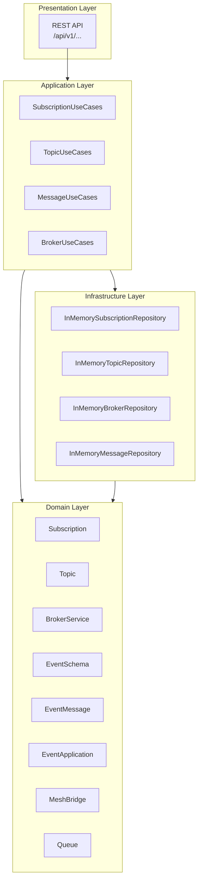
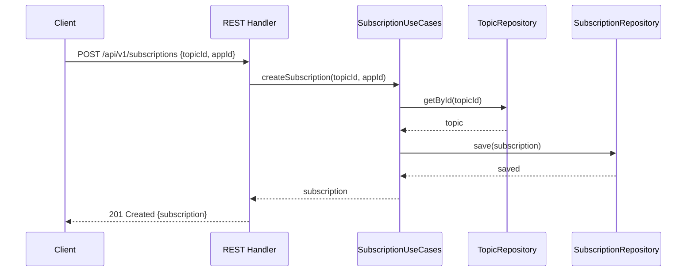
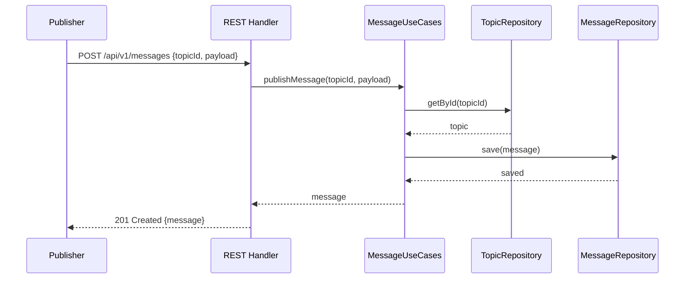

# UML Diagrams — Advanced Events Service

## Class Diagram

```mermaid
classDiagram
    class Subscription {
        +string id
        +string topicId
        +string appId
        +string status
        +string filterExpression
        +string createdAt
    }
    class Topic {
        +string id
        +string name
        +string schemaId
        +string brokerId
        +string description
    }
    class BrokerService {
        +string id
        +string name
        +string brokerType
        +string endpoint
        +string status
    }
    class EventSchema {
        +string id
        +string name
        +string version
        +string schemaContent
        +string format
    }
    class EventMessage {
        +string id
        +string topicId
        +string payload
        +string headers
        +string timestamp
    }
    class EventApplication {
        +string id
        +string name
        +string appType
        +string endpoint
        +string status
    }
    class MeshBridge {
        +string id
        +string sourceBrokerId
        +string targetBrokerId
        +string bridgeType
        +string status
    }
    class Queue {
        +string id
        +string name
        +string brokerId
        +string maxSizeBytes
        +string status
    }

    Topic --> BrokerService : hosted on
    Topic --> EventSchema : validated by
    Subscription --> Topic : subscribes to
    Subscription --> EventApplication : owned by
    EventMessage --> Topic : published to
    Queue --> BrokerService : hosted on
    MeshBridge --> BrokerService : source
    MeshBridge --> BrokerService : target
```

## Component Diagram

```mermaid
flowchart TB
    subgraph Presentation["Presentation Layer"]
        REST["REST API\n/api/v1/..."]
    end
    subgraph Application["Application Layer"]
        SUB_UC["SubscriptionUseCases"]
        TOPIC_UC["TopicUseCases"]
        MSG_UC["MessageUseCases"]
        BROKER_UC["BrokerUseCases"]
    end
    subgraph Domain["Domain Layer"]
        SUB_DOM["Subscription"]
        TOPIC_DOM["Topic"]
        BROKER_DOM["BrokerService"]
        SCHEMA_DOM["EventSchema"]
        MSG_DOM["EventMessage"]
        APP_DOM["EventApplication"]
        BRIDGE_DOM["MeshBridge"]
        QUEUE_DOM["Queue"]
    end
    subgraph Infrastructure["Infrastructure Layer"]
        SUB_REPO["InMemorySubscriptionRepository"]
        TOPIC_REPO["InMemoryTopicRepository"]
        BROKER_REPO["InMemoryBrokerRepository"]
        MSG_REPO["InMemoryMessageRepository"]
    end

    REST --> Application
    Application --> Domain
    Infrastructure --> Domain
    Application --> Infrastructure
```

## Sequence Diagram — Subscribe to Topic

```mermaid
sequenceDiagram
    participant C as Client
    participant R as REST Handler
    participant UC as SubscriptionUseCases
    participant TR as TopicRepository
    participant SR as SubscriptionRepository

    C->>R: POST /api/v1/subscriptions {topicId, appId}
    R->>UC: createSubscription(topicId, appId)
    UC->>TR: getById(topicId)
    TR-->>UC: topic
    UC->>SR: save(subscription)
    SR-->>UC: saved
    UC-->>R: subscription
    R-->>C: 201 Created {subscription}
```

## Sequence Diagram — Publish Event Message

```mermaid
sequenceDiagram
    participant P as Publisher
    participant R as REST Handler
    participant UC as MessageUseCases
    participant TR as TopicRepository
    participant MR as MessageRepository

    P->>R: POST /api/v1/messages {topicId, payload}
    R->>UC: publishMessage(topicId, payload)
    UC->>TR: getById(topicId)
    TR-->>UC: topic
    UC->>MR: save(message)
    MR-->>UC: saved
    UC-->>R: message
    R-->>P: 201 Created {message}
```
