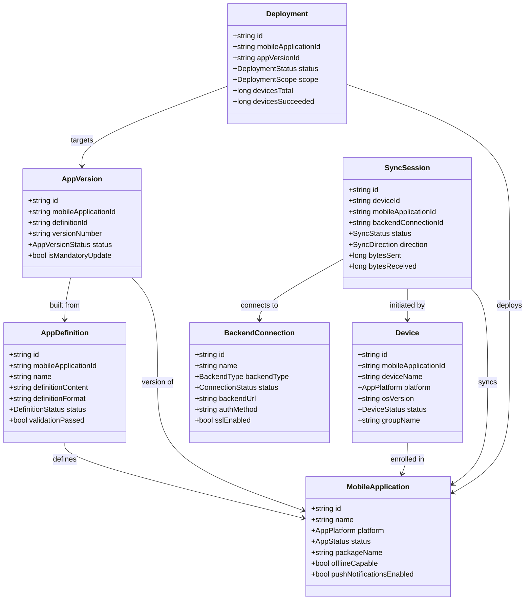
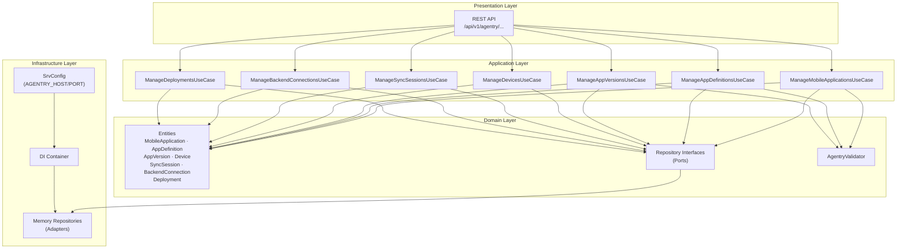
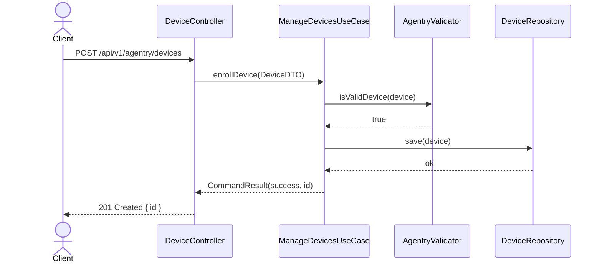
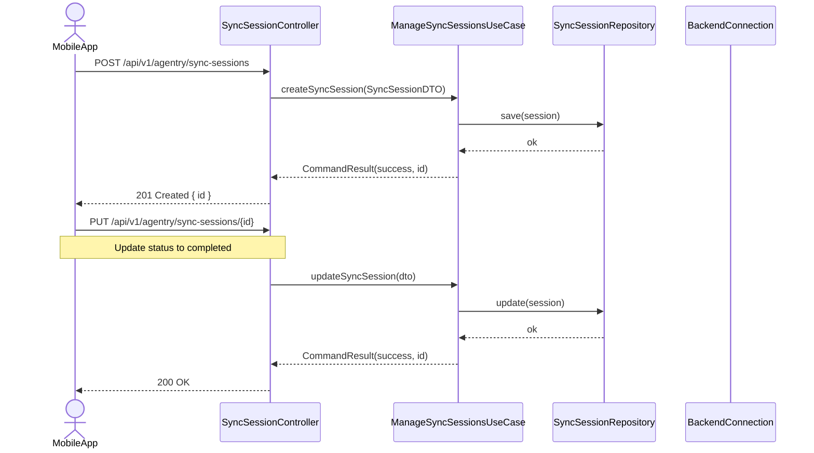
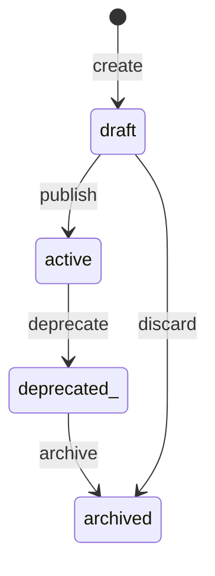
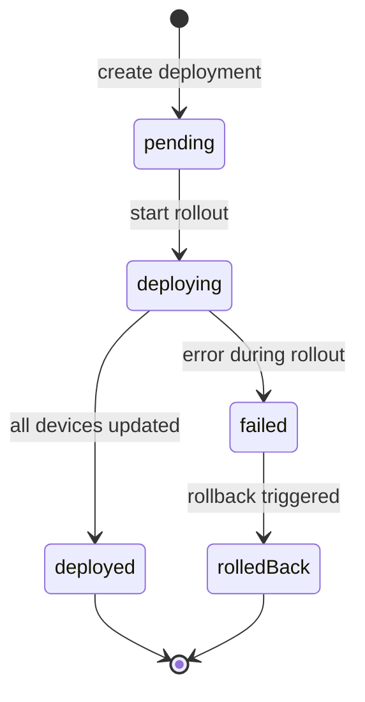

# UML Diagrams — Agentry Service

## Class Diagram

## Component Diagram

## Sequence Diagram — Device Enrollment

## Sequence Diagram — Data Synchronisation

## State Diagram — Mobile Application Lifecycle

## State Diagram — Deployment Lifecycle

