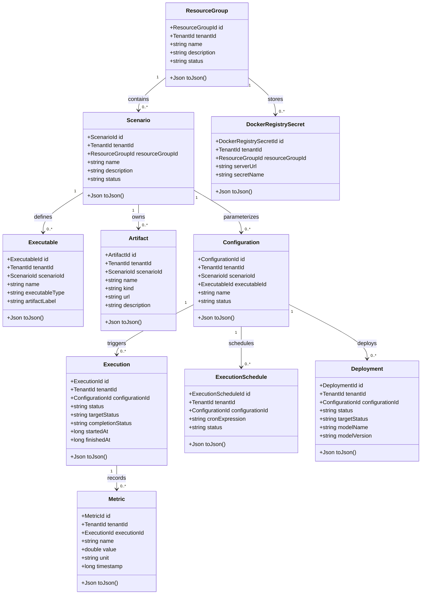
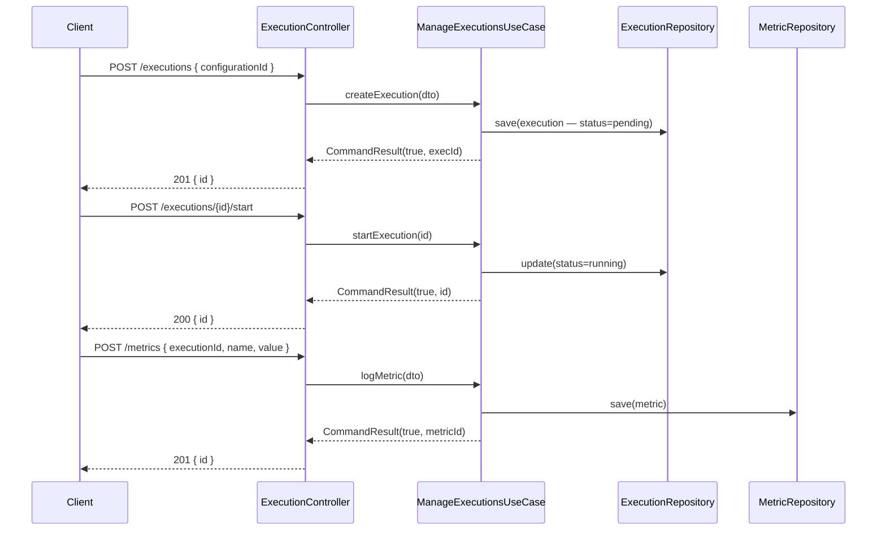
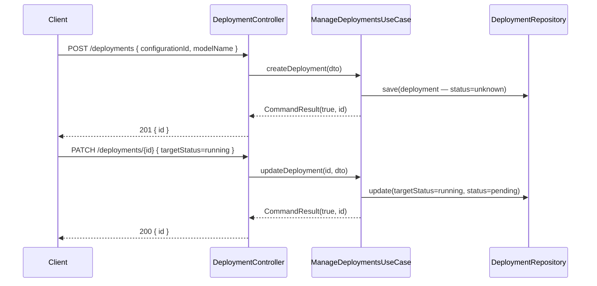

# UML — AI Core Service

## Class Diagram — Domain Entities

```mermaid
classDiagram
    class ResourceGroup {
        +ResourceGroupId id
        +TenantId tenantId
        +string name
        +string description
        +string status
        +Json toJson()
    }
    class Scenario {
        +ScenarioId id
        +TenantId tenantId
        +ResourceGroupId resourceGroupId
        +string name
        +string description
        +string status
        +Json toJson()
    }
    class Executable {
        +ExecutableId id
        +TenantId tenantId
        +ScenarioId scenarioId
        +string name
        +string executableType
        +string artifactLabel
        +Json toJson()
    }
    class Artifact {
        +ArtifactId id
        +TenantId tenantId
        +ScenarioId scenarioId
        +string name
        +string kind
        +string url
        +string description
        +Json toJson()
    }
    class Configuration {
        +ConfigurationId id
        +TenantId tenantId
        +ScenarioId scenarioId
        +ExecutableId executableId
        +string name
        +string status
        +Json toJson()
    }
    class Execution {
        +ExecutionId id
        +TenantId tenantId
        +ConfigurationId configurationId
        +string status
        +string targetStatus
        +string completionStatus
        +long startedAt
        +long finishedAt
        +Json toJson()
    }
    class ExecutionSchedule {
        +ExecutionScheduleId id
        +TenantId tenantId
        +ConfigurationId configurationId
        +string cronExpression
        +string status
        +Json toJson()
    }
    class Deployment {
        +DeploymentId id
        +TenantId tenantId
        +ConfigurationId configurationId
        +string status
        +string targetStatus
        +string modelName
        +string modelVersion
        +Json toJson()
    }
    class Metric {
        +MetricId id
        +TenantId tenantId
        +ExecutionId executionId
        +string name
        +double value
        +string unit
        +long timestamp
        +Json toJson()
    }
    class DockerRegistrySecret {
        +DockerRegistrySecretId id
        +TenantId tenantId
        +ResourceGroupId resourceGroupId
        +string serverUrl
        +string secretName
        +Json toJson()
    }

    ResourceGroup "1" --> "0..*" Scenario : contains
    ResourceGroup "1" --> "0..*" DockerRegistrySecret : stores
    Scenario "1" --> "0..*" Executable : defines
    Scenario "1" --> "0..*" Artifact : owns
    Scenario "1" --> "0..*" Configuration : parameterizes
    Configuration "1" --> "0..*" Execution : triggers
    Configuration "1" --> "0..*" ExecutionSchedule : schedules
    Configuration "1" --> "0..*" Deployment : deploys
    Execution "1" --> "0..*" Metric : records
```

---

## Component Diagram

```mermaid
flowchart TB
    subgraph Presentation["Presentation Layer (HTTP)"]
        C1[ResourceGroupController]
        C2[ScenarioController]
        C3[ExecutableController]
        C4[ArtifactController]
        C5[ConfigurationController]
        C6[ExecutionController]
        C7[ExecutionScheduleController]
        C8[DeploymentController]
        C9[MetricController]
        C10[DockerRegistrySecretController]
        HC[HealthController]
    end
    subgraph Application["Application Layer"]
        UC1[ManageResourceGroupsUseCase]
        UC2[ManageScenariosUseCase]
        UC3[ManageExecutablesUseCase]
        UC4[ManageArtifactsUseCase]
        UC5[ManageConfigurationsUseCase]
        UC6[ManageExecutionsUseCase]
        UC7[ManageExecutionSchedulesUseCase]
        UC8[ManageDeploymentsUseCase]
        UC9[ManageMetricsUseCase]
        UC10[ManageDockerRegistrySecretsUseCase]
    end
    subgraph Domain["Domain Layer"]
        E[Entities ×10]
        V[AiCoreValidator]
    end
    subgraph Infrastructure["Infrastructure Layer"]
        MEM[Memory Repositories ×10]
        CFG[SrvConfig — port 10001]
        CTR[Container / buildContainer]
    end

    C1 --> UC1
    C6 --> UC6
    C8 --> UC8
    UC1 --> E
    UC6 --> V
    MEM --> E
    CTR --> UC1
    CTR --> MEM
```

---

## Sequence Diagram — Training Execution Flow

```mermaid
sequenceDiagram
    participant Client
    participant EC as ExecutionController
    participant EUC as ManageExecutionsUseCase
    participant ER as ExecutionRepository
    participant MR as MetricRepository

    Client->>EC: POST /executions { configurationId }
    EC->>EUC: createExecution(dto)
    EUC->>ER: save(execution — status=pending)
    EUC-->>EC: CommandResult(true, execId)
    EC-->>Client: 201 { id }

    Client->>EC: POST /executions/{id}/start
    EC->>EUC: startExecution(id)
    EUC->>ER: update(status=running)
    EUC-->>EC: CommandResult(true, id)
    EC-->>Client: 200 { id }

    Client->>EC: POST /metrics { executionId, name, value }
    EC->>EUC: logMetric(dto)
    EUC->>MR: save(metric)
    EUC-->>EC: CommandResult(true, metricId)
    EC-->>Client: 201 { id }
```

---

## Sequence Diagram — Deployment Lifecycle

```mermaid
sequenceDiagram
    participant Client
    participant DC as DeploymentController
    participant DUC as ManageDeploymentsUseCase
    participant DR as DeploymentRepository

    Client->>DC: POST /deployments { configurationId, modelName }
    DC->>DUC: createDeployment(dto)
    DUC->>DR: save(deployment — status=unknown)
    DUC-->>DC: CommandResult(true, id)
    DC-->>Client: 201 { id }

    Client->>DC: PATCH /deployments/{id} { targetStatus=running }
    DC->>DUC: updateDeployment(id, dto)
    DUC->>DR: update(targetStatus=running, status=pending)
    DUC-->>DC: CommandResult(true, id)
    DC-->>Client: 200 { id }
```
