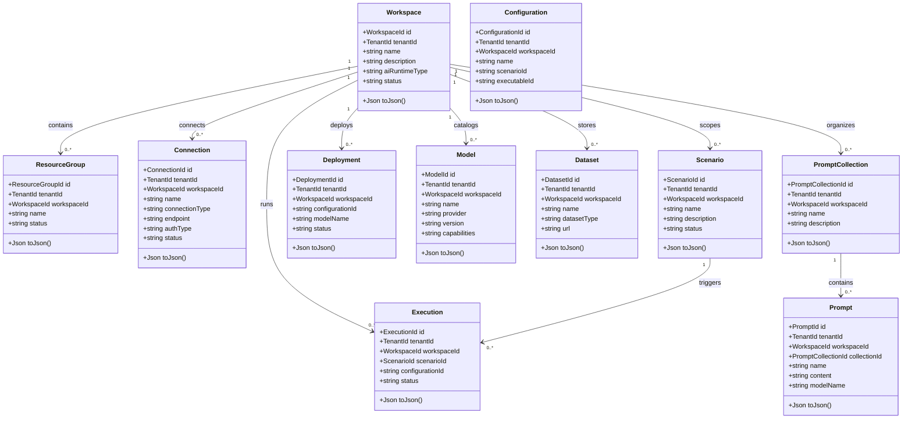
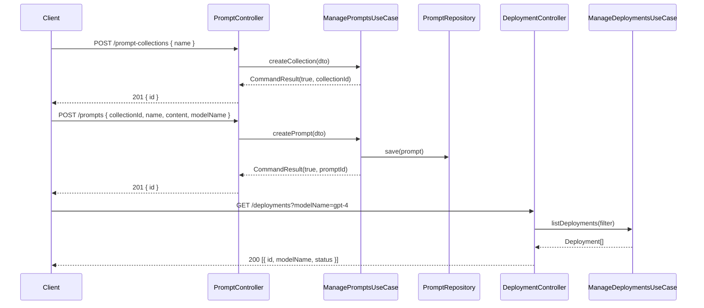

# UML — AI Launchpad Service

## Class Diagram — Domain Entities

```mermaid
classDiagram
    class Workspace {
        +WorkspaceId id
        +TenantId tenantId
        +string name
        +string description
        +string aiRuntimeType
        +string status
        +Json toJson()
    }
    class ResourceGroup {
        +ResourceGroupId id
        +TenantId tenantId
        +WorkspaceId workspaceId
        +string name
        +string status
        +Json toJson()
    }
    class Connection {
        +ConnectionId id
        +TenantId tenantId
        +WorkspaceId workspaceId
        +string name
        +string connectionType
        +string endpoint
        +string authType
        +string status
        +Json toJson()
    }
    class Scenario {
        +ScenarioId id
        +TenantId tenantId
        +WorkspaceId workspaceId
        +string name
        +string description
        +string status
        +Json toJson()
    }
    class Execution {
        +ExecutionId id
        +TenantId tenantId
        +WorkspaceId workspaceId
        +ScenarioId scenarioId
        +string configurationId
        +string status
        +Json toJson()
    }
    class Deployment {
        +DeploymentId id
        +TenantId tenantId
        +WorkspaceId workspaceId
        +string configurationId
        +string modelName
        +string status
        +Json toJson()
    }
    class Model {
        +ModelId id
        +TenantId tenantId
        +WorkspaceId workspaceId
        +string name
        +string provider
        +string version
        +string capabilities
        +Json toJson()
    }
    class Configuration {
        +ConfigurationId id
        +TenantId tenantId
        +WorkspaceId workspaceId
        +string name
        +string scenarioId
        +string executableId
        +Json toJson()
    }
    class Dataset {
        +DatasetId id
        +TenantId tenantId
        +WorkspaceId workspaceId
        +string name
        +string datasetType
        +string url
        +Json toJson()
    }
    class Prompt {
        +PromptId id
        +TenantId tenantId
        +WorkspaceId workspaceId
        +PromptCollectionId collectionId
        +string name
        +string content
        +string modelName
        +Json toJson()
    }
    class PromptCollection {
        +PromptCollectionId id
        +TenantId tenantId
        +WorkspaceId workspaceId
        +string name
        +string description
        +Json toJson()
    }

    Workspace "1" --> "0..*" ResourceGroup : contains
    Workspace "1" --> "0..*" Connection : connects
    Workspace "1" --> "0..*" Scenario : scopes
    Workspace "1" --> "0..*" Execution : runs
    Workspace "1" --> "0..*" Deployment : deploys
    Workspace "1" --> "0..*" Model : catalogs
    Workspace "1" --> "0..*" Dataset : stores
    Workspace "1" --> "0..*" PromptCollection : organizes
    PromptCollection "1" --> "0..*" Prompt : contains
    Scenario "1" --> "0..*" Execution : triggers
```

---

## Component Diagram

```mermaid
flowchart TB
    subgraph Presentation["Presentation Layer (HTTP)"]
        C1[WorkspaceController]
        C2[ResourceGroupController]
        C3[ConnectionController]
        C4[ScenarioController]
        C5[ExecutionController]
        C6[DeploymentController]
        C7[ModelController]
        C8[ConfigurationController]
        C9[DatasetController]
        C10[PromptController]
        C11[PromptCollectionController]
        HC[HealthController]
    end
    subgraph Application["Application Layer"]
        UC1[ManageWorkspacesUseCase]
        UC2[ManageConnectionsUseCase]
        UC3[ManageExecutionsUseCase]
        UC4[ManageDeploymentsUseCase]
        UC5[ManageModelsUseCase]
        UC6[ManagePromptsUseCase]
    end
    subgraph Infrastructure["Infrastructure Layer"]
        MEM[Memory Repositories ×11]
        CFG[SrvConfig — port 10002]
        CTR[Container / buildContainer]
    end

    C1 --> UC1
    C5 --> UC3
    C6 --> UC4
    C7 --> UC5
    C10 --> UC6
    UC1 --> MEM
    CTR --> UC1
    CTR --> MEM
```

---

## Sequence Diagram — Generative AI Prompt Execution

```mermaid
sequenceDiagram
    participant Client
    participant PC as PromptController
    participant PUC as ManagePromptsUseCase
    participant PR as PromptRepository
    participant DC as DeploymentController
    participant DUC as ManageDeploymentsUseCase

    Client->>PC: POST /prompt-collections { name }
    PC->>PUC: createCollection(dto)
    PUC-->>PC: CommandResult(true, collectionId)
    PC-->>Client: 201 { id }

    Client->>PC: POST /prompts { collectionId, name, content, modelName }
    PC->>PUC: createPrompt(dto)
    PUC->>PR: save(prompt)
    PUC-->>PC: CommandResult(true, promptId)
    PC-->>Client: 201 { id }

    Client->>DC: GET /deployments?modelName=gpt-4
    DC->>DUC: listDeployments(filter)
    DUC-->>DC: Deployment[]
    DC-->>Client: 200 [{ id, modelName, status }]
```
