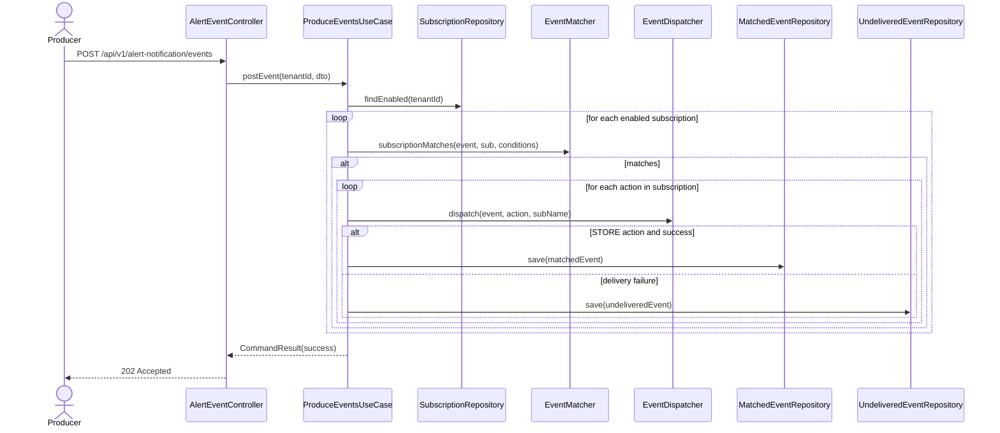
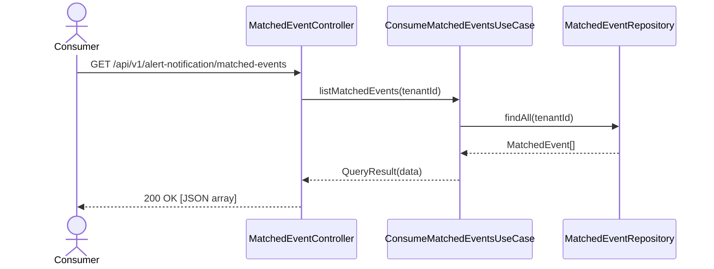
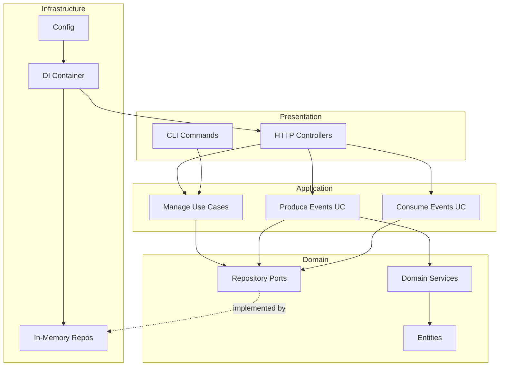

# UML — Alert Notification Service

## Class Diagram — Domain

```mermaid
classDiagram
    class AlertEventId {
        +string value
    }
    class ConditionId {
        +string value
    }
    class ActionId {
        +string value
    }
    class SubscriptionId {
        +string value
    }
    class MatchedEventId {
        +string value
    }
    class UndeliveredEventId {
        +string value
    }

    class AffectedResource {
        +string name
        +string type_
        +string instance_
        +string[string] tags
        +toJson() Json
    }

    class AlertEvent {
        +AlertEventId id
        +string tenantId
        +string eventType
        +EventCategory category
        +EventSeverity severity
        +string subject
        +string body
        +string region
        +long timestamp
        +EventStatus status
        +AffectedResource affectedResource
        +string[string] tags
        +toJson() Json
        +isNull() bool
    }

    class Condition {
        +ConditionId id
        +string tenantId
        +string name
        +string description
        +PropertyKey propertyKey
        +Predicate predicate
        +string propertyValue
        +bool mandatory
        +string[] labels
        +matches(AlertEvent) bool
        +toJson() Json
    }

    class Action {
        +ActionId id
        +string tenantId
        +string name
        +ActionType type_
        +ResourceState state
        +string[string] properties
        +string fallbackAction
        +bool enableDeliveryStatus
        +isEnabled() bool
        +toJson() Json
    }

    class Subscription {
        +SubscriptionId id
        +string tenantId
        +string name
        +string[] conditions
        +string[] actions
        +ResourceState state
        +isEnabled() bool
        +toJson() Json
    }

    class MatchedEvent {
        +MatchedEventId id
        +string tenantId
        +string eventId
        +string subscriptionName
        +string actionName
        +long storedAt
        +long retentionPeriod
        +toJson() Json
    }

    class UndeliveredEvent {
        +UndeliveredEventId id
        +string tenantId
        +string eventId
        +string subscriptionName
        +string actionName
        +string failureReason
        +long failedAt
        +int deliveryAttempts
        +toJson() Json
    }

    AlertEvent --> AffectedResource
    MatchedEvent --> AffectedResource
    UndeliveredEvent --> AffectedResource
```

---

## Class Diagram — Application Use Cases

```mermaid
classDiagram
    class ManageConditionsUseCase {
        +createCondition(tenantId, req) CommandResult
        +getCondition(tenantId, id) QueryResult
        +listConditions(tenantId) QueryResult
        +updateCondition(tenantId, id, req) CommandResult
        +deleteCondition(tenantId, id) CommandResult
    }

    class ManageActionsUseCase {
        +createAction(tenantId, req) CommandResult
        +getAction(tenantId, id) QueryResult
        +listActions(tenantId) QueryResult
        +updateAction(tenantId, id, req) CommandResult
        +deleteAction(tenantId, id) CommandResult
    }

    class ManageSubscriptionsUseCase {
        +createSubscription(tenantId, req) CommandResult
        +getSubscription(tenantId, id) QueryResult
        +listSubscriptions(tenantId) QueryResult
        +updateSubscription(tenantId, id, req) CommandResult
        +deleteSubscription(tenantId, id) CommandResult
    }

    class ProduceEventsUseCase {
        +postEvent(tenantId, req) CommandResult
    }

    class ConsumeMatchedEventsUseCase {
        +listMatchedEvents(tenantId) QueryResult
        +getMatchedEvent(tenantId, id) QueryResult
    }

    class ConsumeUndeliveredEventsUseCase {
        +listUndeliveredEvents(tenantId) QueryResult
        +getUndeliveredEvent(tenantId, id) QueryResult
    }

    ProduceEventsUseCase --> EventMatcher : uses
    ProduceEventsUseCase --> EventDispatcher : uses
    ProduceEventsUseCase --> SubscriptionRepository : uses
    ProduceEventsUseCase --> ConditionRepository : uses
    ProduceEventsUseCase --> ActionRepository : uses
    ProduceEventsUseCase --> MatchedEventRepository : saves
    ProduceEventsUseCase --> UndeliveredEventRepository : saves
```

---

## Sequence Diagram — Post Alert Event

---

## Sequence Diagram — Consumer Pull (Matched Events)

---

## Component Diagram

