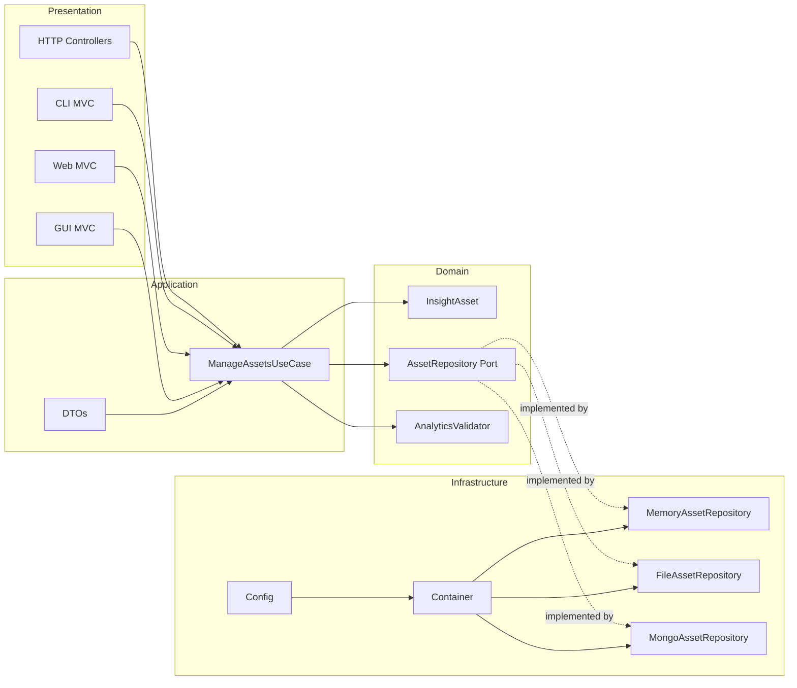
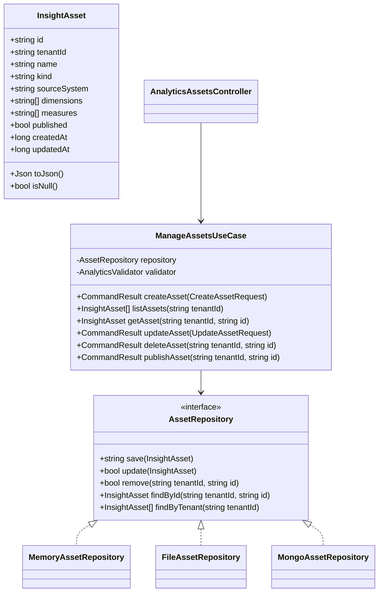
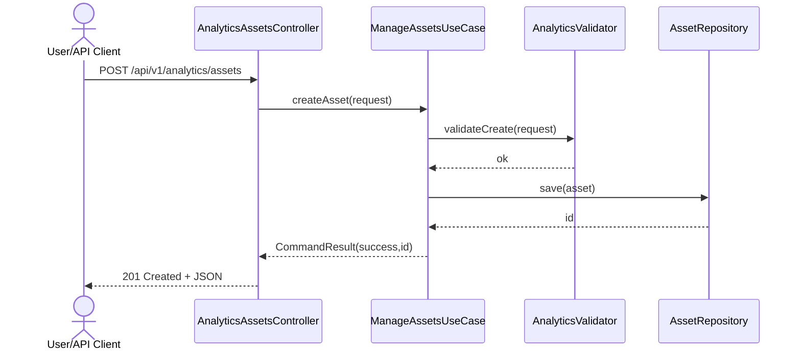
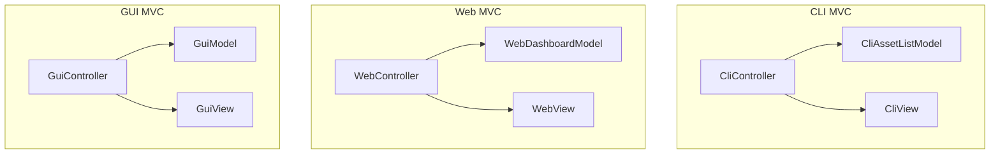

# UML - Analytics Service

## Layered/Hexagonal Overview

```mermaid
flowchart LR
  subgraph P[Presentation]
    HTTP[HTTP Controllers]
    CLI[CLI MVC]
    WEB[Web MVC]
    GUI[GUI MVC]
  end

  subgraph A[Application]
    UC[ManageAssetsUseCase]
    DTO[DTOs]
  end

  subgraph D[Domain]
    ENT[InsightAsset]
    PORT[AssetRepository Port]
    VAL[AnalyticsValidator]
  end

  subgraph I[Infrastructure]
    CFG[Config]
    DI[Container]
    MEM[MemoryAssetRepository]
    FIL[FileAssetRepository]
    MGO[MongoAssetRepository]
  end

  HTTP --> UC
  CLI --> UC
  WEB --> UC
  GUI --> UC
  UC --> VAL
  UC --> PORT
  PORT -.implemented by.-> MEM
  PORT -.implemented by.-> FIL
  PORT -.implemented by.-> MGO
  DI --> MEM
  DI --> FIL
  DI --> MGO
  CFG --> DI
  UC --> ENT
  DTO --> UC
```

## Class Diagram (Core)

```mermaid
classDiagram
  class InsightAsset {
    +string id
    +string tenantId
    +string name
    +string kind
    +string sourceSystem
    +string[] dimensions
    +string[] measures
    +bool published
    +long createdAt
    +long updatedAt
    +Json toJson()
    +bool isNull()
  }

  class AssetRepository {
    <<interface>>
    +string save(InsightAsset)
    +bool update(InsightAsset)
    +bool remove(string tenantId, string id)
    +InsightAsset findById(string tenantId, string id)
    +InsightAsset[] findByTenant(string tenantId)
  }

  class ManageAssetsUseCase {
    -AssetRepository repository
    -AnalyticsValidator validator
    +CommandResult createAsset(CreateAssetRequest)
    +InsightAsset[] listAssets(string tenantId)
    +InsightAsset getAsset(string tenantId, string id)
    +CommandResult updateAsset(UpdateAssetRequest)
    +CommandResult deleteAsset(string tenantId, string id)
    +CommandResult publishAsset(string tenantId, string id)
  }

  class MemoryAssetRepository
  class FileAssetRepository
  class MongoAssetRepository
  class AnalyticsAssetsController

  AssetRepository <|.. MemoryAssetRepository
  AssetRepository <|.. FileAssetRepository
  AssetRepository <|.. MongoAssetRepository
  ManageAssetsUseCase --> AssetRepository
  AnalyticsAssetsController --> ManageAssetsUseCase
```

## Sequence: Create Asset

```mermaid
sequenceDiagram
  actor U as User/API Client
  participant C as AnalyticsAssetsController
  participant UC as ManageAssetsUseCase
  participant V as AnalyticsValidator
  participant R as AssetRepository

  U->>C: POST /api/v1/analytics/assets
  C->>UC: createAsset(request)
  UC->>V: validateCreate(request)
  V-->>UC: ok
  UC->>R: save(asset)
  R-->>UC: id
  UC-->>C: CommandResult(success,id)
  C-->>U: 201 Created + JSON
```

## MVC View

```mermaid
flowchart TB
  subgraph CLI_MVC[CLI MVC]
    CLI_C[CliController] --> CLI_M[CliAssetListModel]
    CLI_C --> CLI_V[CliView]
  end

  subgraph WEB_MVC[Web MVC]
    WEB_C[WebController] --> WEB_M[WebDashboardModel]
    WEB_C --> WEB_V[WebView]
  end

  subgraph GUI_MVC[GUI MVC]
    GUI_C[GuiController] --> GUI_M[GuiModel]
    GUI_C --> GUI_V[GuiView]
  end
```
