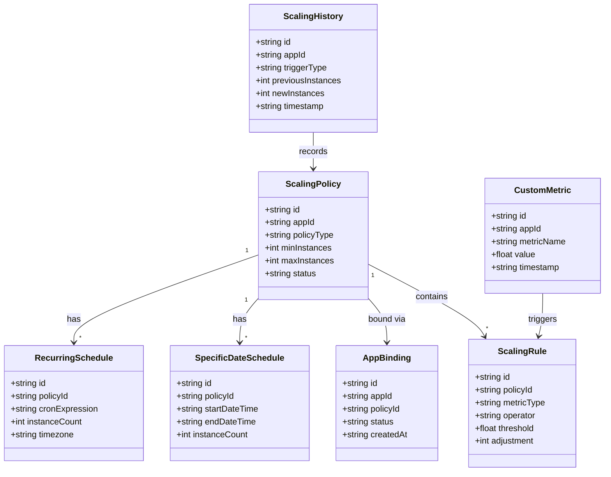
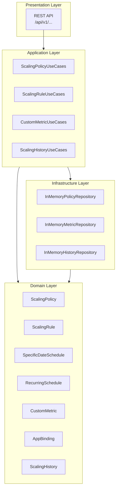
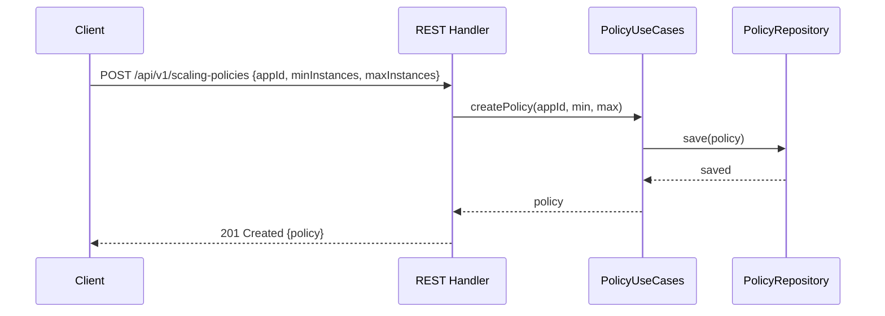

# UML Diagrams — Application Autoscaler Service

## Class Diagram

```mermaid
classDiagram
    class ScalingPolicy {
        +string id
        +string appId
        +string policyType
        +int minInstances
        +int maxInstances
        +string status
    }
    class SpecificDateSchedule {
        +string id
        +string policyId
        +string startDateTime
        +string endDateTime
        +int instanceCount
    }
    class RecurringSchedule {
        +string id
        +string policyId
        +string cronExpression
        +int instanceCount
        +string timezone
    }
    class ScalingRule {
        +string id
        +string policyId
        +string metricType
        +string operator
        +float threshold
        +int adjustment
    }
    class CustomMetric {
        +string id
        +string appId
        +string metricName
        +float value
        +string timestamp
    }
    class AppBinding {
        +string id
        +string appId
        +string policyId
        +string status
        +string createdAt
    }
    class ScalingHistory {
        +string id
        +string appId
        +string triggerType
        +int previousInstances
        +int newInstances
        +string timestamp
    }

    ScalingPolicy --> AppBinding : bound via
    ScalingPolicy "1" --> "*" ScalingRule : contains
    ScalingPolicy "1" --> "*" SpecificDateSchedule : has
    ScalingPolicy "1" --> "*" RecurringSchedule : has
    CustomMetric --> ScalingRule : triggers
    ScalingHistory --> ScalingPolicy : records
```

## Component Diagram

```mermaid
flowchart TB
    subgraph Presentation["Presentation Layer"]
        REST["REST API\n/api/v1/..."]
    end
    subgraph Application["Application Layer"]
        POLICY_UC["ScalingPolicyUseCases"]
        RULE_UC["ScalingRuleUseCases"]
        METRIC_UC["CustomMetricUseCases"]
        HISTORY_UC["ScalingHistoryUseCases"]
    end
    subgraph Domain["Domain Layer"]
        POLICY["ScalingPolicy"]
        RULE["ScalingRule"]
        SCHEDULE_SD["SpecificDateSchedule"]
        SCHEDULE_REC["RecurringSchedule"]
        METRIC["CustomMetric"]
        BINDING["AppBinding"]
        HISTORY["ScalingHistory"]
    end
    subgraph Infrastructure["Infrastructure Layer"]
        POLICY_REPO["InMemoryPolicyRepository"]
        METRIC_REPO["InMemoryMetricRepository"]
        HISTORY_REPO["InMemoryHistoryRepository"]
    end

    REST --> Application
    Application --> Domain
    Infrastructure --> Domain
    Application --> Infrastructure
```

## Sequence Diagram — Create Scaling Policy

```mermaid
sequenceDiagram
    participant C as Client
    participant R as REST Handler
    participant UC as PolicyUseCases
    participant PR as PolicyRepository

    C->>R: POST /api/v1/scaling-policies {appId, minInstances, maxInstances}
    R->>UC: createPolicy(appId, min, max)
    UC->>PR: save(policy)
    PR-->>UC: saved
    UC-->>R: policy
    R-->>C: 201 Created {policy}
```
