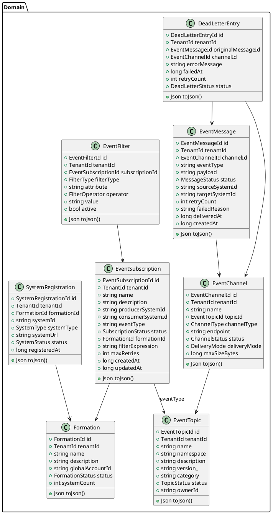
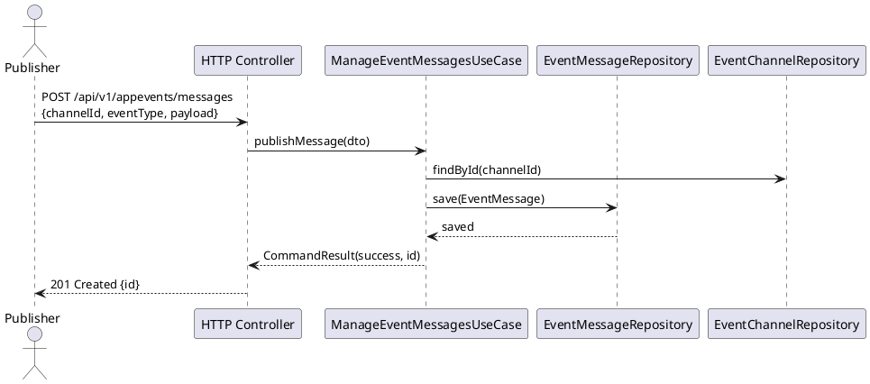
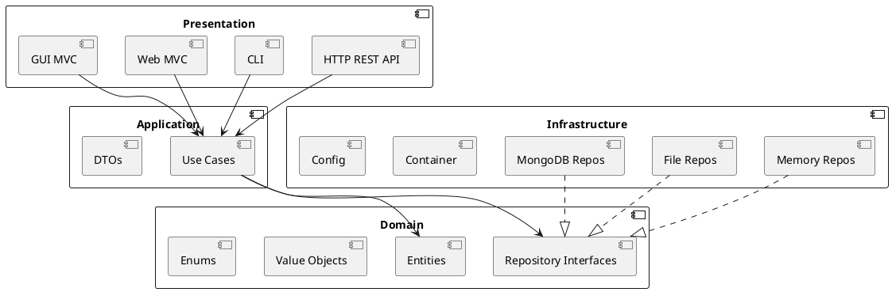

# UML — SAP Cloud Application Event Hub Service

## Class Diagram — Domain Model

```plantuml
@startuml
package "Domain" {
  class EventSubscription {
    +EventSubscriptionId id
    +TenantId tenantId
    +string name
    +string description
    +string producerSystemId
    +string consumerSystemId
    +string eventType
    +SubscriptionStatus status
    +FormationId formationId
    +string filterExpression
    +int maxRetries
    +long createdAt
    +long updatedAt
    +Json toJson()
  }

  class EventTopic {
    +EventTopicId id
    +TenantId tenantId
    +string name
    +string namespace
    +string description
    +string version_
    +string category
    +TopicStatus status
    +string ownerId
    +Json toJson()
  }

  class EventChannel {
    +EventChannelId id
    +TenantId tenantId
    +string name
    +EventTopicId topicId
    +ChannelType channelType
    +string endpoint
    +ChannelStatus status
    +DeliveryMode deliveryMode
    +long maxSizeBytes
    +Json toJson()
  }

  class EventMessage {
    +EventMessageId id
    +TenantId tenantId
    +EventChannelId channelId
    +string eventType
    +string payload
    +MessageStatus status
    +string sourceSystemId
    +string targetSystemId
    +int retryCount
    +string failedReason
    +long deliveredAt
    +long createdAt
    +Json toJson()
  }

  class EventFilter {
    +EventFilterId id
    +TenantId tenantId
    +EventSubscriptionId subscriptionId
    +FilterType filterType
    +string attribute
    +FilterOperator operator
    +string value
    +bool active
    +Json toJson()
  }

  class DeadLetterEntry {
    +DeadLetterEntryId id
    +TenantId tenantId
    +EventMessageId originalMessageId
    +EventChannelId channelId
    +string errorMessage
    +long failedAt
    +int retryCount
    +DeadLetterStatus status
    +Json toJson()
  }

  class Formation {
    +FormationId id
    +TenantId tenantId
    +string name
    +string description
    +string globalAccountId
    +FormationStatus status
    +int systemCount
    +Json toJson()
  }

  class SystemRegistration {
    +SystemRegistrationId id
    +TenantId tenantId
    +FormationId formationId
    +string systemId
    +SystemType systemType
    +string systemUrl
    +SystemStatus status
    +long registeredAt
    +Json toJson()
  }
}

EventSubscription --> Formation
EventSubscription --> EventTopic : eventType
EventChannel --> EventTopic
EventMessage --> EventChannel
EventFilter --> EventSubscription
DeadLetterEntry --> EventMessage
DeadLetterEntry --> EventChannel
SystemRegistration --> Formation
@enduml
```

## Sequence Diagram — Publish and Route Event

```plantuml
@startuml
actor Publisher
participant "HTTP Controller" as HC
participant "ManageEventMessagesUseCase" as UC
participant "EventMessageRepository" as Repo
participant "EventChannelRepository" as ChanRepo

Publisher -> HC : POST /api/v1/appevents/messages\n{channelId, eventType, payload}
HC -> UC : publishMessage(dto)
UC -> ChanRepo : findById(channelId)
UC -> Repo : save(EventMessage)
Repo --> UC : saved
UC --> HC : CommandResult(success, id)
HC --> Publisher : 201 Created {id}
@enduml
```

## Component Diagram

```plantuml
@startuml
component "Presentation" {
  [HTTP REST API]
  [CLI]
  [Web MVC]
  [GUI MVC]
}
component "Application" {
  [Use Cases]
  [DTOs]
}
component "Domain" {
  [Entities]
  [Repository Interfaces]
  [Value Objects]
  [Enums]
}
component "Infrastructure" {
  [Memory Repos]
  [File Repos]
  [MongoDB Repos]
  [Container]
  [Config]
}

[HTTP REST API] --> [Use Cases]
[CLI] --> [Use Cases]
[Web MVC] --> [Use Cases]
[GUI MVC] --> [Use Cases]
[Use Cases] --> [Entities]
[Use Cases] --> [Repository Interfaces]
[Memory Repos] ..|> [Repository Interfaces]
[File Repos] ..|> [Repository Interfaces]
[MongoDB Repos] ..|> [Repository Interfaces]
@enduml
```
