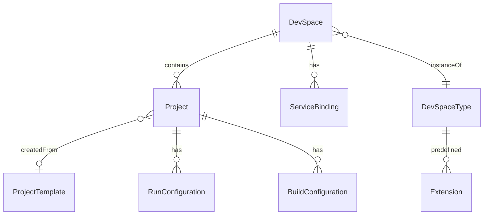
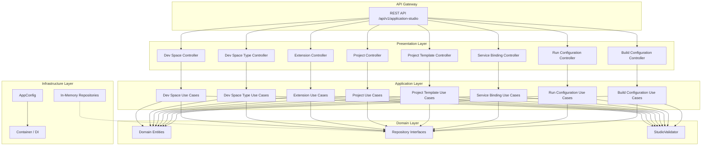
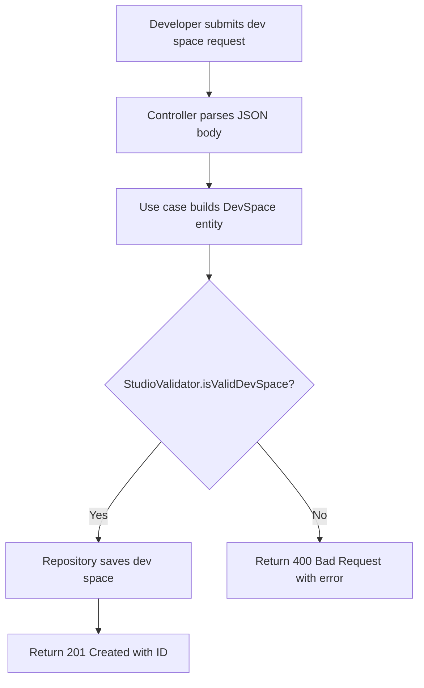
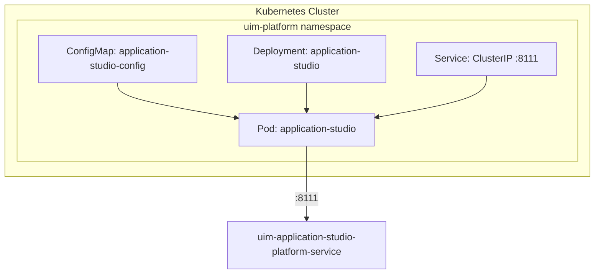

# Application Studio — NAFv4 Architecture Views

## C1 — Capability Taxonomy

```mermaid
graph TB
    AS[Application Studio Service]
    AS --> DSM[Dev Space Management]
    AS --> DSTM[Dev Space Type Management]
    AS --> EM[Extension Management]
    AS --> PM[Project Management]
    AS --> PTM[Project Template Management]
    AS --> SBM[Service Binding Management]
    AS --> RCM[Run Configuration Management]
    AS --> BCM[Build Configuration Management]

    DSM --> DSM1[Create Dev Space]
    DSM --> DSM2[Start/Stop Dev Space]
    DSM --> DSM3[Configure Resources]
    DSM --> DSM4[Hibernate Dev Space]

    DSTM --> DSTM1[Define Dev Space Types]
    DSTM --> DSTM2[Configure Runtime Stacks]
    DSTM --> DSTM3[Map Project Types]

    EM --> EM1[Install Extensions]
    EM --> EM2[Manage Scope]
    EM --> EM3[Track Dependencies]

    PM --> PM1[Create from Template]
    PM --> PM2[Clone from Git]
    PM --> PM3[Manage Lifecycle]

    PTM --> PTM1[Define Templates]
    PTM --> PTM2[Configure Scaffolding]
    PTM --> PTM3[Set Default Files]

    SBM --> SBM1[Connect SAP BTP Services]
    SBM --> SBM2[Connect External Systems]
    SBM --> SBM3[Manage Credentials]

    RCM --> RCM1[Configure Run Mode]
    RCM --> RCM2[Configure Debug Mode]
    RCM --> RCM3[Configure Test Mode]
    RCM --> RCM4[Configure Preview]

    BCM --> BCM1[Build MTA]
    BCM --> BCM2[Deploy to Cloud Foundry]
    BCM --> BCM3[Deploy to Kyma]
    BCM --> BCM4[Deploy to ABAP]
```

## C2 — Service Taxonomy

| Service | Description |
|---------|-------------|
| Dev Space Service | Manages cloud-based development environments with resource allocation and lifecycle control |
| Dev Space Type Service | Defines available development environment templates with runtime configurations |
| Extension Service | Manages IDE extensions, tools, and plugins with versioning and dependency resolution |
| Project Service | Handles project creation, Git integration, and project lifecycle management |
| Project Template Service | Provides scaffolding templates for SAP project types with configuration wizards |
| Service Binding Service | Connects development environments to SAP BTP and external service endpoints |
| Run Configuration Service | Manages application execution profiles for running, debugging, testing, and previewing |
| Build Configuration Service | Orchestrates build and deployment pipelines for multiple target platforms |

## L1 — Logical Data Model

## L2 — Logical Service Architecture

## L4 — Activity Flow: Create Dev Space

## P1 — Physical Deployment

## S1 — Security Overview

| Aspect | Implementation |
|--------|---------------|
| Transport | HTTPS via Kubernetes Ingress TLS termination |
| Authentication | Tenant ID extraction from request headers |
| Authorization | Tenant-scoped data isolation on all queries |
| Credential Storage | Service binding credentials stored as opaque strings |
| Input Validation | StudioValidator validates all entities before persistence |
| Error Handling | Generic error messages returned to clients (no internal details leaked) |

## Sv1 — Service Contract

| Endpoint Group | Base Path | Operations | Content Type |
|----------------|-----------|------------|--------------|
| Dev Spaces | `/api/v1/application-studio/dev-spaces` | CRUD | application/json |
| Dev Space Types | `/api/v1/application-studio/dev-space-types` | CRUD | application/json |
| Extensions | `/api/v1/application-studio/extensions` | CRUD | application/json |
| Projects | `/api/v1/application-studio/projects` | CRUD | application/json |
| Project Templates | `/api/v1/application-studio/project-templates` | CRUD | application/json |
| Service Bindings | `/api/v1/application-studio/service-bindings` | CRUD | application/json |
| Run Configurations | `/api/v1/application-studio/run-configurations` | CRUD | application/json |
| Build Configurations | `/api/v1/application-studio/build-configurations` | CRUD | application/json |
| Health | `/health` | GET | application/json |
