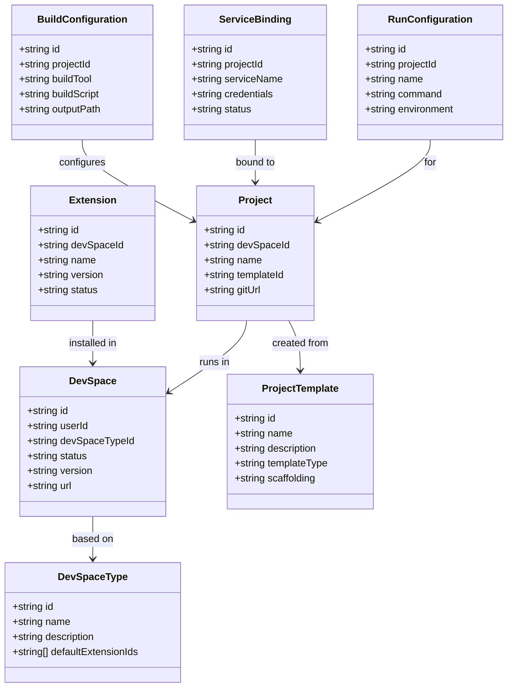
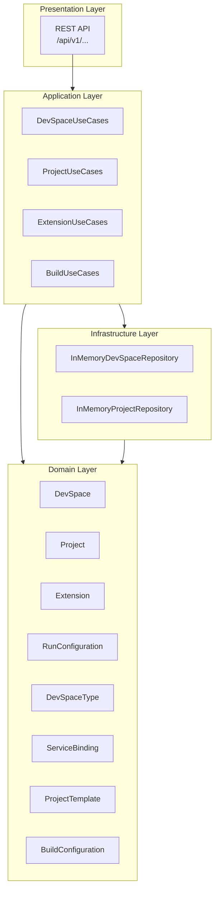
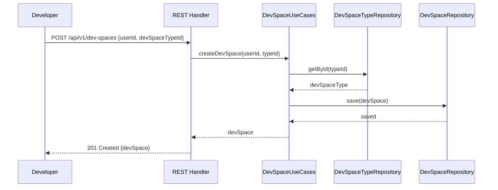

# UML Diagrams — Application Studio Service

## Class Diagram

```mermaid
classDiagram
    class DevSpace {
        +string id
        +string userId
        +string devSpaceTypeId
        +string status
        +string version
        +string url
    }
    class Project {
        +string id
        +string devSpaceId
        +string name
        +string templateId
        +string gitUrl
    }
    class Extension {
        +string id
        +string devSpaceId
        +string name
        +string version
        +string status
    }
    class RunConfiguration {
        +string id
        +string projectId
        +string name
        +string command
        +string environment
    }
    class DevSpaceType {
        +string id
        +string name
        +string description
        +string[] defaultExtensionIds
    }
    class ServiceBinding {
        +string id
        +string projectId
        +string serviceName
        +string credentials
        +string status
    }
    class ProjectTemplate {
        +string id
        +string name
        +string description
        +string templateType
        +string scaffolding
    }
    class BuildConfiguration {
        +string id
        +string projectId
        +string buildTool
        +string buildScript
        +string outputPath
    }

    DevSpace --> DevSpaceType : based on
    Project --> DevSpace : runs in
    Extension --> DevSpace : installed in
    RunConfiguration --> Project : for
    ServiceBinding --> Project : bound to
    Project --> ProjectTemplate : created from
    BuildConfiguration --> Project : configures
```

## Component Diagram

```mermaid
flowchart TB
    subgraph Presentation["Presentation Layer"]
        REST["REST API\n/api/v1/..."]
    end
    subgraph Application["Application Layer"]
        DS_UC["DevSpaceUseCases"]
        PROJ_UC["ProjectUseCases"]
        EXT_UC["ExtensionUseCases"]
        BUILD_UC["BuildUseCases"]
    end
    subgraph Domain["Domain Layer"]
        DS["DevSpace"]
        PROJ["Project"]
        EXT["Extension"]
        RC["RunConfiguration"]
        DST["DevSpaceType"]
        SB["ServiceBinding"]
        PT["ProjectTemplate"]
        BC["BuildConfiguration"]
    end
    subgraph Infrastructure["Infrastructure Layer"]
        DS_REPO["InMemoryDevSpaceRepository"]
        PROJ_REPO["InMemoryProjectRepository"]
    end

    REST --> Application
    Application --> Domain
    Infrastructure --> Domain
    Application --> Infrastructure
```

## Sequence Diagram — Create Dev Space

```mermaid
sequenceDiagram
    participant D as Developer
    participant R as REST Handler
    participant UC as DevSpaceUseCases
    participant DTR as DevSpaceTypeRepository
    participant DSR as DevSpaceRepository

    D->>R: POST /api/v1/dev-spaces {userId, devSpaceTypeId}
    R->>UC: createDevSpace(userId, typeId)
    UC->>DTR: getById(typeId)
    DTR-->>UC: devSpaceType
    UC->>DSR: save(devSpace)
    DSR-->>UC: saved
    UC-->>R: devSpace
    R-->>D: 201 Created {devSpace}
```
