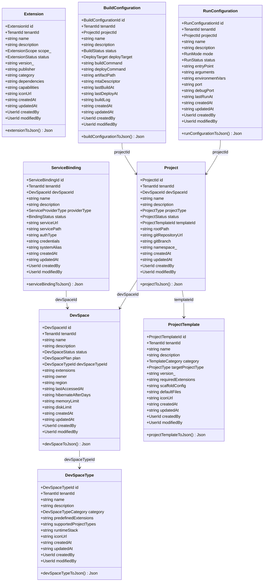
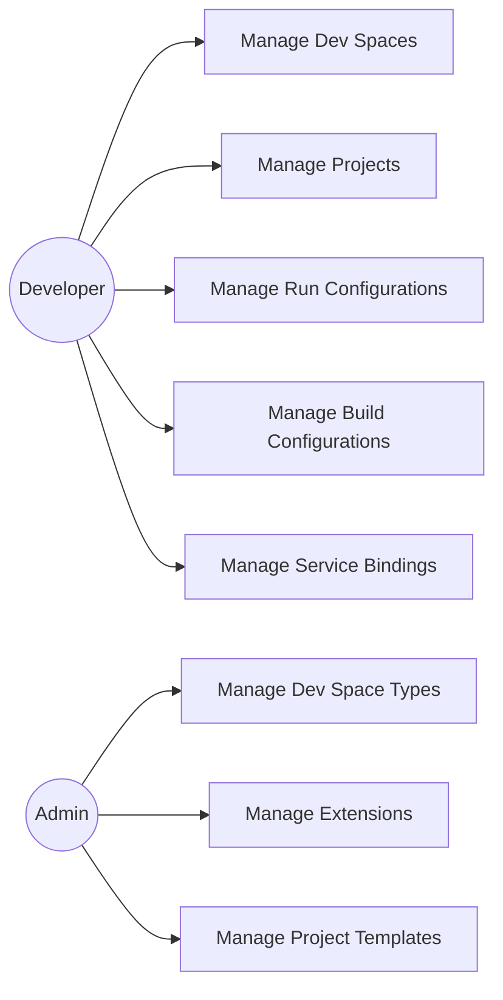
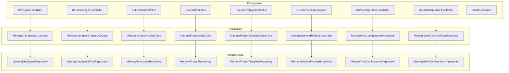
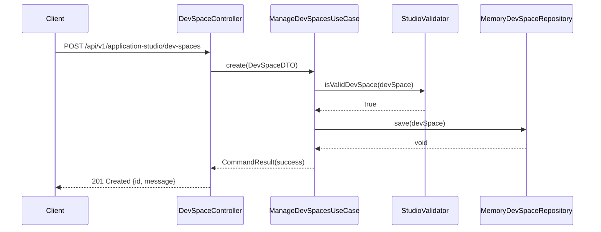
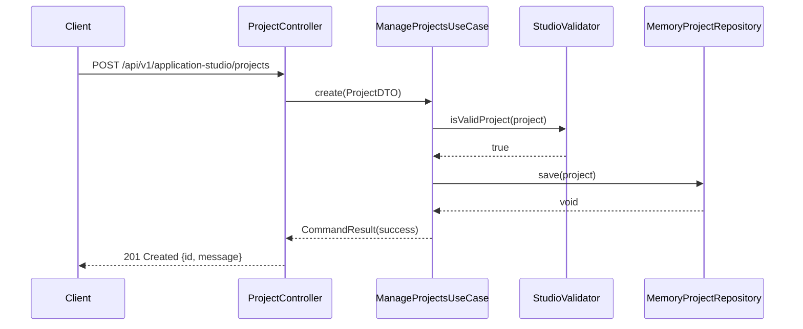

# Application Studio — UML Diagrams

## Class Diagram — Domain Entities

## Repository Interfaces

```mermaid
classDiagram
    class DevSpaceRepository {
        <<interface>>
        +existsById(DevSpaceId) bool
        +findById(DevSpaceId) DevSpace
        +findAll() DevSpace[]
        +findByTenant(TenantId) DevSpace[]
        +findByOwner(string) DevSpace[]
        +findByStatus(DevSpaceStatus) DevSpace[]
        +save(DevSpace) void
        +update(DevSpace) void
        +remove(DevSpaceId) void
    }

    class DevSpaceTypeRepository {
        <<interface>>
        +existsById(DevSpaceTypeId) bool
        +findById(DevSpaceTypeId) DevSpaceType
        +findAll() DevSpaceType[]
        +findByTenant(TenantId) DevSpaceType[]
        +findByCategory(DevSpaceTypeCategory) DevSpaceType[]
        +save(DevSpaceType) void
        +update(DevSpaceType) void
        +remove(DevSpaceTypeId) void
    }

    class ExtensionRepository {
        <<interface>>
        +existsById(ExtensionId) bool
        +findById(ExtensionId) Extension
        +findAll() Extension[]
        +findByTenant(TenantId) Extension[]
        +findByScope(ExtensionScope) Extension[]
        +findByStatus(ExtensionStatus) Extension[]
        +save(Extension) void
        +update(Extension) void
        +remove(ExtensionId) void
    }

    class ProjectRepository {
        <<interface>>
        +existsById(ProjectId) bool
        +findById(ProjectId) Project
        +findAll() Project[]
        +findByTenant(TenantId) Project[]
        +findByDevSpace(DevSpaceId) Project[]
        +findByType(ProjectType) Project[]
        +save(Project) void
        +update(Project) void
        +remove(ProjectId) void
    }

    class ProjectTemplateRepository {
        <<interface>>
        +existsById(ProjectTemplateId) bool
        +findById(ProjectTemplateId) ProjectTemplate
        +findAll() ProjectTemplate[]
        +findByTenant(TenantId) ProjectTemplate[]
        +findByCategory(TemplateCategory) ProjectTemplate[]
        +save(ProjectTemplate) void
        +update(ProjectTemplate) void
        +remove(ProjectTemplateId) void
    }

    class ServiceBindingRepository {
        <<interface>>
        +existsById(ServiceBindingId) bool
        +findById(ServiceBindingId) ServiceBinding
        +findAll() ServiceBinding[]
        +findByTenant(TenantId) ServiceBinding[]
        +findByDevSpace(DevSpaceId) ServiceBinding[]
        +findByStatus(BindingStatus) ServiceBinding[]
        +save(ServiceBinding) void
        +update(ServiceBinding) void
        +remove(ServiceBindingId) void
    }

    class RunConfigurationRepository {
        <<interface>>
        +existsById(RunConfigurationId) bool
        +findById(RunConfigurationId) RunConfiguration
        +findAll() RunConfiguration[]
        +findByTenant(TenantId) RunConfiguration[]
        +findByProject(ProjectId) RunConfiguration[]
        +save(RunConfiguration) void
        +update(RunConfiguration) void
        +remove(RunConfigurationId) void
    }

    class BuildConfigurationRepository {
        <<interface>>
        +existsById(BuildConfigurationId) bool
        +findById(BuildConfigurationId) BuildConfiguration
        +findAll() BuildConfiguration[]
        +findByTenant(TenantId) BuildConfiguration[]
        +findByProject(ProjectId) BuildConfiguration[]
        +findByStatus(BuildStatus) BuildConfiguration[]
        +save(BuildConfiguration) void
        +update(BuildConfiguration) void
        +remove(BuildConfigurationId) void
    }

    MemoryDevSpaceRepository ..|> DevSpaceRepository
    MemoryDevSpaceTypeRepository ..|> DevSpaceTypeRepository
    MemoryExtensionRepository ..|> ExtensionRepository
    MemoryProjectRepository ..|> ProjectRepository
    MemoryProjectTemplateRepository ..|> ProjectTemplateRepository
    MemoryServiceBindingRepository ..|> ServiceBindingRepository
    MemoryRunConfigurationRepository ..|> RunConfigurationRepository
    MemoryBuildConfigurationRepository ..|> BuildConfigurationRepository
```

## Use Case Diagram

## Component Diagram

## Sequence Diagram — Create Dev Space

## Sequence Diagram — Create Project from Template

