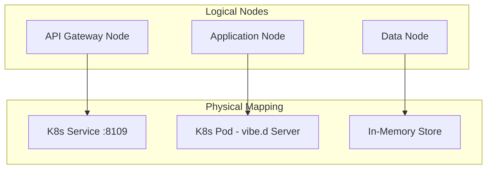
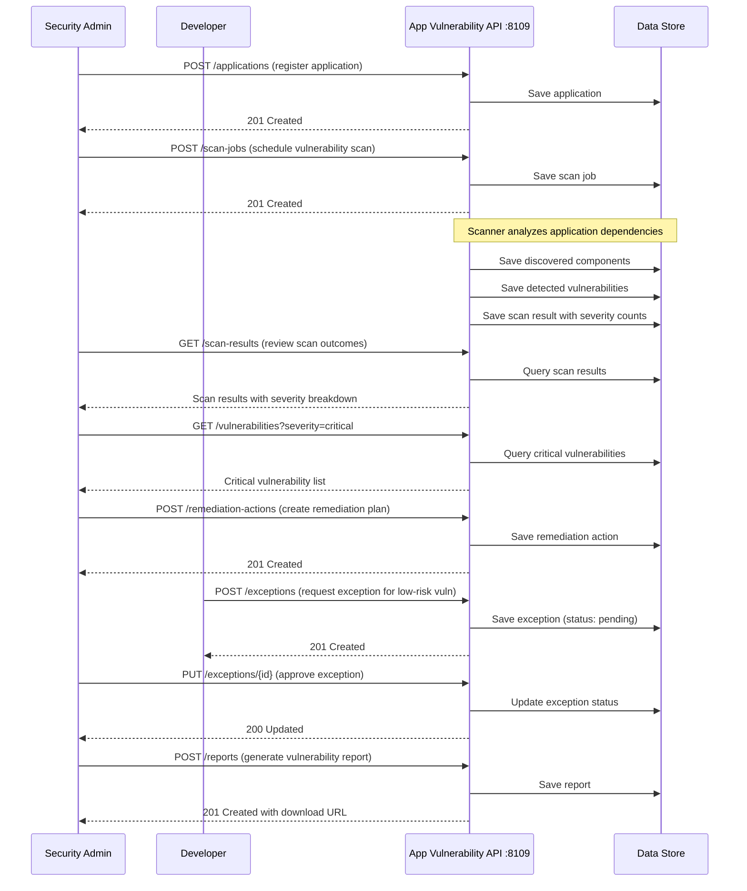
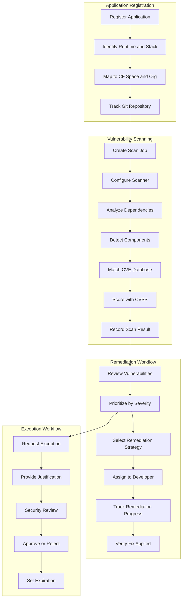
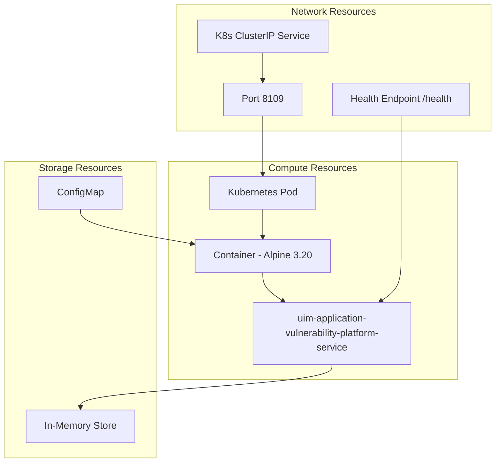
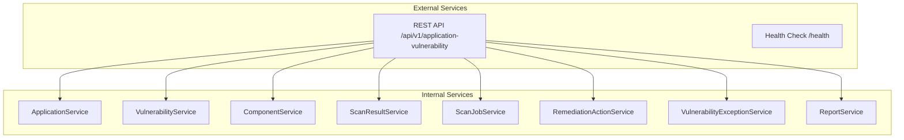

# NAF v4 Architecture Views — Application Vulnerability

NATO Architecture Framework v4 (NAFv4) views for the Application Vulnerability Service, modeled after SAP BTP Application Vulnerability Report.

## C1 — Capability Taxonomy

```mermaid
graph TB
    AV[Application Vulnerability]
    AV --> APM[Application Management]
    AV --> VUL[Vulnerability Detection]
    AV --> CMP[Component Analysis]
    AV --> SCN[Scan Management]
    AV --> REM[Remediation Management]
    AV --> EXC[Exception Management]
    AV --> RPT[Report Generation]

    APM --> APM1[Register Applications]
    APM --> APM2[Track Runtime and Buildpack]
    APM --> APM3[Monitor Application Status]
    APM --> APM4[Map to CF Spaces and Orgs]

    VUL --> VUL1[CVE-Based Detection]
    VUL --> VUL2[CVSS Scoring]
    VUL --> VUL3[Severity Classification]
    VUL --> VUL4[Affected Version Tracking]

    CMP --> CMP1[Third-Party Inventory]
    CMP --> CMP2[License Detection]
    CMP --> CMP3[Package URL Mapping]
    CMP --> CMP4[Version Freshness Check]

    SCN --> SCN1[Schedule Scan Jobs]
    SCN --> SCN2[Recurring Scans]
    SCN --> SCN3[Capture Scan Results]
    SCN --> SCN4[Severity Breakdown]

    REM --> REM1[Upgrade Strategy]
    REM --> REM2[Patch Strategy]
    REM --> REM3[Workaround Strategy]
    REM --> REM4[Accept Risk Strategy]

    EXC --> EXC1[Request Exception]
    EXC --> EXC2[Approval Workflow]
    EXC --> EXC3[Expiration Policy]
    EXC --> EXC4[Justification Tracking]

    RPT --> RPT1[PDF Reports]
    RPT --> RPT2[CSV Reports]
    RPT --> RPT3[JSON Reports]
    RPT --> RPT4[Severity Summaries]
```

## C2 — Enterprise Vision

The Application Vulnerability Service provides comprehensive open-source vulnerability management for deployed applications. It enables:

1. **Application Management** through registration of deployed applications across Cloud Foundry spaces and organizations with runtime, buildpack, stack, memory, and instance tracking
2. **Vulnerability Detection** through CVE-based scanning with CVSS v3.1 scoring, severity classification (critical, high, medium, low, informational), affected and fixed version tracking, and advisory linking
3. **Component Analysis** through automated inventory of third-party libraries and frameworks per application with license detection, Package URL (purl) mapping, ecosystem classification, and version freshness monitoring
4. **Scan Management** through scheduled and on-demand vulnerability scanning with configurable scanner settings, recurring schedules, trigger attribution, and detailed result capture including severity breakdowns and scan duration metrics
5. **Remediation Management** through creation of actionable remediation plans with strategy selection (upgrade, patch, workaround, accept risk), assignee tracking, effort estimation, and due date enforcement
6. **Exception Management** through structured exception requests with justification, multi-level approval workflows, expiration policies, and audit trails
7. **Report Generation** through vulnerability reports in PDF, CSV, JSON, and HTML formats with severity summaries, component counts, and time-limited download URLs

## L1 — Node Types

## L2 — Logical Scenario

## L4 — Logical Activity

## P1 — Resource Types

## S1 — Service Taxonomy

## Sv1 — Service Interface

| Service | Method | Path | Description |
|---------|--------|------|-------------|
| Applications | GET | `/api/v1/application-vulnerability/applications` | List all applications |
| Applications | POST | `/api/v1/application-vulnerability/applications` | Register application |
| Applications | GET | `/api/v1/application-vulnerability/applications/:id` | Get by ID |
| Applications | PUT | `/api/v1/application-vulnerability/applications/:id` | Update |
| Applications | DELETE | `/api/v1/application-vulnerability/applications/:id` | Delete |
| Vulnerabilities | GET | `/api/v1/application-vulnerability/vulnerabilities` | List all vulnerabilities |
| Vulnerabilities | POST | `/api/v1/application-vulnerability/vulnerabilities` | Create vulnerability |
| Vulnerabilities | GET | `/api/v1/application-vulnerability/vulnerabilities/:id` | Get by ID |
| Vulnerabilities | PUT | `/api/v1/application-vulnerability/vulnerabilities/:id` | Update |
| Vulnerabilities | DELETE | `/api/v1/application-vulnerability/vulnerabilities/:id` | Delete |
| Components | GET | `/api/v1/application-vulnerability/components` | List all components |
| Components | POST | `/api/v1/application-vulnerability/components` | Create component |
| Components | GET | `/api/v1/application-vulnerability/components/:id` | Get by ID |
| Components | PUT | `/api/v1/application-vulnerability/components/:id` | Update |
| Components | DELETE | `/api/v1/application-vulnerability/components/:id` | Delete |
| Scan Results | GET | `/api/v1/application-vulnerability/scan-results` | List all scan results |
| Scan Results | POST | `/api/v1/application-vulnerability/scan-results` | Create scan result |
| Scan Results | GET | `/api/v1/application-vulnerability/scan-results/:id` | Get by ID |
| Scan Results | PUT | `/api/v1/application-vulnerability/scan-results/:id` | Update |
| Scan Results | DELETE | `/api/v1/application-vulnerability/scan-results/:id` | Delete |
| Scan Jobs | GET | `/api/v1/application-vulnerability/scan-jobs` | List all scan jobs |
| Scan Jobs | POST | `/api/v1/application-vulnerability/scan-jobs` | Create scan job |
| Scan Jobs | GET | `/api/v1/application-vulnerability/scan-jobs/:id` | Get by ID |
| Scan Jobs | PUT | `/api/v1/application-vulnerability/scan-jobs/:id` | Update |
| Scan Jobs | DELETE | `/api/v1/application-vulnerability/scan-jobs/:id` | Delete |
| Remediation Actions | GET | `/api/v1/application-vulnerability/remediation-actions` | List all |
| Remediation Actions | POST | `/api/v1/application-vulnerability/remediation-actions` | Create |
| Remediation Actions | GET | `/api/v1/application-vulnerability/remediation-actions/:id` | Get by ID |
| Remediation Actions | PUT | `/api/v1/application-vulnerability/remediation-actions/:id` | Update |
| Remediation Actions | DELETE | `/api/v1/application-vulnerability/remediation-actions/:id` | Delete |
| Exceptions | GET | `/api/v1/application-vulnerability/exceptions` | List all exceptions |
| Exceptions | POST | `/api/v1/application-vulnerability/exceptions` | Request exception |
| Exceptions | GET | `/api/v1/application-vulnerability/exceptions/:id` | Get by ID |
| Exceptions | PUT | `/api/v1/application-vulnerability/exceptions/:id` | Update (approve/reject) |
| Exceptions | DELETE | `/api/v1/application-vulnerability/exceptions/:id` | Delete |
| Reports | GET | `/api/v1/application-vulnerability/reports` | List all reports |
| Reports | POST | `/api/v1/application-vulnerability/reports` | Generate report |
| Reports | GET | `/api/v1/application-vulnerability/reports/:id` | Get by ID |
| Reports | PUT | `/api/v1/application-vulnerability/reports/:id` | Update |
| Reports | DELETE | `/api/v1/application-vulnerability/reports/:id` | Delete |
| Health | GET | `/health` | Service health check |
