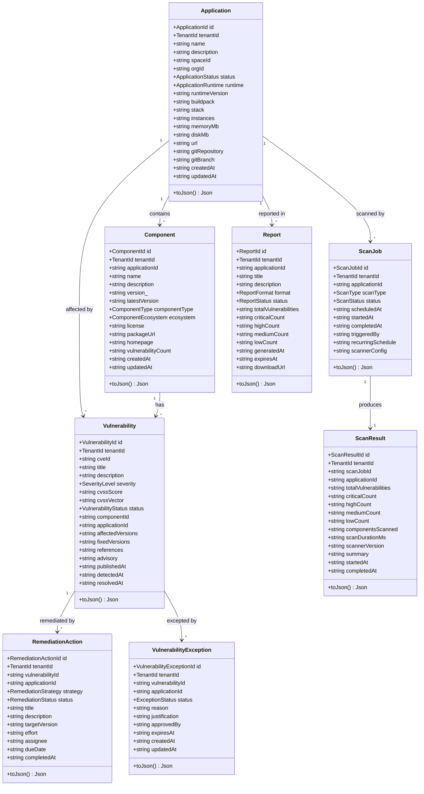
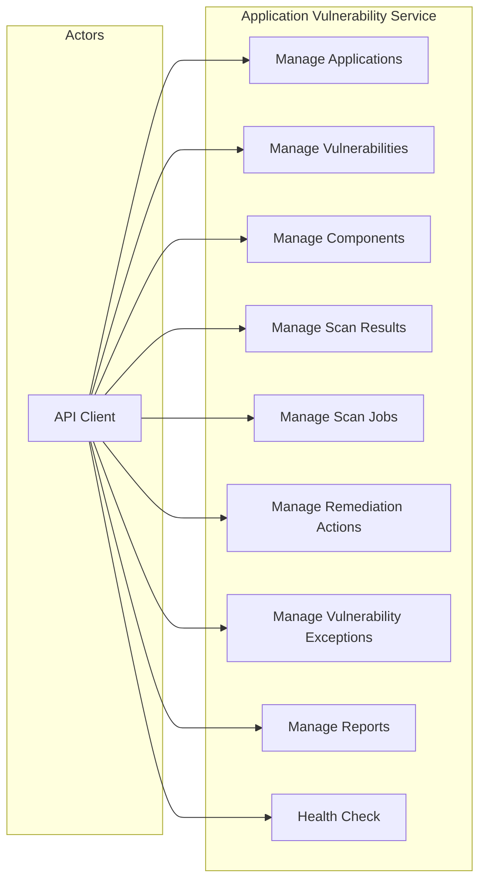
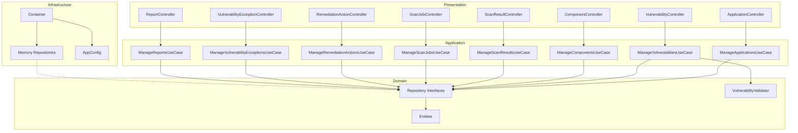
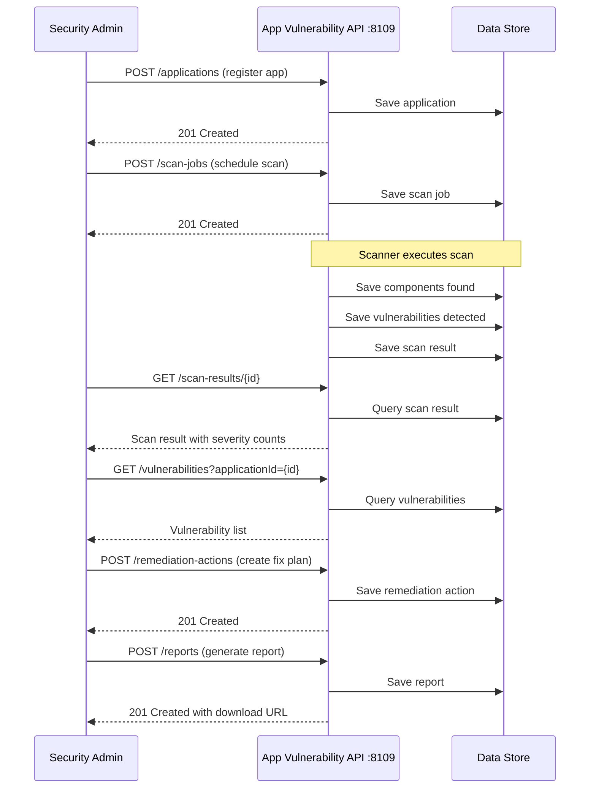
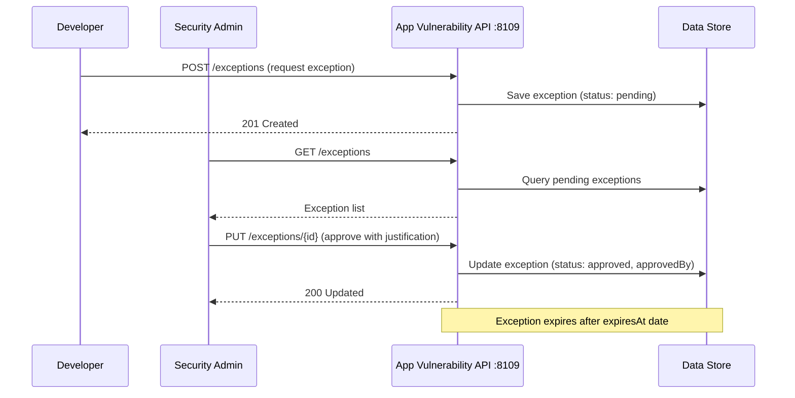

# Application Vulnerability — UML Diagrams

## Class Diagram — Domain Entities

## Class Diagram — Repository Interfaces

```mermaid
classDiagram
    class IApplicationRepository {
        <<interface>>
        +findAll() Application[]
        +findByTenant(tenantId) Application[]
        +findById(id) Application
        +findBySpaceId(spaceId) Application[]
        +save(entity) void
        +update(entity) void
        +removeById(id) void
    }

    class IVulnerabilityRepository {
        <<interface>>
        +findAll() Vulnerability[]
        +findByTenant(tenantId) Vulnerability[]
        +findById(id) Vulnerability
        +findByApplicationId(id) Vulnerability[]
        +findBySeverity(severity) Vulnerability[]
        +findByCveId(cveId) Vulnerability
        +save(entity) void
        +update(entity) void
        +removeById(id) void
    }

    class IComponentRepository {
        <<interface>>
        +findAll() Component[]
        +findByTenant(tenantId) Component[]
        +findById(id) Component
        +findByApplicationId(id) Component[]
        +save(entity) void
        +update(entity) void
        +removeById(id) void
    }

    class IScanResultRepository {
        <<interface>>
        +findAll() ScanResult[]
        +findByTenant(tenantId) ScanResult[]
        +findById(id) ScanResult
        +findByApplicationId(id) ScanResult[]
        +findByScanJobId(id) ScanResult
        +save(entity) void
        +update(entity) void
        +removeById(id) void
    }

    class IScanJobRepository {
        <<interface>>
        +findAll() ScanJob[]
        +findByTenant(tenantId) ScanJob[]
        +findById(id) ScanJob
        +findByApplicationId(id) ScanJob[]
        +findByStatus(status) ScanJob[]
        +save(entity) void
        +update(entity) void
        +removeById(id) void
    }

    class IRemediationActionRepository {
        <<interface>>
        +findAll() RemediationAction[]
        +findByTenant(tenantId) RemediationAction[]
        +findById(id) RemediationAction
        +findByVulnerabilityId(id) RemediationAction[]
        +findByApplicationId(id) RemediationAction[]
        +save(entity) void
        +update(entity) void
        +removeById(id) void
    }

    class IVulnerabilityExceptionRepository {
        <<interface>>
        +findAll() VulnerabilityException[]
        +findByTenant(tenantId) VulnerabilityException[]
        +findById(id) VulnerabilityException
        +findByVulnerabilityId(id) VulnerabilityException[]
        +findByApplicationId(id) VulnerabilityException[]
        +save(entity) void
        +update(entity) void
        +removeById(id) void
    }

    class IReportRepository {
        <<interface>>
        +findAll() Report[]
        +findByTenant(tenantId) Report[]
        +findById(id) Report
        +findByApplicationId(id) Report[]
        +save(entity) void
        +update(entity) void
        +removeById(id) void
    }
```

## Use Case Diagram

## Component Diagram

## Sequence Diagram — Vulnerability Scan Workflow

## Sequence Diagram — Exception Workflow

