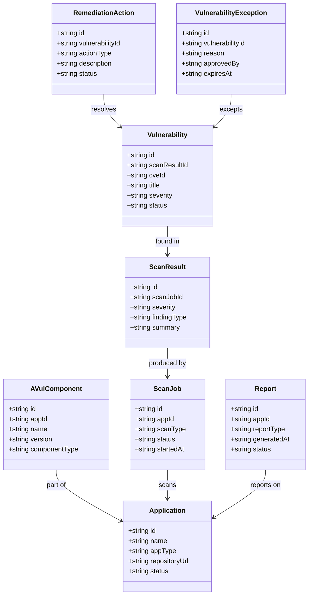
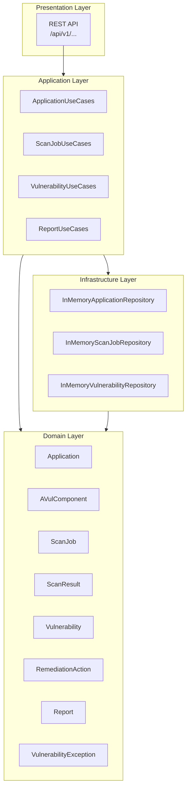
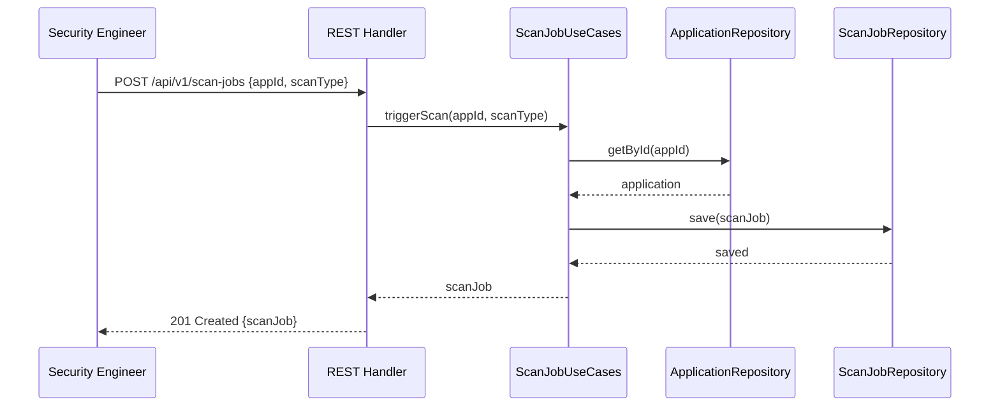

# UML Diagrams — Application Vulnerability Service

## Documentation update

This document is maintained alongside the implementation, deployment manifests, and tests for the same package so the service documentation stays aligned with the codebase.

## Class Diagram

```mermaid
classDiagram
    class Application {
        +string id
        +string name
        +string appType
        +string repositoryUrl
        +string status
    }
    class AVulComponent {
        +string id
        +string appId
        +string name
        +string version
        +string componentType
    }
    class ScanJob {
        +string id
        +string appId
        +string scanType
        +string status
        +string startedAt
    }
    class ScanResult {
        +string id
        +string scanJobId
        +string severity
        +string findingType
        +string summary
    }
    class Vulnerability {
        +string id
        +string scanResultId
        +string cveId
        +string title
        +string severity
        +string status
    }
    class RemediationAction {
        +string id
        +string vulnerabilityId
        +string actionType
        +string description
        +string status
    }
    class Report {
        +string id
        +string appId
        +string reportType
        +string generatedAt
        +string status
    }
    class VulnerabilityException {
        +string id
        +string vulnerabilityId
        +string reason
        +string approvedBy
        +string expiresAt
    }

    AVulComponent --> Application : part of
    ScanJob --> Application : scans
    ScanResult --> ScanJob : produced by
    Vulnerability --> ScanResult : found in
    RemediationAction --> Vulnerability : resolves
    Report --> Application : reports on
    VulnerabilityException --> Vulnerability : excepts
```

## AVulComponent Diagram

```mermaid
flowchart TB
    subgraph Presentation["Presentation Layer"]
        REST["REST API\n/api/v1/..."]
    end
    subgraph Application["Application Layer"]
        APP_UC["ApplicationUseCases"]
        SCAN_UC["ScanJobUseCases"]
        VULN_UC["VulnerabilityUseCases"]
        REPORT_UC["ReportUseCases"]
    end
    subgraph Domain["Domain Layer"]
        APP["Application"]
        COMP["AVulComponent"]
        SCAN["ScanJob"]
        RESULT["ScanResult"]
        VULN["Vulnerability"]
        REM["RemediationAction"]
        REP["Report"]
        EXC["VulnerabilityException"]
    end
    subgraph Infrastructure["Infrastructure Layer"]
        APP_REPO["InMemoryApplicationRepository"]
        SCAN_REPO["InMemoryScanJobRepository"]
        VULN_REPO["InMemoryVulnerabilityRepository"]
    end

    REST --> Application
    Application --> Domain
    Infrastructure --> Domain
    Application --> Infrastructure
```

## Sequence Diagram — Trigger Vulnerability Scan

```mermaid
sequenceDiagram
    participant S as Security Engineer
    participant R as REST Handler
    participant UC as ScanJobUseCases
    participant AR as ApplicationRepository
    participant SR as ScanJobRepository

    S->>R: POST /api/v1/scan-jobs {appId, scanType}
    R->>UC: triggerScan(appId, scanType)
    UC->>AR: getById(appId)
    AR-->>UC: application
    UC->>SR: save(scanJob)
    SR-->>UC: saved
    UC-->>R: scanJob
    R-->>S: 201 Created {scanJob}
```
