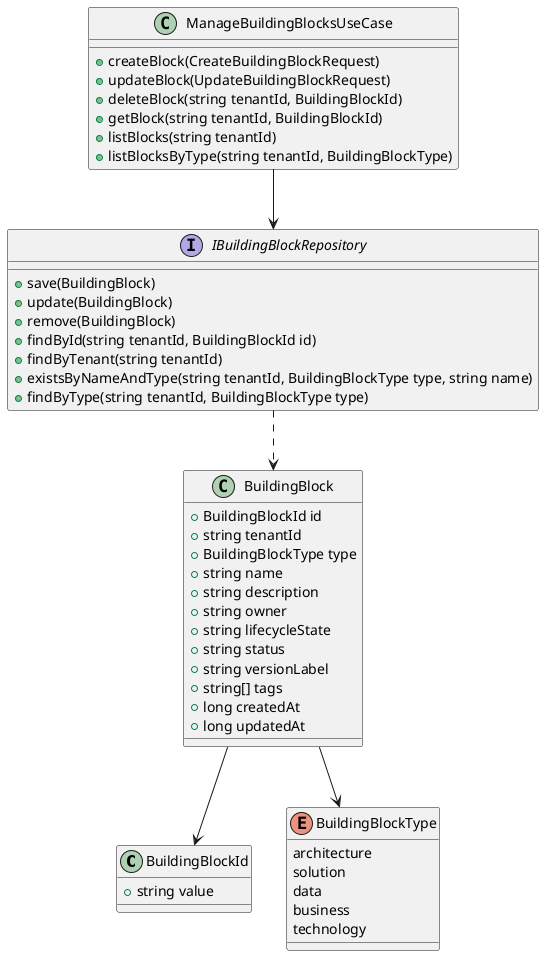
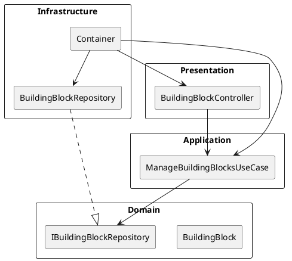

# UML - TOGAF Building Blocks Service

## Domain Class Diagram

```plantuml
@startuml architecture-domain

class BuildingBlockId {
  +string value
}

enum BuildingBlockType {
  architecture
  solution
  data
  business
  technology
}

class BuildingBlock {
  +BuildingBlockId id
  +string tenantId
  +BuildingBlockType type
  +string name
  +string description
  +string owner
  +string lifecycleState
  +string status
  +string versionLabel
  +string[] tags
  +long createdAt
  +long updatedAt
}

interface IBuildingBlockRepository {
  +save(BuildingBlock)
  +update(BuildingBlock)
  +remove(BuildingBlock)
  +findById(string tenantId, BuildingBlockId id)
  +findByTenant(string tenantId)
  +existsByNameAndType(string tenantId, BuildingBlockType type, string name)
  +findByType(string tenantId, BuildingBlockType type)
}

class ManageBuildingBlocksUseCase {
  +createBlock(CreateBuildingBlockRequest)
  +updateBlock(UpdateBuildingBlockRequest)
  +deleteBlock(string tenantId, BuildingBlockId)
  +getBlock(string tenantId, BuildingBlockId)
  +listBlocks(string tenantId)
  +listBlocksByType(string tenantId, BuildingBlockType)
}

ManageBuildingBlocksUseCase --> IBuildingBlockRepository
IBuildingBlockRepository ..> BuildingBlock
BuildingBlock --> BuildingBlockType
BuildingBlock --> BuildingBlockId

@enduml
```

## Layered / Hexagonal Diagram

```plantuml
@startuml architecture-hexagonal

skinparam componentStyle rectangle

rectangle "Presentation" {
  [BuildingBlockController]
}

rectangle "Application" {
  [ManageBuildingBlocksUseCase]
}

rectangle "Domain" {
  [BuildingBlock]
  [IBuildingBlockRepository]
}

rectangle "Infrastructure" {
  [BuildingBlockRepository]
  [Container]
}

[BuildingBlockController] --> [ManageBuildingBlocksUseCase]
[ManageBuildingBlocksUseCase] --> [IBuildingBlockRepository]
[BuildingBlockRepository] ..|> [IBuildingBlockRepository]
[Container] --> [BuildingBlockController]
[Container] --> [ManageBuildingBlocksUseCase]
[Container] --> [BuildingBlockRepository]

@enduml
```
