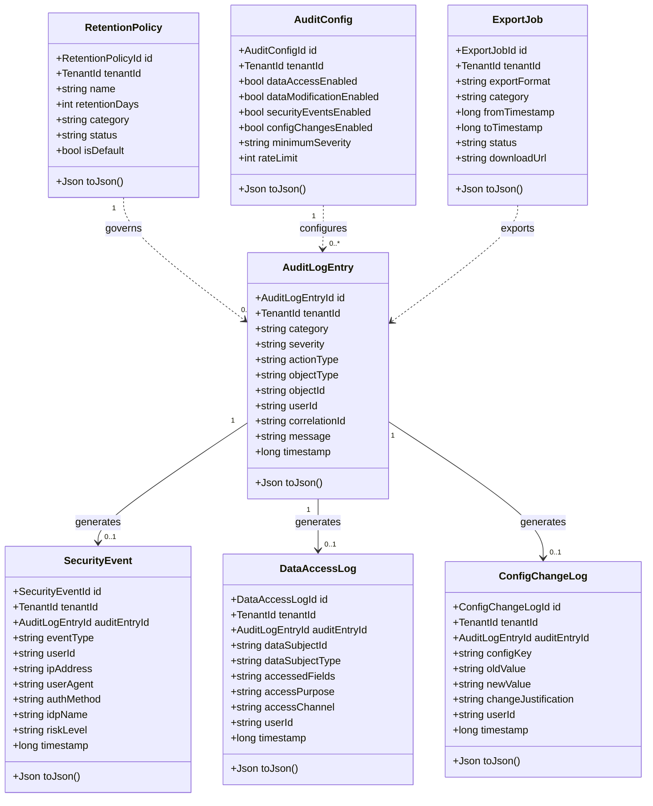
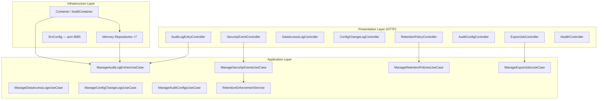
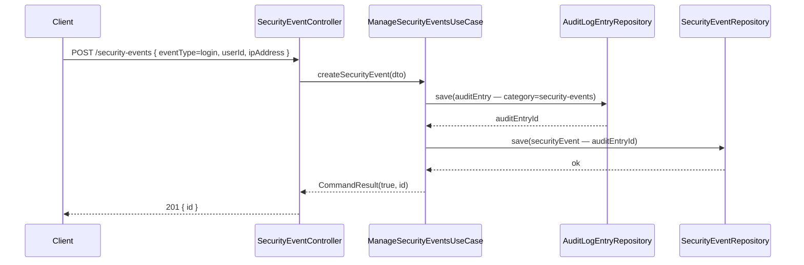
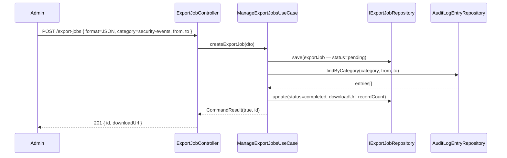

# UML — Audit Log Service

## Class Diagram — Domain Entities

```mermaid
classDiagram
    class AuditLogEntry {
        +AuditLogEntryId id
        +TenantId tenantId
        +string category
        +string severity
        +string actionType
        +string objectType
        +string objectId
        +string userId
        +string correlationId
        +string message
        +long timestamp
        +Json toJson()
    }
    class SecurityEvent {
        +SecurityEventId id
        +TenantId tenantId
        +AuditLogEntryId auditEntryId
        +string eventType
        +string userId
        +string ipAddress
        +string userAgent
        +string authMethod
        +string idpName
        +string riskLevel
        +long timestamp
        +Json toJson()
    }
    class DataAccessLog {
        +DataAccessLogId id
        +TenantId tenantId
        +AuditLogEntryId auditEntryId
        +string dataSubjectId
        +string dataSubjectType
        +string accessedFields
        +string accessPurpose
        +string accessChannel
        +string userId
        +long timestamp
        +Json toJson()
    }
    class ConfigChangeLog {
        +ConfigChangeLogId id
        +TenantId tenantId
        +AuditLogEntryId auditEntryId
        +string configKey
        +string oldValue
        +string newValue
        +string changeJustification
        +string userId
        +long timestamp
        +Json toJson()
    }
    class RetentionPolicy {
        +RetentionPolicyId id
        +TenantId tenantId
        +string name
        +int retentionDays
        +string category
        +string status
        +bool isDefault
        +Json toJson()
    }
    class AuditConfig {
        +AuditConfigId id
        +TenantId tenantId
        +bool dataAccessEnabled
        +bool dataModificationEnabled
        +bool securityEventsEnabled
        +bool configChangesEnabled
        +string minimumSeverity
        +int rateLimit
        +Json toJson()
    }
    class ExportJob {
        +ExportJobId id
        +TenantId tenantId
        +string exportFormat
        +string category
        +long fromTimestamp
        +long toTimestamp
        +string status
        +string downloadUrl
        +Json toJson()
    }

    AuditLogEntry "1" --> "0..1" SecurityEvent : generates
    AuditLogEntry "1" --> "0..1" DataAccessLog : generates
    AuditLogEntry "1" --> "0..1" ConfigChangeLog : generates
    RetentionPolicy "1" ..> "0..*" AuditLogEntry : governs
    AuditConfig "1" ..> "0..*" AuditLogEntry : configures
    ExportJob ..> AuditLogEntry : exports
```

---

## Component Diagram

```mermaid
flowchart TB
    subgraph Presentation["Presentation Layer (HTTP)"]
        C1[AuditLogEntryController]
        C2[SecurityEventController]
        C3[DataAccessLogController]
        C4[ConfigChangeLogController]
        C5[RetentionPolicyController]
        C6[AuditConfigController]
        C7[ExportJobController]
        HC[HealthController]
    end
    subgraph Application["Application Layer"]
        UC1[ManageAuditLogEntriesUseCase]
        UC2[ManageSecurityEventsUseCase]
        UC3[ManageDataAccessLogsUseCase]
        UC4[ManageConfigChangeLogsUseCase]
        UC5[ManageRetentionPoliciesUseCase]
        UC6[ManageAuditConfigsUseCase]
        UC7[ManageExportJobsUseCase]
        RET[RetentionEnforcementService]
    end
    subgraph Infrastructure["Infrastructure Layer"]
        MEM[Memory Repositories ×7]
        CFG[SrvConfig — port 8085]
        CTR[Container / buildContainer]
    end

    C1 --> UC1
    C2 --> UC2
    C5 --> UC5
    C7 --> UC7
    UC2 --> RET
    MEM --> UC1
    CTR --> UC1
    CTR --> MEM
```

---

## Sequence Diagram — Write Security Event

```mermaid
sequenceDiagram
    participant Client
    participant SEC as SecurityEventController
    participant SUC as ManageSecurityEventsUseCase
    participant AR as AuditLogEntryRepository
    participant SR as SecurityEventRepository

    Client->>SEC: POST /security-events { eventType=login, userId, ipAddress }
    SEC->>SUC: createSecurityEvent(dto)
    SUC->>AR: save(auditEntry — category=security-events)
    AR-->>SUC: auditEntryId
    SUC->>SR: save(securityEvent — auditEntryId)
    SR-->>SUC: ok
    SUC-->>SEC: CommandResult(true, id)
    SEC-->>Client: 201 { id }
```

---

## Sequence Diagram — Export Job

```mermaid
sequenceDiagram
    participant Admin
    participant EC as ExportJobController
    participant EUC as ManageExportJobsUseCase
    participant ER as IExportJobRepository
    participant AR as AuditLogEntryRepository

    Admin->>EC: POST /export-jobs { format=JSON, category=security-events, from, to }
    EC->>EUC: createExportJob(dto)
    EUC->>ER: save(exportJob — status=pending)
    EUC->>AR: findByCategory(category, from, to)
    AR-->>EUC: entries[]
    EUC->>ER: update(status=completed, downloadUrl, recordCount)
    EUC-->>EC: CommandResult(true, id)
    EC-->>Admin: 201 { id, downloadUrl }
```
