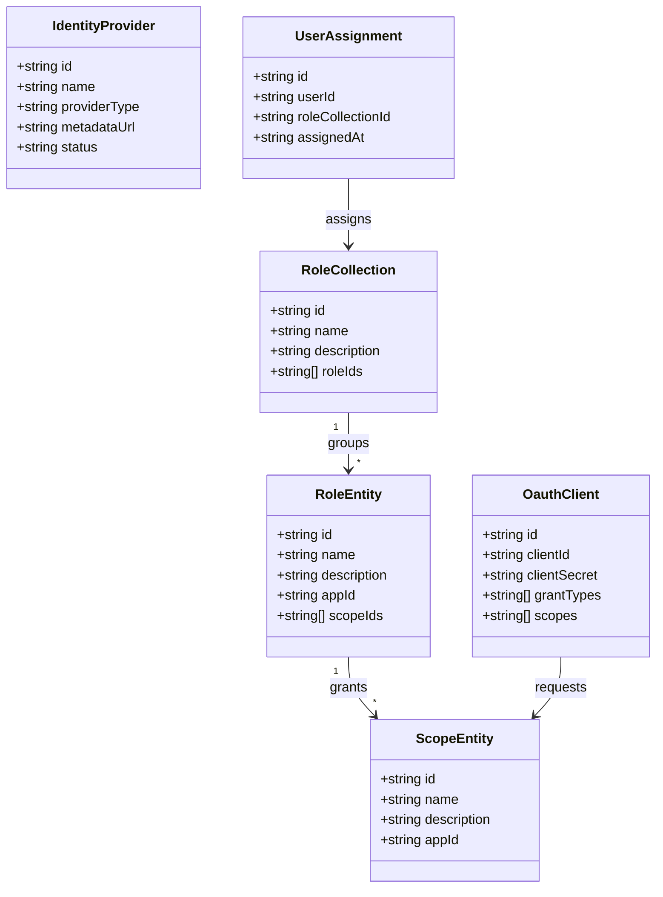
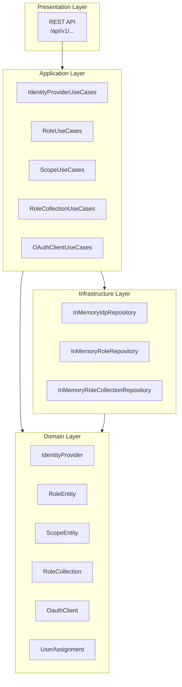
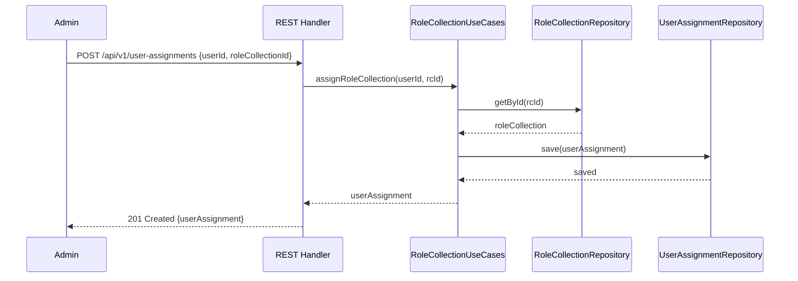

# UML Diagrams — Authorization and Trust Management Service

## Class Diagram

```mermaid
classDiagram
    class IdentityProvider {
        +string id
        +string name
        +string providerType
        +string metadataUrl
        +string status
    }
    class RoleEntity {
        +string id
        +string name
        +string description
        +string appId
        +string[] scopeIds
    }
    class OauthClient {
        +string id
        +string clientId
        +string clientSecret
        +string[] grantTypes
        +string[] scopes
    }
    class ScopeEntity {
        +string id
        +string name
        +string description
        +string appId
    }
    class RoleCollection {
        +string id
        +string name
        +string description
        +string[] roleIds
    }
    class UserAssignment {
        +string id
        +string userId
        +string roleCollectionId
        +string assignedAt
    }

    RoleCollection "1" --> "*" RoleEntity : groups
    RoleEntity "1" --> "*" ScopeEntity : grants
    UserAssignment --> RoleCollection : assigns
    OauthClient --> ScopeEntity : requests
```

## Component Diagram

```mermaid
flowchart TB
    subgraph Presentation["Presentation Layer"]
        REST["REST API\n/api/v1/..."]
    end
    subgraph Application["Application Layer"]
        IDP_UC["IdentityProviderUseCases"]
        ROLE_UC["RoleUseCases"]
        SCOPE_UC["ScopeUseCases"]
        RC_UC["RoleCollectionUseCases"]
        CLIENT_UC["OAuthClientUseCases"]
    end
    subgraph Domain["Domain Layer"]
        IDP["IdentityProvider"]
        ROLE["RoleEntity"]
        SCOPE["ScopeEntity"]
        RC["RoleCollection"]
        CLIENT["OauthClient"]
        UA["UserAssignment"]
    end
    subgraph Infrastructure["Infrastructure Layer"]
        IDP_REPO["InMemoryIdpRepository"]
        ROLE_REPO["InMemoryRoleRepository"]
        RC_REPO["InMemoryRoleCollectionRepository"]
    end

    REST --> Application
    Application --> Domain
    Infrastructure --> Domain
    Application --> Infrastructure
```

## Sequence Diagram — Assign Role Collection to User

```mermaid
sequenceDiagram
    participant A as Admin
    participant R as REST Handler
    participant UC as RoleCollectionUseCases
    participant RCR as RoleCollectionRepository
    participant UAR as UserAssignmentRepository

    A->>R: POST /api/v1/user-assignments {userId, roleCollectionId}
    R->>UC: assignRoleCollection(userId, rcId)
    UC->>RCR: getById(rcId)
    RCR-->>UC: roleCollection
    UC->>UAR: save(userAssignment)
    UAR-->>UC: saved
    UC-->>R: userAssignment
    R-->>A: 201 Created {userAssignment}
```
