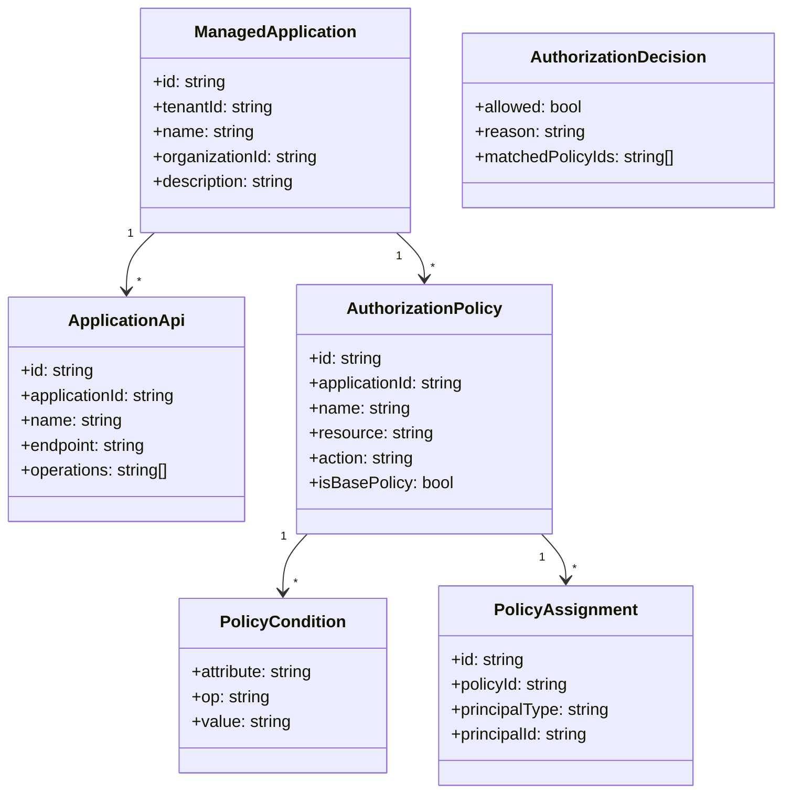
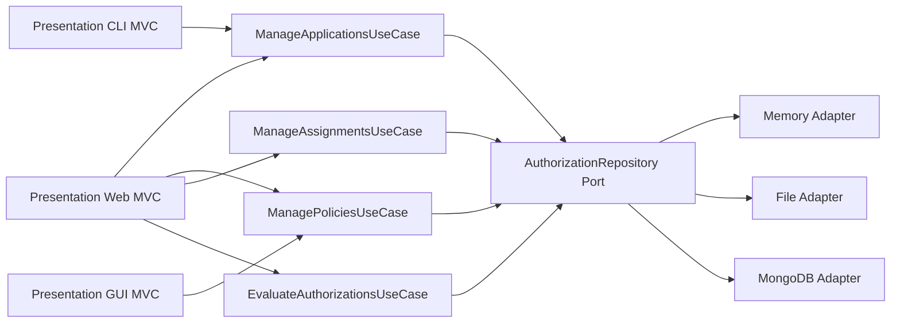

# UML - Authorization Management Service

## Documentation update

This document is maintained alongside the implementation, deployment manifests, and tests for the same package so the service documentation stays aligned with the codebase.

## Domain Class Diagram

## Component Diagram

