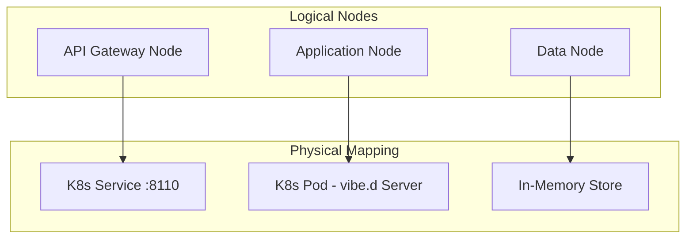
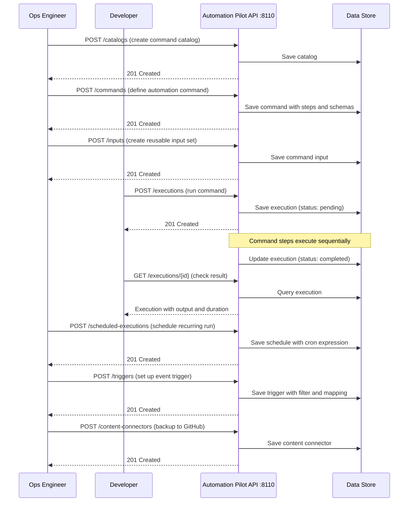
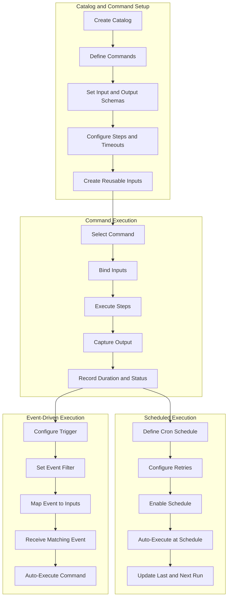
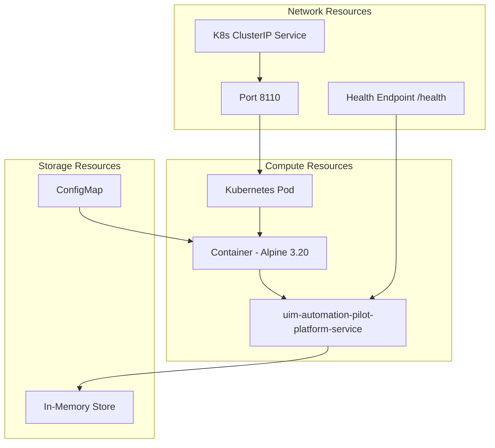
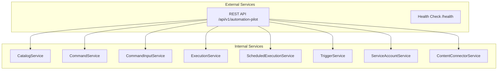

# NAF v4 Architecture Views — Automation Pilot

NATO Architecture Framework v4 (NAFv4) views for the Automation Pilot Service, modeled after SAP Automation Pilot.

## C1 — Capability Taxonomy

```mermaid
graph TB
    AP[Automation Pilot]
    AP --> CAT[Catalog Management]
    AP --> CMD[Command Design]
    AP --> INP[Input Management]
    AP --> EXE[Execution Engine]
    AP --> SCH[Schedule Management]
    AP --> TRG[Trigger Management]
    AP --> SAC[Service Account Management]
    AP --> CCN[Content Connector Management]

    CAT --> CAT1[Create Catalogs]
    CAT --> CAT2[Version Catalogs]
    CAT --> CAT3[Tag and Classify]
    CAT --> CAT4[Built-in vs Custom]

    CMD --> CMD1[Define Input and Output Schemas]
    CMD --> CMD2[Multi-Step Execution Logic]
    CMD --> CMD3[Timeout and Retry Policies]
    CMD --> CMD4[Version Control]

    INP --> INP1[Reusable Key-Value Sets]
    INP --> INP2[Sensitive Value Masking]
    INP --> INP3[Cross-Command Sharing]
    INP --> INP4[Input Versioning]

    EXE --> EXE1[On-Demand Execution]
    EXE --> EXE2[Status Tracking]
    EXE --> EXE3[Output Capture]
    EXE --> EXE4[Error Logging]

    SCH --> SCH1[Cron-Based Scheduling]
    SCH --> SCH2[One-Time Scheduling]
    SCH --> SCH3[Retry Configuration]
    SCH --> SCH4[Enable and Disable Toggles]

    TRG --> TRG1[Event Type Filtering]
    TRG --> TRG2[Event Source Binding]
    TRG --> TRG3[Filter Expressions]
    TRG --> TRG4[Input Mapping]

    SAC --> SAC1[API Credential Management]
    SAC --> SAC2[Permission Scoping]
    SAC --> SAC3[Expiration Policies]
    SAC --> SAC4[Usage Tracking]

    CCN --> CCN1[GitHub Repository Backup]
    CCN --> CCN2[Branch Configuration]
    CCN --> CCN3[Path Mapping]
    CCN --> CCN4[Restore Operations]
```

## C2 — Enterprise Vision

The Automation Pilot Service provides comprehensive DevOps automation capabilities for cloud operations. It enables:

1. **Catalog Management** through organized groupings of automation commands with versioning, tagging, and classification into built-in and custom catalogs for structured command discovery and governance
2. **Command Design** through definition of automation workflows with typed input/output schemas, multi-step execution logic, configurable timeout and retry policies, and full version history
3. **Input Management** through creation of reusable key-value input sets that can be shared across commands, with support for sensitive value masking, input type classification, and versioned input definitions
4. **Execution Engine** through on-demand command execution with real-time status tracking (pending, running, completed, failed, cancelled), input binding, output capture, error logging, and duration measurement
5. **Schedule Management** through cron-based and one-time scheduling of command executions with retry configuration, enable/disable controls, and automatic next-run calculation
6. **Trigger Management** through event-driven automation with configurable event type and source filtering, filter expressions for event matching, and input mapping from event payloads to command inputs
7. **Service Account Management** through API access credential lifecycle management with permission scoping, client ID tracking, expiration policies, and usage auditing
8. **Content Connector Management** through backup and restore of automation content to external repositories (GitHub) with branch and path configuration

## L1 — Node Types

## L2 — Logical Scenario

## L4 — Logical Activity

## P1 — Resource Types

## S1 — Service Taxonomy

## Sv1 — Service Interface

| Service | Method | Path | Description |
|---------|--------|------|-------------|
| Catalogs | GET | `/api/v1/automation-pilot/catalogs` | List all catalogs |
| Catalogs | POST | `/api/v1/automation-pilot/catalogs` | Create catalog |
| Catalogs | GET | `/api/v1/automation-pilot/catalogs/:id` | Get by ID |
| Catalogs | PUT | `/api/v1/automation-pilot/catalogs/:id` | Update |
| Catalogs | DELETE | `/api/v1/automation-pilot/catalogs/:id` | Delete |
| Commands | GET | `/api/v1/automation-pilot/commands` | List all commands |
| Commands | POST | `/api/v1/automation-pilot/commands` | Create command |
| Commands | GET | `/api/v1/automation-pilot/commands/:id` | Get by ID |
| Commands | PUT | `/api/v1/automation-pilot/commands/:id` | Update |
| Commands | DELETE | `/api/v1/automation-pilot/commands/:id` | Delete |
| Inputs | GET | `/api/v1/automation-pilot/inputs` | List all inputs |
| Inputs | POST | `/api/v1/automation-pilot/inputs` | Create input |
| Inputs | GET | `/api/v1/automation-pilot/inputs/:id` | Get by ID |
| Inputs | PUT | `/api/v1/automation-pilot/inputs/:id` | Update |
| Inputs | DELETE | `/api/v1/automation-pilot/inputs/:id` | Delete |
| Executions | GET | `/api/v1/automation-pilot/executions` | List all executions |
| Executions | POST | `/api/v1/automation-pilot/executions` | Execute command |
| Executions | GET | `/api/v1/automation-pilot/executions/:id` | Get by ID |
| Executions | PUT | `/api/v1/automation-pilot/executions/:id` | Update |
| Executions | DELETE | `/api/v1/automation-pilot/executions/:id` | Delete |
| Scheduled Executions | GET | `/api/v1/automation-pilot/scheduled-executions` | List all |
| Scheduled Executions | POST | `/api/v1/automation-pilot/scheduled-executions` | Schedule |
| Scheduled Executions | GET | `/api/v1/automation-pilot/scheduled-executions/:id` | Get by ID |
| Scheduled Executions | PUT | `/api/v1/automation-pilot/scheduled-executions/:id` | Update |
| Scheduled Executions | DELETE | `/api/v1/automation-pilot/scheduled-executions/:id` | Delete |
| Triggers | GET | `/api/v1/automation-pilot/triggers` | List all triggers |
| Triggers | POST | `/api/v1/automation-pilot/triggers` | Create trigger |
| Triggers | GET | `/api/v1/automation-pilot/triggers/:id` | Get by ID |
| Triggers | PUT | `/api/v1/automation-pilot/triggers/:id` | Update |
| Triggers | DELETE | `/api/v1/automation-pilot/triggers/:id` | Delete |
| Service Accounts | GET | `/api/v1/automation-pilot/service-accounts` | List all |
| Service Accounts | POST | `/api/v1/automation-pilot/service-accounts` | Create |
| Service Accounts | GET | `/api/v1/automation-pilot/service-accounts/:id` | Get by ID |
| Service Accounts | PUT | `/api/v1/automation-pilot/service-accounts/:id` | Update |
| Service Accounts | DELETE | `/api/v1/automation-pilot/service-accounts/:id` | Delete |
| Content Connectors | GET | `/api/v1/automation-pilot/content-connectors` | List all |
| Content Connectors | POST | `/api/v1/automation-pilot/content-connectors` | Create |
| Content Connectors | GET | `/api/v1/automation-pilot/content-connectors/:id` | Get by ID |
| Content Connectors | PUT | `/api/v1/automation-pilot/content-connectors/:id` | Update |
| Content Connectors | DELETE | `/api/v1/automation-pilot/content-connectors/:id` | Delete |
| Health | GET | `/health` | Service health check |
