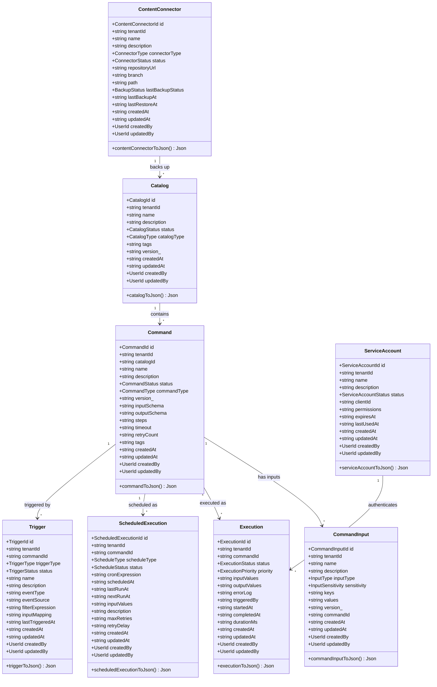
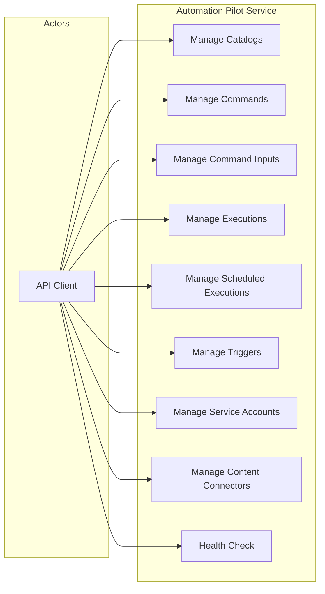
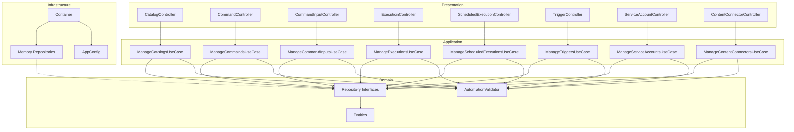
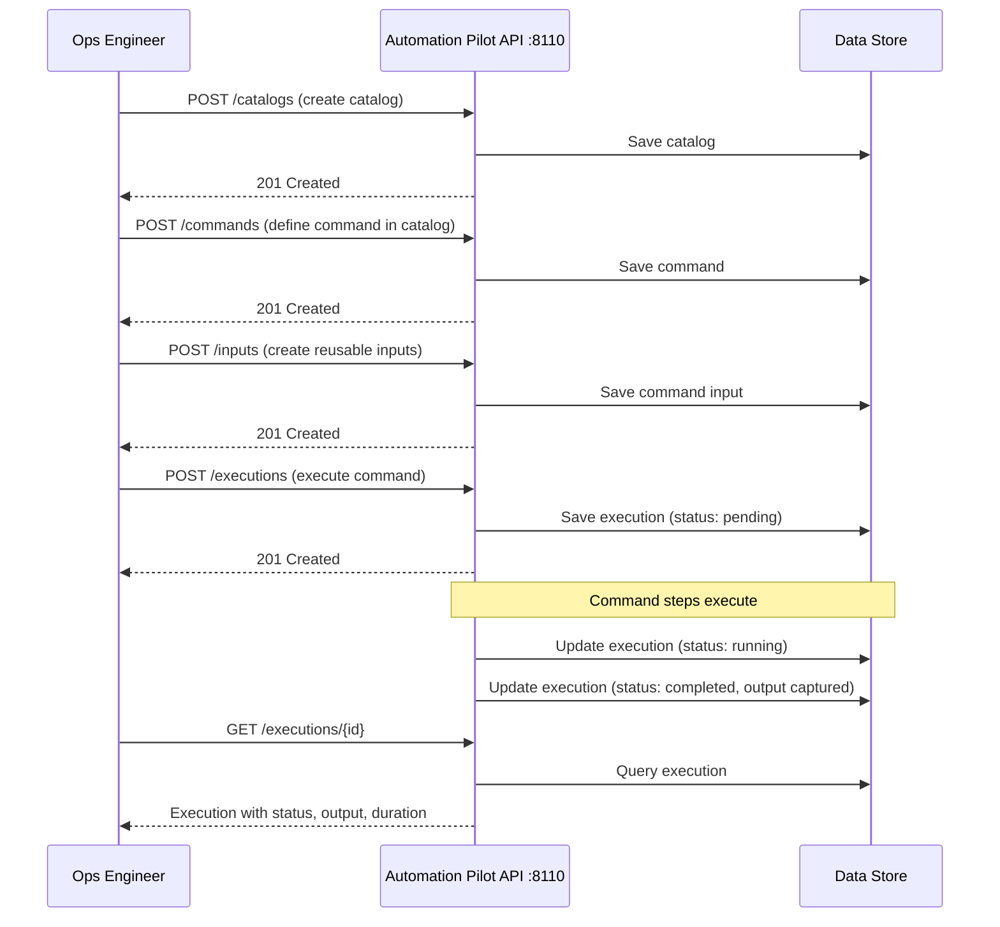
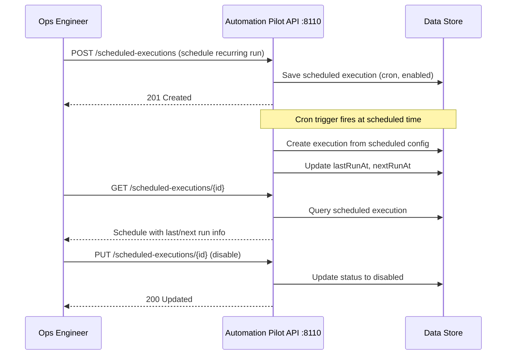
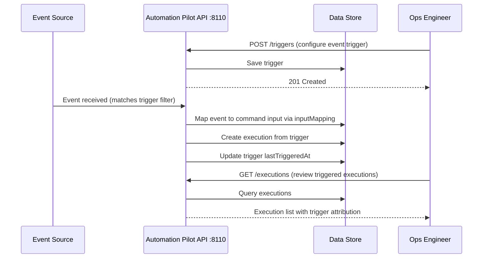

# Automation Pilot — UML Diagrams

## Class Diagram — Domain Entities

## Class Diagram — Repository Interfaces

```mermaid
classDiagram
    class ICatalogRepository {
        <<interface>>
        +findAll() Catalog[]
        +findByTenant(tenantId) Catalog[]
        +findById(id) Catalog
        +existsById(id) bool
        +findByName(name) Catalog
        +save(entity) void
        +update(entity) void
        +remove(id) void
    }

    class ICommandRepository {
        <<interface>>
        +findAll() Command[]
        +findByTenant(tenantId) Command[]
        +findById(id) Command
        +existsById(id) bool
        +findByCatalogId(id) Command[]
        +save(entity) void
        +update(entity) void
        +remove(id) void
    }

    class ICommandInputRepository {
        <<interface>>
        +findAll() CommandInput[]
        +findByTenant(tenantId) CommandInput[]
        +findById(id) CommandInput
        +existsById(id) bool
        +findByCommandId(id) CommandInput[]
        +save(entity) void
        +update(entity) void
        +remove(id) void
    }

    class IExecutionRepository {
        <<interface>>
        +findAll() Execution[]
        +findByTenant(tenantId) Execution[]
        +findById(id) Execution
        +existsById(id) bool
        +findByCommandId(id) Execution[]
        +findByStatus(status) Execution[]
        +save(entity) void
        +update(entity) void
        +remove(id) void
    }

    class IScheduledExecutionRepository {
        <<interface>>
        +findAll() ScheduledExecution[]
        +findByTenant(tenantId) ScheduledExecution[]
        +findById(id) ScheduledExecution
        +existsById(id) bool
        +findByCommandId(id) ScheduledExecution[]
        +save(entity) void
        +update(entity) void
        +remove(id) void
    }

    class ITriggerRepository {
        <<interface>>
        +findAll() Trigger[]
        +findByTenant(tenantId) Trigger[]
        +findById(id) Trigger
        +existsById(id) bool
        +findByCommandId(id) Trigger[]
        +findByEventType(type) Trigger[]
        +save(entity) void
        +update(entity) void
        +remove(id) void
    }

    class IServiceAccountRepository {
        <<interface>>
        +findAll() ServiceAccount[]
        +findByTenant(tenantId) ServiceAccount[]
        +findById(id) ServiceAccount
        +existsById(id) bool
        +findByClientId(clientId) ServiceAccount
        +save(entity) void
        +update(entity) void
        +remove(id) void
    }

    class IContentConnectorRepository {
        <<interface>>
        +findAll() ContentConnector[]
        +findByTenant(tenantId) ContentConnector[]
        +findById(id) ContentConnector
        +existsById(id) bool
        +save(entity) void
        +update(entity) void
        +remove(id) void
    }
```

## Use Case Diagram

## Component Diagram

## Sequence Diagram — Command Execution Workflow

## Sequence Diagram — Scheduled Execution Workflow

## Sequence Diagram — Trigger-Based Execution

