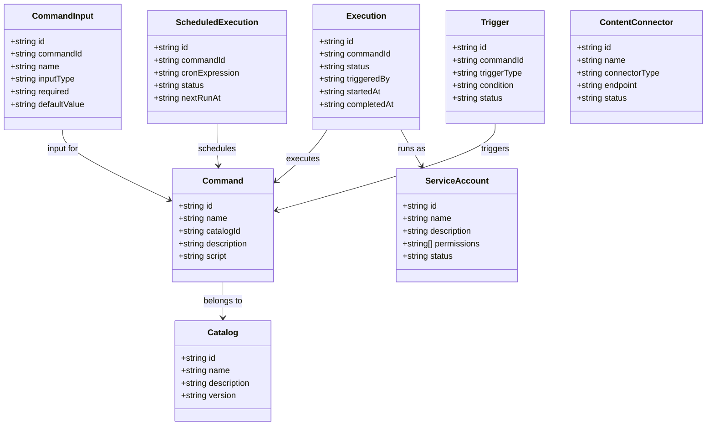
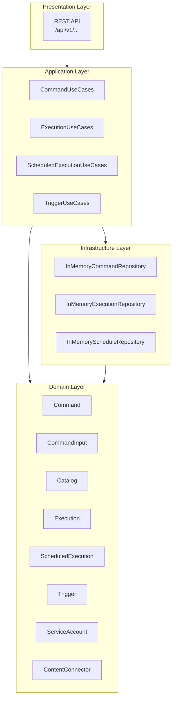
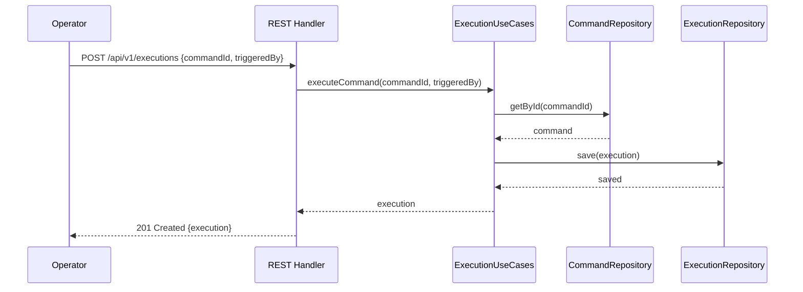

# UML Diagrams — Automation Pilot Service

## Class Diagram

```mermaid
classDiagram
    class Command {
        +string id
        +string name
        +string catalogId
        +string description
        +string script
    }
    class CommandInput {
        +string id
        +string commandId
        +string name
        +string inputType
        +string required
        +string defaultValue
    }
    class Catalog {
        +string id
        +string name
        +string description
        +string version
    }
    class Execution {
        +string id
        +string commandId
        +string status
        +string triggeredBy
        +string startedAt
        +string completedAt
    }
    class ScheduledExecution {
        +string id
        +string commandId
        +string cronExpression
        +string status
        +string nextRunAt
    }
    class Trigger {
        +string id
        +string commandId
        +string triggerType
        +string condition
        +string status
    }
    class ServiceAccount {
        +string id
        +string name
        +string description
        +string[] permissions
        +string status
    }
    class ContentConnector {
        +string id
        +string name
        +string connectorType
        +string endpoint
        +string status
    }

    Command --> Catalog : belongs to
    CommandInput --> Command : input for
    Execution --> Command : executes
    ScheduledExecution --> Command : schedules
    Trigger --> Command : triggers
    Execution --> ServiceAccount : runs as
```

## Component Diagram

```mermaid
flowchart TB
    subgraph Presentation["Presentation Layer"]
        REST["REST API\n/api/v1/..."]
    end
    subgraph Application["Application Layer"]
        CMD_UC["CommandUseCases"]
        EXEC_UC["ExecutionUseCases"]
        SCHED_UC["ScheduledExecutionUseCases"]
        TRIGGER_UC["TriggerUseCases"]
    end
    subgraph Domain["Domain Layer"]
        CMD["Command"]
        INPUT["CommandInput"]
        CATALOG["Catalog"]
        EXEC["Execution"]
        SCHED["ScheduledExecution"]
        TRIG["Trigger"]
        SA["ServiceAccount"]
        CC["ContentConnector"]
    end
    subgraph Infrastructure["Infrastructure Layer"]
        CMD_REPO["InMemoryCommandRepository"]
        EXEC_REPO["InMemoryExecutionRepository"]
        SCHED_REPO["InMemoryScheduleRepository"]
    end

    REST --> Application
    Application --> Domain
    Infrastructure --> Domain
    Application --> Infrastructure
```

## Sequence Diagram — Execute Command

```mermaid
sequenceDiagram
    participant O as Operator
    participant R as REST Handler
    participant UC as ExecutionUseCases
    participant CR as CommandRepository
    participant ER as ExecutionRepository

    O->>R: POST /api/v1/executions {commandId, triggeredBy}
    R->>UC: executeCommand(commandId, triggeredBy)
    UC->>CR: getById(commandId)
    CR-->>UC: command
    UC->>ER: save(execution)
    ER-->>UC: saved
    UC-->>R: execution
    R-->>O: 201 Created {execution}
```
