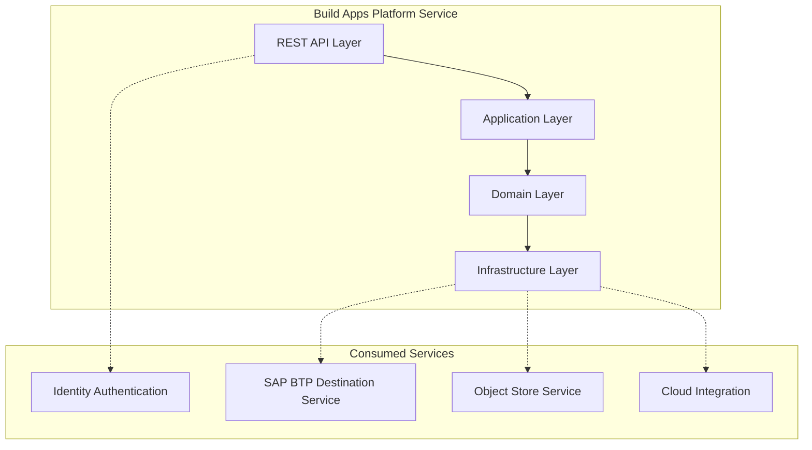
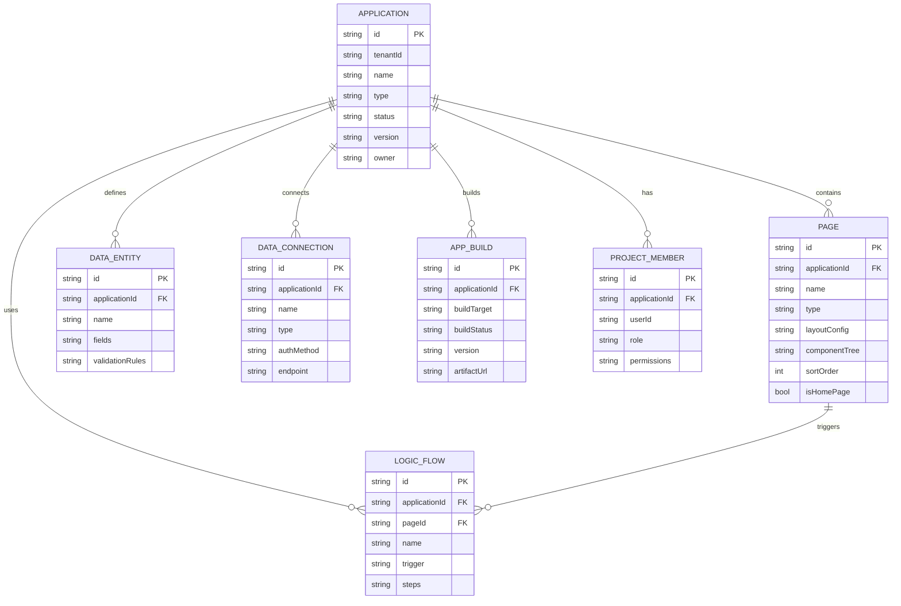
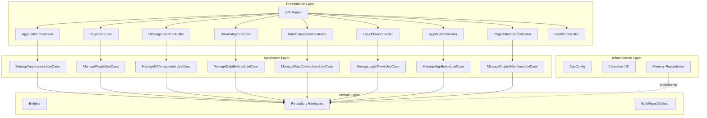
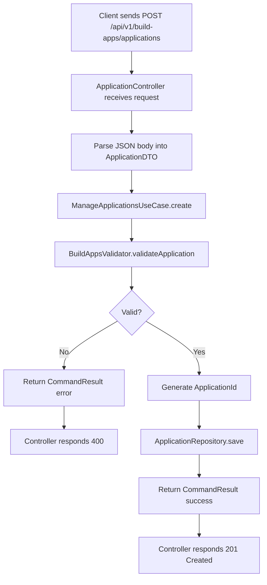
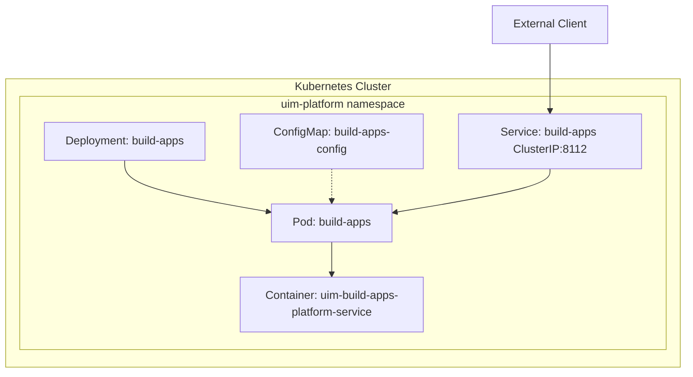
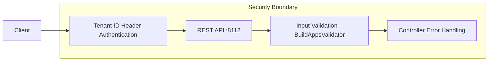

# Build Apps — NAFv4 Architecture Views

## C1 — Capability Taxonomy

```mermaid
graph TB
    BA[Build Apps Service]
    BA --> AM[Application Management]
    BA --> PGM[Page Management]
    BA --> UCM[UI Component Management]
    BA --> DEM[Data Entity Management]
    BA --> DCM[Data Connection Management]
    BA --> LFM[Logic Flow Management]
    BA --> ABM[App Build Management]
    BA --> PMM[Project Member Management]

    AM --> AM1[Create Application]
    AM --> AM2[Configure App Type]
    AM --> AM3[Version Management]
    AM --> AM4[Theme Configuration]

    PGM --> PGM1[Create Pages]
    PGM --> PGM2[Drag-and-Drop Layout]
    PGM --> PGM3[Navigation Config]
    PGM --> PGM4[Data Bindings]

    UCM --> UCM1[Component Library]
    UCM --> UCM2[Custom Components]
    UCM --> UCM3[Property Schemas]
    UCM --> UCM4[Event Definitions]

    DEM --> DEM1[Define Data Models]
    DEM --> DEM2[Field Definitions]
    DEM --> DEM3[Validation Rules]
    DEM --> DEM4[Index Configuration]

    DCM --> DCM1[SAP BTP Destinations]
    DCM --> DCM2[OData / REST APIs]
    DCM --> DCM3[SAP S/4HANA]
    DCM --> DCM4[Authentication Management]

    LFM --> LFM1[Visual Logic Builder]
    LFM --> LFM2[Event Triggers]
    LFM --> LFM3[Flow Steps]
    LFM --> LFM4[Error Handling]

    ABM --> ABM1[Web Builds]
    ABM --> ABM2[iOS Builds]
    ABM --> ABM3[Android Builds]
    ABM --> ABM4[Signing Config]

    PMM --> PMM1[Role Assignment]
    PMM --> PMM2[Permission Management]
    PMM --> PMM3[Invitation Flow]
```

## C2 — Service Taxonomy

## L1 — Logical Data Model

## L2 — Service Architecture

## L4 — Activity Flow (Create Application)

## P1 — Physical Deployment

## S1 — Security

## Sv1 — Service Contract

| Property | Value |
|----------|-------|
| Service Name | Build Apps Platform Service |
| Service ID | `uim-build-apps-platform-service` |
| Version | 1.0.0 |
| Protocol | HTTP/REST |
| Port | 8112 |
| Base Path | `/api/v1/build-apps` |
| Health Endpoint | `/health` |
| Authentication | Tenant ID header |
| Content Type | `application/json` |
| Namespace | `uim-platform` |
| Container Image | `uim-platform/build-apps:latest` |
