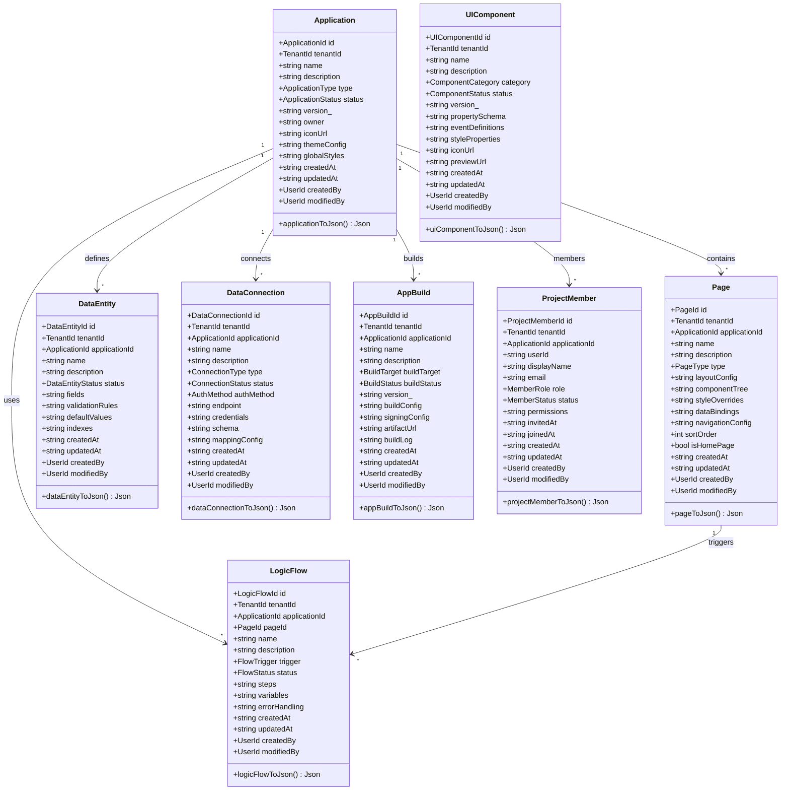
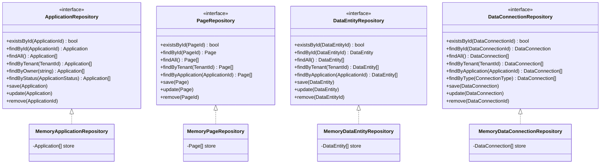
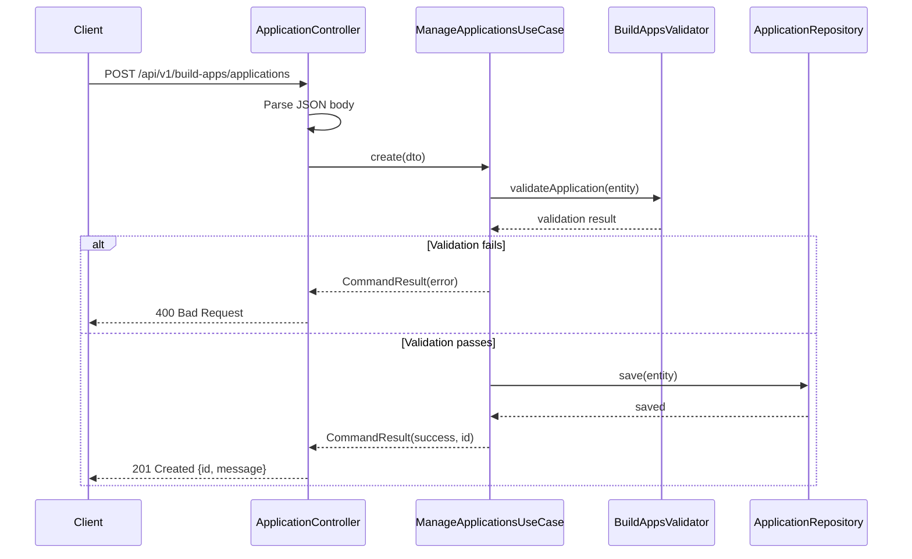
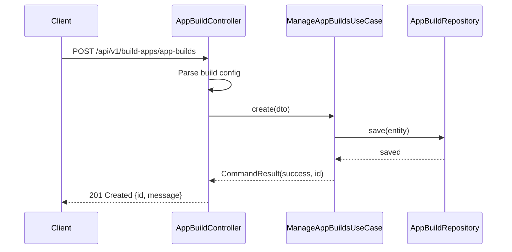
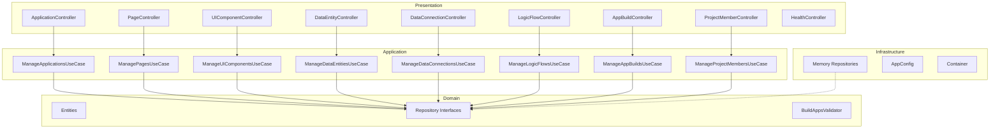

# Build Apps — UML Diagrams

## Class Diagram — Domain Entities

## Class Diagram — Repository Interfaces

## Sequence Diagram — Create Application

## Sequence Diagram — Build App for Target Platform

## Component Diagram

