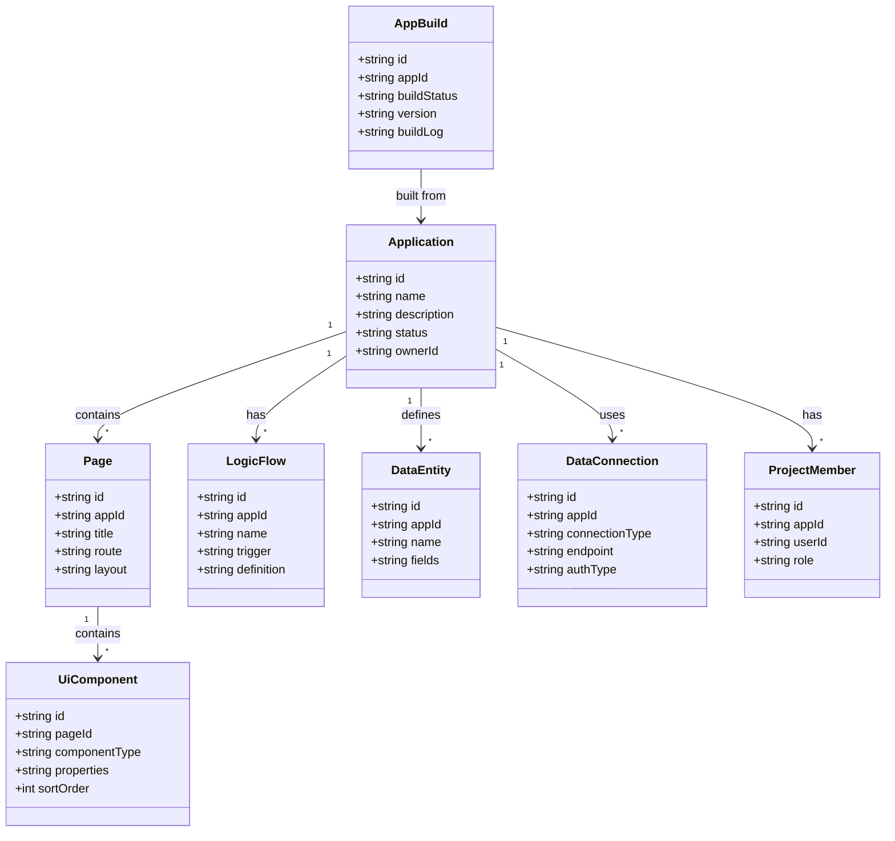
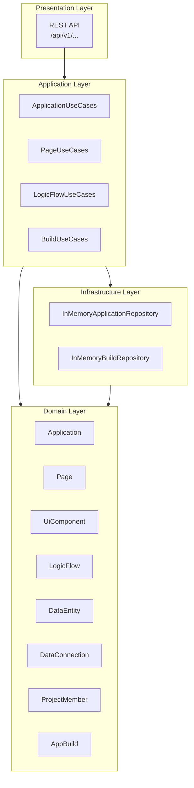
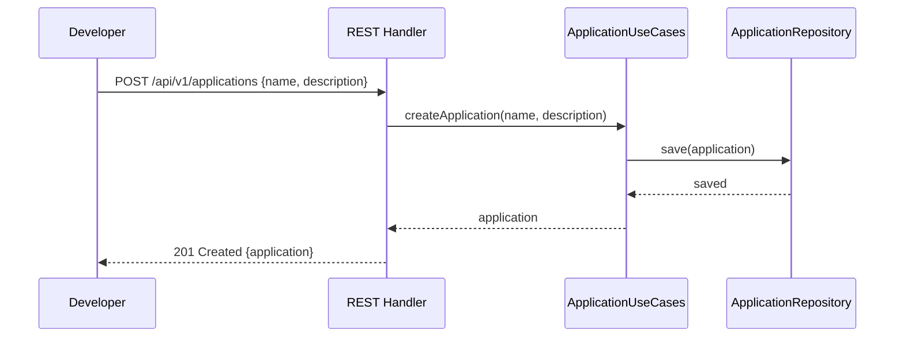

# UML Diagrams — Build Apps Service

## Class Diagram

```mermaid
classDiagram
    class Application {
        +string id
        +string name
        +string description
        +string status
        +string ownerId
    }
    class Page {
        +string id
        +string appId
        +string title
        +string route
        +string layout
    }
    class UiComponent {
        +string id
        +string pageId
        +string componentType
        +string properties
        +int sortOrder
    }
    class LogicFlow {
        +string id
        +string appId
        +string name
        +string trigger
        +string definition
    }
    class DataEntity {
        +string id
        +string appId
        +string name
        +string fields
    }
    class DataConnection {
        +string id
        +string appId
        +string connectionType
        +string endpoint
        +string authType
    }
    class ProjectMember {
        +string id
        +string appId
        +string userId
        +string role
    }
    class AppBuild {
        +string id
        +string appId
        +string buildStatus
        +string version
        +string buildLog
    }

    Application "1" --> "*" Page : contains
    Page "1" --> "*" UiComponent : contains
    Application "1" --> "*" LogicFlow : has
    Application "1" --> "*" DataEntity : defines
    Application "1" --> "*" DataConnection : uses
    Application "1" --> "*" ProjectMember : has
    AppBuild --> Application : built from
```

## Component Diagram

```mermaid
flowchart TB
    subgraph Presentation["Presentation Layer"]
        REST["REST API\n/api/v1/..."]
    end
    subgraph Application["Application Layer"]
        APP_UC["ApplicationUseCases"]
        PAGE_UC["PageUseCases"]
        FLOW_UC["LogicFlowUseCases"]
        BUILD_UC["BuildUseCases"]
    end
    subgraph Domain["Domain Layer"]
        APP["Application"]
        PAGE["Page"]
        COMP["UiComponent"]
        FLOW["LogicFlow"]
        ENTITY["DataEntity"]
        CONN["DataConnection"]
        MEMBER["ProjectMember"]
        BUILD["AppBuild"]
    end
    subgraph Infrastructure["Infrastructure Layer"]
        APP_REPO["InMemoryApplicationRepository"]
        BUILD_REPO["InMemoryBuildRepository"]
    end

    REST --> Application
    Application --> Domain
    Infrastructure --> Domain
    Application --> Infrastructure
```

## Sequence Diagram — Create Application

```mermaid
sequenceDiagram
    participant D as Developer
    participant R as REST Handler
    participant UC as ApplicationUseCases
    participant AR as ApplicationRepository

    D->>R: POST /api/v1/applications {name, description}
    R->>UC: createApplication(name, description)
    UC->>AR: save(application)
    AR-->>UC: saved
    UC-->>R: application
    R-->>D: 201 Created {application}
```
