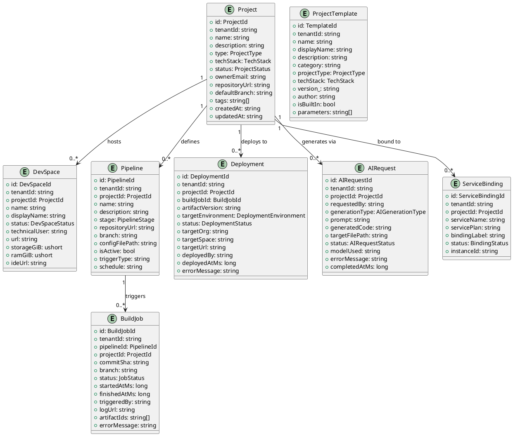
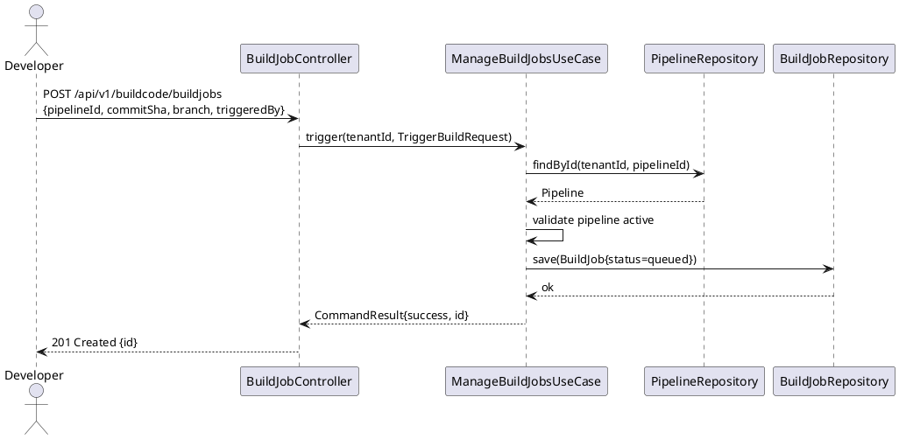
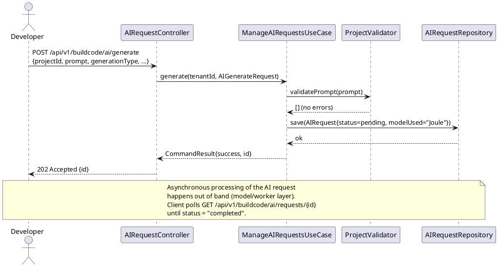
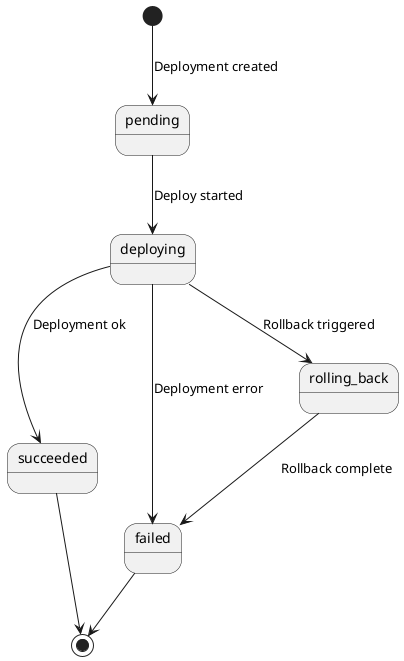

# UML — SAP Build Code Platform Service

## 1. Domain Entity Model

---

## 2. Hexagonal Architecture

```plantuml
@startuml Hexagonal Architecture

package "Driving Adapters" {
  [HTTP Client] as HC
}

package "Presentation (HTTP)" {
  [ProjectController]        as PC
  [DevSpaceController]       as DSC
  [TemplateController]       as TC
  [PipelineController]       as PLC
  [BuildJobController]       as BJC
  [DeploymentController]     as DC
  [AIRequestController]      as AIC
  [ServiceBindingController] as SBC
  [HealthController]         as HTC
}

package "Application" {
  [ManageProjectsUseCase]        as MPU
  [ManageDevSpacesUseCase]       as MDU
  [ManageTemplatesUseCase]       as MTU
  [ManagePipelinesUseCase]       as MPLU
  [ManageBuildJobsUseCase]       as MBJU
  [ManageDeploymentsUseCase]     as MDpU
  [ManageAIRequestsUseCase]      as MAIU
  [ManageServiceBindingsUseCase] as MSBU
}

package "Domain" {
  [Project Entity]         as PE
  [DevSpace Entity]        as DSE
  [Template Entity]        as TE
  [Pipeline Entity]        as PLE
  [BuildJob Entity]        as BJE
  [Deployment Entity]      as DE
  [AIRequest Entity]       as AIE
  [ServiceBinding Entity]  as SBE
  [ProjectValidator]       as PV
  [QuotaService]           as QS

  interface ProjectRepository        as PR
  interface DevSpaceRepository       as DSR
  interface TemplateRepository       as TR
  interface PipelineRepository       as PLR
  interface BuildJobRepository       as BJR
  interface DeploymentRepository     as DR
  interface AIRequestRepository      as AIR
  interface ServiceBindingRepository as SBR
}

package "Driven Adapters (In-Memory)" {
  [MemoryProjectRepository]        as MPR
  [MemoryDevSpaceRepository]       as MDSR
  [MemoryTemplateRepository]       as MTR
  [MemoryPipelineRepository]       as MPLR
  [MemoryBuildJobRepository]       as MBJR
  [MemoryDeploymentRepository]     as MDR
  [MemoryAIRequestRepository]      as MAIR
  [MemoryServiceBindingRepository] as MSBR
}

HC --> PC
HC --> DSC
HC --> TC
HC --> PLC
HC --> BJC
HC --> DC
HC --> AIC
HC --> SBC
HC --> HTC

PC  --> MPU
DSC --> MDU
TC  --> MTU
PLC --> MPLU
BJC --> MBJU
DC  --> MDpU
AIC --> MAIU
SBC --> MSBU

MPU  --> PR
MDU  --> DSR
MTU  --> TR
MPLU --> PLR
MBJU --> BJR
MDpU --> DR
MAIU --> AIR
MSBU --> SBR

MPR  ..|> PR
MDSR ..|> DSR
MTR  ..|> TR
MPLR ..|> PLR
MBJR ..|> BJR
MDR  ..|> DR
MAIR ..|> AIR
MSBR ..|> SBR

@enduml
```

---

## 3. CI/CD Pipeline Execution Sequence

---

## 4. AI Generation Request Flow

---

## 5. Deployment State Machine

