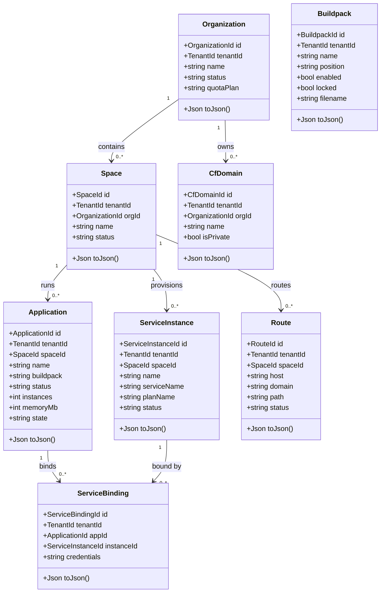
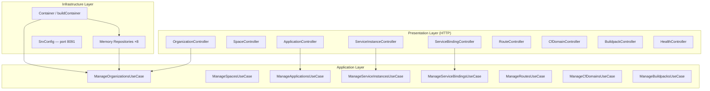
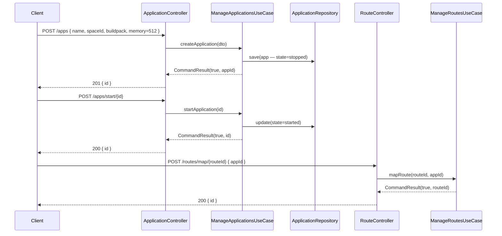

# UML — Cloud Foundry Runtime Service

## Class Diagram — Domain Entities

```mermaid
classDiagram
    class Organization {
        +OrganizationId id
        +TenantId tenantId
        +string name
        +string status
        +string quotaPlan
        +Json toJson()
    }
    class Space {
        +SpaceId id
        +TenantId tenantId
        +OrganizationId orgId
        +string name
        +string status
        +Json toJson()
    }
    class Application {
        +ApplicationId id
        +TenantId tenantId
        +SpaceId spaceId
        +string name
        +string buildpack
        +string status
        +int instances
        +int memoryMb
        +string state
        +Json toJson()
    }
    class ServiceInstance {
        +ServiceInstanceId id
        +TenantId tenantId
        +SpaceId spaceId
        +string name
        +string serviceName
        +string planName
        +string status
        +Json toJson()
    }
    class ServiceBinding {
        +ServiceBindingId id
        +TenantId tenantId
        +ApplicationId appId
        +ServiceInstanceId instanceId
        +string credentials
        +Json toJson()
    }
    class Route {
        +RouteId id
        +TenantId tenantId
        +SpaceId spaceId
        +string host
        +string domain
        +string path
        +string status
        +Json toJson()
    }
    class CfDomain {
        +CfDomainId id
        +TenantId tenantId
        +OrganizationId orgId
        +string name
        +bool isPrivate
        +Json toJson()
    }
    class Buildpack {
        +BuildpackId id
        +TenantId tenantId
        +string name
        +string position
        +bool enabled
        +bool locked
        +string filename
        +Json toJson()
    }

    Organization "1" --> "0..*" Space : contains
    Organization "1" --> "0..*" CfDomain : owns
    Space "1" --> "0..*" Application : runs
    Space "1" --> "0..*" ServiceInstance : provisions
    Space "1" --> "0..*" Route : routes
    Application "1" --> "0..*" ServiceBinding : binds
    ServiceInstance "1" --> "0..*" ServiceBinding : bound by
```

---

## Component Diagram

```mermaid
flowchart TB
    subgraph Presentation["Presentation Layer (HTTP)"]
        C1[OrganizationController]
        C2[SpaceController]
        C3[ApplicationController]
        C4[ServiceInstanceController]
        C5[ServiceBindingController]
        C6[RouteController]
        C7[CfDomainController]
        C8[BuildpackController]
        HC[HealthController]
    end
    subgraph Application["Application Layer"]
        UC1[ManageOrganizationsUseCase]
        UC2[ManageSpacesUseCase]
        UC3[ManageApplicationsUseCase]
        UC4[ManageServiceInstancesUseCase]
        UC5[ManageServiceBindingsUseCase]
        UC6[ManageRoutesUseCase]
        UC7[ManageCfDomainsUseCase]
        UC8[ManageBuildpacksUseCase]
    end
    subgraph Infrastructure["Infrastructure Layer"]
        MEM[Memory Repositories ×8]
        CFG[SrvConfig — port 8091]
        CTR[Container / buildContainer]
    end

    C1 --> UC1
    C3 --> UC3
    C4 --> UC4
    C5 --> UC5
    MEM --> UC1
    CTR --> UC1
    CTR --> MEM
```

---

## Sequence Diagram — Push Application

```mermaid
sequenceDiagram
    participant Client
    participant AC as ApplicationController
    participant AUC as ManageApplicationsUseCase
    participant AR as ApplicationRepository
    participant RC as RouteController
    participant RUC as ManageRoutesUseCase

    Client->>AC: POST /apps { name, spaceId, buildpack, memory=512 }
    AC->>AUC: createApplication(dto)
    AUC->>AR: save(app — state=stopped)
    AUC-->>AC: CommandResult(true, appId)
    AC-->>Client: 201 { id }

    Client->>AC: POST /apps/start/{id}
    AC->>AUC: startApplication(id)
    AUC->>AR: update(state=started)
    AUC-->>AC: CommandResult(true, id)
    AC-->>Client: 200 { id }

    Client->>RC: POST /routes/map/{routeId} { appId }
    RC->>RUC: mapRoute(routeId, appId)
    RUC-->>RC: CommandResult(true, routeId)
    RC-->>Client: 200 { id }
```
