# UIM Connectivity Platform Service

A microservice for managing cloud-to-on-premise connectivity, destination
routing, Cloud Connector tunnels, service channels, access control rules,
certificate stores, and connectivity monitoring, inspired by the
**SAP BTP Connectivity Service**. Built with **D** and **vibe.d**, following
**Clean Architecture** and **Hexagonal Architecture** (Ports & Adapters)
principles.

Part of the [UIM Platform](https://www.sueel.de/uim/sap) suite.

## Features

| Capability | Description |
|---|---|
| **Destination Management** | Full CRUD for named connectivity endpoints with 11 authentication types (NoAuth, Basic, 7 OAuth2 variants, Client Certificate, Principal Propagation, SAML Assertion), proxy types (Internet, On-Premise, Private Link), custom properties, and additional headers |
| **Auth Flow Validation** | Domain service that validates destination authentication configuration — checks required fields per auth type (e.g., OAuth2 Client Credentials requires `clientId`, `clientSecret`, `tokenServiceUrl`) and on-premise proxy constraints |
| **Cloud Connector Management** | Registration, heartbeat, disconnect, and unregistration of on-premise Cloud Connectors with location IDs, version tracking, tunnel endpoints, and connection status monitoring |
| **Service Channels** | Virtual host/port-to-backend host/port mapping through Cloud Connectors; supports HTTP, RFC, and TCP channel types with open/close lifecycle and connector status validation |
| **Access Control Rules** | Path-prefix-based access rules for exposed on-premise backends; longest-prefix matching with allow/deny policies, protocol filtering (HTTP, HTTPS, RFC, TCP, LDAP), and principal propagation support |
| **Certificate Store** | Certificate lifecycle management for mTLS, SAML signing, and encryption; supports X.509, PKCS#12, PEM, and JKS formats with expiry tracking and active/inactive toggling |
| **Connectivity Monitoring** | Immutable event log with 16 event types, severity levels (info, warning, error, critical), source tracking, and tenant-scoped summary aggregation |
| **Health Check** | Service liveness endpoint |

## Architecture

```
connectivity/
├── source/
│   ├── app.d                                       # Entry point & composition root
│   ├── domain/                                     # Pure business logic (no dependencies)
│   │   ├── types.d                                 #   8 type aliases & 11 enums
│   │   ├── entities/                               #   Core domain structs
│   │   │   ├── destination.d                       #     Named connectivity endpoint with auth config
│   │   │   ├── cloud_connector.d                   #     On-premise Cloud Connector registration
│   │   │   ├── service_channel.d                   #     Virtual-to-backend host/port tunnel
│   │   │   ├── access_rule.d                       #     Path-prefix access control rule
│   │   │   ├── certificate.d                       #     Certificate store entry with expiry methods
│   │   │   └── connectivity_log.d                  #     Immutable connectivity event log entry
│   │   ├── ports/                                  #   Repository interfaces (ports)
│   │   │   ├── destination_repository.d            #     findByName, findByProxyType, CRUD
│   │   │   ├── connector_repository.d              #     findByLocationId, findBySubaccount, CRUD
│   │   │   ├── channel_repository.d                #     findByConnector, findByStatus, CRUD
│   │   │   ├── access_rule_repository.d            #     findByConnector, findByTenant, CRUD
│   │   │   ├── certificate_repository.d            #     findByName, findExpiring, CRUD
│   │   │   └── connectivity_log_repository.d       #     findByTenant, findBySeverity, findBySource
│   │   └── services/                               #   Stateless domain services
│   │       ├── auth_flow_resolver.d                #     Validates auth config for all 11 auth types
│   │       └── access_control_evaluator.d          #     Longest-prefix access rule matching
│   ├── application/                                #   Application layer (use cases)
│   │   ├── dto.d                                   #     Request DTOs & CommandResult
│   │   └── usecases/                              #     Application services
│   │       ├── manage.destinations.d               #       Destination CRUD with auth validation
│   │       ├── manage.connectors.d                 #       Connector register/heartbeat/disconnect
│   │       ├── manage.channels.d                   #       Channel create/open/close with connector checks
│   │       ├── manage.access_rules.d               #       Access rule CRUD with connector validation
│   │       ├── manage.certificates.d               #       Certificate CRUD with expiry queries
│   │       └── monitor_connectivity.d              #       Log queries and summary aggregation
│   ├── infrastructure/                             #   Technical adapters
│   │   ├── config.d                                #     Environment-based configuration
│   │   ├── container.d                             #     Dependency injection wiring
│   │   └── persistence/                            #     In-memory repository implementations
│   │       ├── in_memory_destination_repo.d
│   │       ├── in_memory_connector_repo.d
│   │       ├── in_memory_channel_repo.d
│   │       ├── in_memory_access_rule_repo.d
│   │       ├── in_memory_certificate_repo.d
│   │       └── in_memory_connectivity_log_repo.d
│   └── presentation/                               #   HTTP driving adapters
│       └── http/
│           ├── json_utils.d                        #     JSON helper functions
│           ├── health_controller.d
│           ├── destination_controller.d
│           ├── connector_controller.d
│           ├── channel_controller.d
│           ├── access_rule_controller.d
│           ├── certificate_controller.d
│           └── monitoring_controller.d
└── dub.sdl
```

## REST API

### Destinations

```
POST   /api/v1/destinations                Create a destination
GET    /api/v1/destinations                List all destinations for tenant
GET    /api/v1/destinations/{id}           Get destination by ID
PUT    /api/v1/destinations/{id}           Update a destination
DELETE /api/v1/destinations/{id}           Delete a destination
```

### Cloud Connectors

```
POST   /api/v1/connectors                  Register a Cloud Connector
GET    /api/v1/connectors                  List all connectors for tenant
GET    /api/v1/connectors/{id}             Get connector by ID
POST   /api/v1/connectors/{id}/heartbeat   Send heartbeat
DELETE /api/v1/connectors/{id}             Unregister a connector
```

### Service Channels

```
POST   /api/v1/channels                    Create a service channel
GET    /api/v1/channels                    List all channels for tenant
GET    /api/v1/channels/{id}               Get channel by ID
POST   /api/v1/channels/{id}/open          Open a channel
POST   /api/v1/channels/{id}/close         Close a channel
DELETE /api/v1/channels/{id}               Delete a channel
```

### Access Rules

```
POST   /api/v1/access-rules                Create an access rule
GET    /api/v1/access-rules                List all access rules for tenant
GET    /api/v1/access-rules/{id}           Get access rule by ID
PUT    /api/v1/access-rules/{id}           Update an access rule
DELETE /api/v1/access-rules/{id}           Delete an access rule
```

### Certificates

```
POST   /api/v1/certificates                Create a certificate entry
GET    /api/v1/certificates                List all certificates for tenant
GET    /api/v1/certificates/{id}           Get certificate by ID
PUT    /api/v1/certificates/{id}           Update certificate (description, active)
DELETE /api/v1/certificates/{id}           Delete a certificate
```

### Monitoring

```
GET    /api/v1/monitoring/logs             List connectivity event logs for tenant
GET    /api/v1/monitoring/summary          Get event count summary for tenant
```

### Health

```
GET    /api/v1/health                      → {"status":"UP","service":"connectivity"}
```

## Build and Run

```bash
# Build
cd connectivity
dub build

# Run (default: 0.0.0.0:8088)
./build/uim-connectivity-platform-service

# Override host/port via environment
CONN_HOST=127.0.0.1 CONN_PORT=9090 ./build/uim-connectivity-platform-service
```

## Configuration

| Variable | Default | Description |
|---|---|---|
| `CONN_HOST` | `0.0.0.0` | HTTP bind address |
| `CONN_PORT` | `8088` | HTTP listen port |

## Domain Model Overview

### Type Aliases

| Alias | Underlying | Purpose |
|---|---|---|
| `DestinationId` | `string` | Destination identifier |
| `ConnectorId` | `string` | Cloud Connector identifier |
| `ChannelId` | `string` | Service channel identifier |
| `RuleId` | `string` | Access rule identifier |
| `CertificateId` | `string` | Certificate identifier |
| `ConnectivityLogId` | `string` | Log entry identifier |
| `TenantId` | `string` | Tenant identifier |
| `SubaccountId` | `string` | Subaccount identifier |

### Enumerations

| Enum | Values |
|---|---|
| **DestinationType** | http, rfc, mail, ldap |
| **AuthenticationType** | noAuthentication, basicAuthentication, oauth2ClientCredentials, oauth2SAMLBearerAssertion, oauth2UserTokenExchange, oauth2JWTBearer, oauth2Password, oauth2AuthorizationCode, clientCertificateAuthentication, principalPropagation, samlAssertion |
| **ProxyType** | internet, onPremise, privateLink |
| **ConnectorStatus** | connected, disconnected, error, maintenance |
| **ChannelType** | http, rfc, tcp |
| **ChannelStatus** | open, closed, error |
| **AccessPolicy** | allow, deny |
| **AccessProtocol** | http, https, rfc, tcp, ldap |
| **CertificateType** | x509, pkcs12, pem, jks |
| **CertificateUsage** | authentication, signing, encryption |
| **LogSeverity** | info, warning, error, critical |
| **ConnectivityEventType** | connectionEstablished, connectionLost, connectionRefused, authenticationSuccess, authenticationFailure, certificateExpiring, certificateExpired, channelOpened, channelClosed, channelError, accessDenied, accessGranted, healthCheckPassed, healthCheckFailed, destinationResolved, destinationNotFound |

### Domain Services

- **AuthFlowResolver** — validates a `Destination`'s authentication configuration using `final switch` over all 11 `AuthenticationType` values; checks required fields per auth type (e.g., Basic requires `user` + `password`, OAuth2 Client Credentials requires `clientId` + `clientSecret` + `tokenServiceUrl`, Principal Propagation requires on-premise proxy); returns `AuthFlowResult` with `valid`, `errors[]`, and `resolvedAuthHeader`
- **AccessControlEvaluator** — evaluates an array of `AccessRule` entries against a virtual host, port, and URL path using longest-prefix matching on `urlPathPrefix`; returns `AccessEvaluation` with `allowed`, `matchedRuleId`, and `reason`

---

## UML – Architecture Diagram (PlantUML)

```plantuml
@startuml Connectivity Service – Hexagonal Architecture

!define PRESENTATION_COLOR #E3F2FD
!define APPLICATION_COLOR  #FFF3E0
!define DOMAIN_COLOR       #E8F5E9
!define INFRA_COLOR        #F3E5F5
!define PORT_COLOR         #E1F5FE
!define SERVICE_COLOR      #FFF8E1

skinparam class {
  BackgroundColor    WHITE
  BorderColor        #37474F
  ArrowColor         #37474F
  FontSize           11
}

skinparam package {
  FontSize          12
  FontStyle         bold
  BorderThickness   2
}

title UIM Connectivity Platform Service\nClean + Hexagonal Architecture

' ============================================================
' PRESENTATION LAYER (Driving Adapters)
' ============================================================

package "Presentation Layer  «driving adapters»" as PRES <<Rectangle>> {
  skinparam packageBackgroundColor PRESENTATION_COLOR

  class DestinationController << (H,#EF5350) >> {
    POST   /api/v1/destinations
    GET    /api/v1/destinations
    GET    /api/v1/destinations/{id}
    PUT    /api/v1/destinations/{id}
    DELETE /api/v1/destinations/{id}
  }

  class ConnectorController << (H,#EF5350) >> {
    POST   /api/v1/connectors
    GET    /api/v1/connectors
    GET    /api/v1/connectors/{id}
    POST   /api/v1/connectors/{id}/heartbeat
    DELETE /api/v1/connectors/{id}
  }

  class ChannelController << (H,#EF5350) >> {
    POST   /api/v1/channels
    GET    /api/v1/channels
    GET    /api/v1/channels/{id}
    POST   /api/v1/channels/{id}/open
    POST   /api/v1/channels/{id}/close
    DELETE /api/v1/channels/{id}
  }

  class AccessRuleController << (H,#EF5350) >> {
    POST   /api/v1/access-rules
    GET    /api/v1/access-rules
    GET    /api/v1/access-rules/{id}
    PUT    /api/v1/access-rules/{id}
    DELETE /api/v1/access-rules/{id}
  }

  class CertificateController << (H,#EF5350) >> {
    POST   /api/v1/certificates
    GET    /api/v1/certificates
    GET    /api/v1/certificates/{id}
    PUT    /api/v1/certificates/{id}
    DELETE /api/v1/certificates/{id}
  }

  class MonitoringController << (H,#EF5350) >> {
    GET /api/v1/monitoring/logs
    GET /api/v1/monitoring/summary
  }

  class HealthController << (H,#EF5350) >> {
    GET /api/v1/health
  }
}

' ============================================================
' APPLICATION LAYER (Use Cases)
' ============================================================

package "Application Layer  «use cases»" as APP <<Rectangle>> {
  skinparam packageBackgroundColor APPLICATION_COLOR

  class ManageDestinationsUseCase << (U,#FF7043) >> {
    + createDestination(req) : CommandResult
    + updateDestination(id, req) : CommandResult
    + getDestination(id) : Destination
    + getByName(tenantId, name) : Destination
    + listDestinations(tenantId) : Destination[]
    + deleteDestination(id) : CommandResult
  }

  class ManageConnectorsUseCase << (U,#FF7043) >> {
    + registerConnector(req) : CommandResult
    + heartbeat(id, req) : CommandResult
    + disconnect(id) : CommandResult
    + getConnector(id) : CloudConnector
    + listBySubaccount(subaccountId) : CloudConnector[]
    + listByTenant(tenantId) : CloudConnector[]
    + unregister(id) : CommandResult
  }

  class ManageChannelsUseCase << (U,#FF7043) >> {
    + createChannel(req) : CommandResult
    + openChannel(id) : CommandResult
    + closeChannel(id) : CommandResult
    + getChannel(id) : ServiceChannel
    + listByConnector(connectorId) : ServiceChannel[]
    + listByTenant(tenantId) : ServiceChannel[]
    + deleteChannel(id) : CommandResult
  }

  class ManageAccessRulesUseCase << (U,#FF7043) >> {
    + createRule(req) : CommandResult
    + updateRule(id, req) : CommandResult
    + getRule(id) : AccessRule
    + listByConnector(connectorId) : AccessRule[]
    + listByTenant(tenantId) : AccessRule[]
    + deleteRule(id) : CommandResult
  }

  class ManageCertificatesUseCase << (U,#FF7043) >> {
    + createCertificate(req) : CommandResult
    + updateCertificate(id, req) : CommandResult
    + getCertificate(id) : Certificate
    + listCertificates(tenantId) : Certificate[]
    + listExpiring(tenantId, now, days) : Certificate[]
    + deleteCertificate(id) : CommandResult
  }

  class MonitorConnectivityUseCase << (U,#FF7043) >> {
    + listLogs(tenantId) : ConnectivityLog[]
    + listBySeverity(tenantId, sev) : ConnectivityLog[]
    + listBySource(sourceId) : ConnectivityLog[]
    + getSummary(tenantId) : ConnectivitySummary
  }
}

' ============================================================
' DOMAIN LAYER
' ============================================================

package "Domain Layer  «business logic»" as DOMAIN <<Rectangle>> {
  skinparam packageBackgroundColor DOMAIN_COLOR

  package "Entities" as ENTITIES <<Rectangle>> {
    class Destination << (E,#66BB6A) >> {
      id : DestinationId
      tenantId : TenantId
      name, description, url : string
      destinationType : DestinationType
      authType : AuthenticationType
      proxyType : ProxyType
      user, password : string
      clientId, clientSecret : string
      tokenServiceUrl : string
      certificateId : CertificateId
      cloudConnectorLocationId : string
      properties : DestinationProperty[]
      additionalHeaders : DestinationProperty[]
    }

    class CloudConnector << (E,#66BB6A) >> {
      id : ConnectorId
      subaccountId : SubaccountId
      tenantId : TenantId
      locationId : string
      connectorVersion : string
      host : string
      port : ushort
      status : ConnectorStatus
      lastHeartbeat : long
      tunnelEndpoint : string
    }

    class ServiceChannel << (E,#66BB6A) >> {
      id : ChannelId
      connectorId : ConnectorId
      tenantId : TenantId
      name : string
      channelType : ChannelType
      status : ChannelStatus
      virtualHost : string
      virtualPort : ushort
      backendHost : string
      backendPort : ushort
    }

    class AccessRule << (E,#66BB6A) >> {
      id : RuleId
      connectorId : ConnectorId
      tenantId : TenantId
      protocol : AccessProtocol
      virtualHost : string
      virtualPort : ushort
      urlPathPrefix : string
      policy : AccessPolicy
      principalPropagation : bool
    }

    class Certificate << (E,#66BB6A) >> {
      id : CertificateId
      tenantId : TenantId
      name, description : string
      certType : CertificateType
      usage : CertificateUsage
      subjectDN, issuerDN : string
      fingerprint : string
      validFrom, validTo : long
      active : bool
      + isExpired(now) : bool
      + expiresWithinDays(now, days) : bool
    }

    class ConnectivityLog << (E,#66BB6A) >> {
      id : ConnectivityLogId
      tenantId : TenantId
      eventType : ConnectivityEventType
      severity : LogSeverity
      sourceId, sourceType : string
      message : string
      remoteHost : string
      remotePort : ushort
      timestamp : long
    }
  }

  package "Ports  «interfaces»" as PORTS <<Rectangle>> {
    interface DestinationRepository << (P,#42A5F5) >> {
      + findById(id) : Destination
      + findByName(tenantId, name) : Destination
      + findByTenant(tenantId) : Destination[]
      + findByProxyType(tenantId, type) : Destination[]
      + save(entity) : void
      + update(entity) : void
      + removeById(id) : void
    }

    interface ConnectorRepository << (P,#42A5F5) >> {
      + findById(id) : CloudConnector
      + findByLocationId(subaccountId, locationId) : CloudConnector
      + findBySubaccount(subaccountId) : CloudConnector[]
      + findByTenant(tenantId) : CloudConnector[]
      + save(entity) : void
      + update(entity) : void
      + removeById(id) : void
    }

    interface ChannelRepository << (P,#42A5F5) >> {
      + findById(id) : ServiceChannel
      + findByConnector(connectorId) : ServiceChannel[]
      + findByTenant(tenantId) : ServiceChannel[]
      + findByStatus(tenantId, status) : ServiceChannel[]
      + save(entity) : void
      + update(entity) : void
      + removeById(id) : void
    }

    interface AccessRuleRepository << (P,#42A5F5) >> {
      + findById(id) : AccessRule
      + findByConnector(connectorId) : AccessRule[]
      + findByTenant(tenantId) : AccessRule[]
      + save(entity) : void
      + update(entity) : void
      + removeById(id) : void
    }

    interface CertificateRepository << (P,#42A5F5) >> {
      + findById(id) : Certificate
      + findByName(tenantId, name) : Certificate
      + findByTenant(tenantId) : Certificate[]
      + findExpiring(tenantId, now, days) : Certificate[]
      + save(entity) : void
      + update(entity) : void
      + removeById(id) : void
    }

    interface ConnectivityLogRepository << (P,#42A5F5) >> {
      + findByTenant(tenantId) : ConnectivityLog[]
      + findBySeverity(tenantId, sev) : ConnectivityLog[]
      + findBySource(sourceId) : ConnectivityLog[]
      + save(entry) : void
    }
  }

  package "Domain Services" as DSVC <<Rectangle>> {
    class AuthFlowResolver << (S,#FFA726) >> {
      {static} + validate(dest) : AuthFlowResult
    }

    class AccessControlEvaluator << (S,#FFA726) >> {
      {static} + evaluate(rules, host, port, path) : AccessEvaluation
    }
  }
}

' ============================================================
' INFRASTRUCTURE LAYER (Driven Adapters)
' ============================================================

package "Infrastructure Layer  «driven adapters»" as INFRA <<Rectangle>> {
  skinparam packageBackgroundColor INFRA_COLOR

  class AppConfig << (C,#AB47BC) >> {
    host : string = "0.0.0.0"
    port : ushort = 8088
    serviceName : string
  }

  class Container << (C,#AB47BC) >> {
    + buildContainer(config) : Container
  }

  class MemoryDestinationRepo << (A,#AB47BC) >>
  class MemoryConnectorRepo << (A,#AB47BC) >>
  class MemoryChannelRepo << (A,#AB47BC) >>
  class MemoryAccessRuleRepo << (A,#AB47BC) >>
  class MemoryCertificateRepo << (A,#AB47BC) >>
  class MemoryConnectivityLogRepo << (A,#AB47BC) >>
}

' ============================================================
' RELATIONSHIPS
' ============================================================

' Presentation → Application
DestinationController --> ManageDestinationsUseCase
ConnectorController --> ManageConnectorsUseCase
ChannelController --> ManageChannelsUseCase
AccessRuleController --> ManageAccessRulesUseCase
CertificateController --> ManageCertificatesUseCase
MonitoringController --> MonitorConnectivityUseCase

' Application → Ports
ManageDestinationsUseCase --> DestinationRepository
ManageDestinationsUseCase --> ConnectivityLogRepository
ManageDestinationsUseCase --> AuthFlowResolver
ManageConnectorsUseCase --> ConnectorRepository
ManageConnectorsUseCase --> ConnectivityLogRepository
ManageChannelsUseCase --> ChannelRepository
ManageChannelsUseCase --> ConnectorRepository
ManageChannelsUseCase --> ConnectivityLogRepository
ManageAccessRulesUseCase --> AccessRuleRepository
ManageAccessRulesUseCase --> ConnectorRepository
ManageCertificatesUseCase --> CertificateRepository
MonitorConnectivityUseCase --> ConnectivityLogRepository

' Infrastructure implements Ports
MemoryDestinationRepo ..|> DestinationRepository
MemoryConnectorRepo ..|> ConnectorRepository
MemoryChannelRepo ..|> ChannelRepository
MemoryAccessRuleRepo ..|> AccessRuleRepository
MemoryCertificateRepo ..|> CertificateRepository
MemoryConnectivityLogRepo ..|> ConnectivityLogRepository

' Container wires everything
Container --> MemoryDestinationRepo
Container --> MemoryConnectorRepo
Container --> MemoryChannelRepo
Container --> MemoryAccessRuleRepo
Container --> MemoryCertificateRepo
Container --> MemoryConnectivityLogRepo

@enduml
```



## Testing

```bash
dub test
```

## License

See the repository root [LICENSE](../LICENSE) file.
