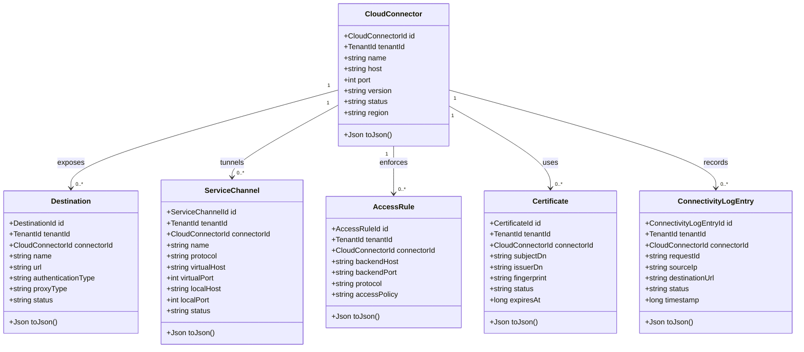
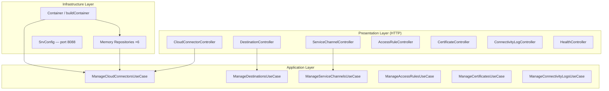
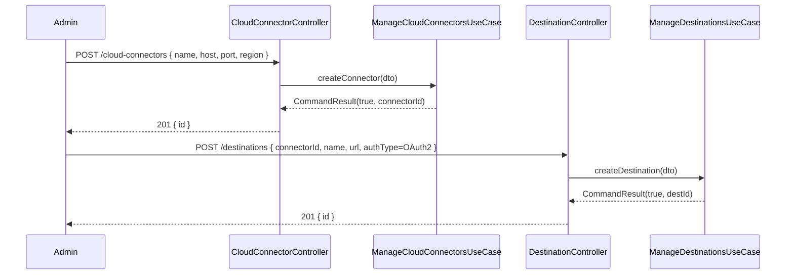

# UML — Connectivity Service

## Class Diagram — Domain Entities

```mermaid
classDiagram
    class CloudConnector {
        +CloudConnectorId id
        +TenantId tenantId
        +string name
        +string host
        +int port
        +string version
        +string status
        +string region
        +Json toJson()
    }
    class Destination {
        +DestinationId id
        +TenantId tenantId
        +CloudConnectorId connectorId
        +string name
        +string url
        +string authenticationType
        +string proxyType
        +string status
        +Json toJson()
    }
    class ServiceChannel {
        +ServiceChannelId id
        +TenantId tenantId
        +CloudConnectorId connectorId
        +string name
        +string protocol
        +string virtualHost
        +int virtualPort
        +string localHost
        +int localPort
        +string status
        +Json toJson()
    }
    class AccessRule {
        +AccessRuleId id
        +TenantId tenantId
        +CloudConnectorId connectorId
        +string backendHost
        +string backendPort
        +string protocol
        +string accessPolicy
        +Json toJson()
    }
    class Certificate {
        +CertificateId id
        +TenantId tenantId
        +CloudConnectorId connectorId
        +string subjectDn
        +string issuerDn
        +string fingerprint
        +string status
        +long expiresAt
        +Json toJson()
    }
    class ConnectivityLogEntry {
        +ConnectivityLogEntryId id
        +TenantId tenantId
        +CloudConnectorId connectorId
        +string requestId
        +string sourceIp
        +string destinationUrl
        +string status
        +long timestamp
        +Json toJson()
    }

    CloudConnector "1" --> "0..*" Destination : exposes
    CloudConnector "1" --> "0..*" ServiceChannel : tunnels
    CloudConnector "1" --> "0..*" AccessRule : enforces
    CloudConnector "1" --> "0..*" Certificate : uses
    CloudConnector "1" --> "0..*" ConnectivityLogEntry : records
```

---

## Component Diagram

```mermaid
flowchart TB
    subgraph Presentation["Presentation Layer (HTTP)"]
        C1[CloudConnectorController]
        C2[DestinationController]
        C3[ServiceChannelController]
        C4[AccessRuleController]
        C5[CertificateController]
        C6[ConnectivityLogController]
        HC[HealthController]
    end
    subgraph Application["Application Layer"]
        UC1[ManageCloudConnectorsUseCase]
        UC2[ManageDestinationsUseCase]
        UC3[ManageServiceChannelsUseCase]
        UC4[ManageAccessRulesUseCase]
        UC5[ManageCertificatesUseCase]
        UC6[ManageConnectivityLogsUseCase]
    end
    subgraph Infrastructure["Infrastructure Layer"]
        MEM[Memory Repositories ×6]
        CFG[SrvConfig — port 8088]
        CTR[Container / buildContainer]
    end

    C1 --> UC1
    C2 --> UC2
    C3 --> UC3
    MEM --> UC1
    CTR --> UC1
    CTR --> MEM
```

---

## Sequence Diagram — Register Cloud Connector and Destination

```mermaid
sequenceDiagram
    participant Admin
    participant CC as CloudConnectorController
    participant CUC as ManageCloudConnectorsUseCase
    participant DC as DestinationController
    participant DUC as ManageDestinationsUseCase

    Admin->>CC: POST /cloud-connectors { name, host, port, region }
    CC->>CUC: createConnector(dto)
    CUC-->>CC: CommandResult(true, connectorId)
    CC-->>Admin: 201 { id }

    Admin->>DC: POST /destinations { connectorId, name, url, authType=OAuth2 }
    DC->>DUC: createDestination(dto)
    DUC-->>DC: CommandResult(true, destId)
    DC-->>Admin: 201 { id }
```
