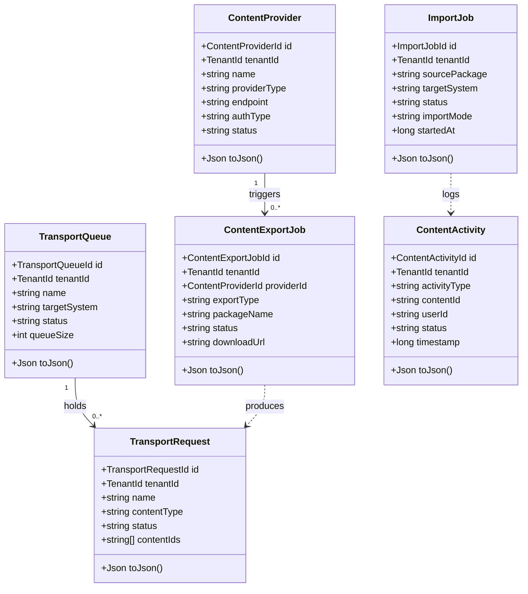
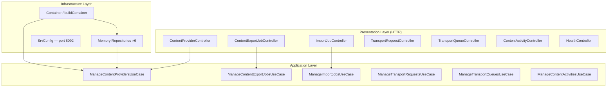
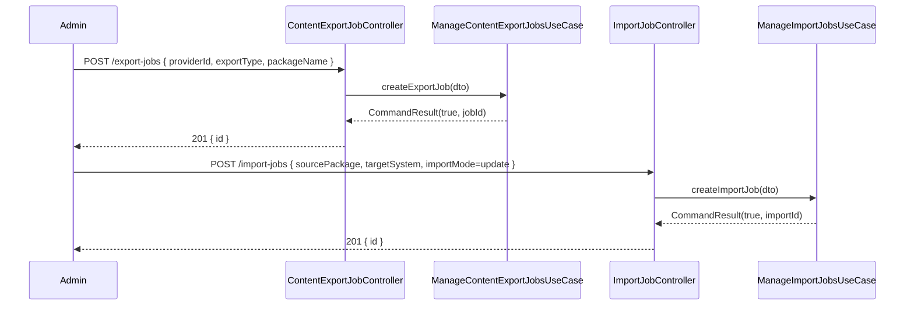

# UML — Content Agent Service

## Class Diagram — Domain Entities

```mermaid
classDiagram
    class ContentProvider {
        +ContentProviderId id
        +TenantId tenantId
        +string name
        +string providerType
        +string endpoint
        +string authType
        +string status
        +Json toJson()
    }
    class ContentExportJob {
        +ContentExportJobId id
        +TenantId tenantId
        +ContentProviderId providerId
        +string exportType
        +string packageName
        +string status
        +string downloadUrl
        +Json toJson()
    }
    class ImportJob {
        +ImportJobId id
        +TenantId tenantId
        +string sourcePackage
        +string targetSystem
        +string status
        +string importMode
        +long startedAt
        +Json toJson()
    }
    class TransportRequest {
        +TransportRequestId id
        +TenantId tenantId
        +string name
        +string contentType
        +string status
        +string[] contentIds
        +Json toJson()
    }
    class TransportQueue {
        +TransportQueueId id
        +TenantId tenantId
        +string name
        +string targetSystem
        +string status
        +int queueSize
        +Json toJson()
    }
    class ContentActivity {
        +ContentActivityId id
        +TenantId tenantId
        +string activityType
        +string contentId
        +string userId
        +string status
        +long timestamp
        +Json toJson()
    }

    ContentProvider "1" --> "0..*" ContentExportJob : triggers
    TransportQueue "1" --> "0..*" TransportRequest : holds
    ContentExportJob ..> TransportRequest : produces
    ImportJob ..> ContentActivity : logs
```

---

## Component Diagram

```mermaid
flowchart TB
    subgraph Presentation["Presentation Layer (HTTP)"]
        C1[ContentProviderController]
        C2[ContentExportJobController]
        C3[ImportJobController]
        C4[TransportRequestController]
        C5[TransportQueueController]
        C6[ContentActivityController]
        HC[HealthController]
    end
    subgraph Application["Application Layer"]
        UC1[ManageContentProvidersUseCase]
        UC2[ManageContentExportJobsUseCase]
        UC3[ManageImportJobsUseCase]
        UC4[ManageTransportRequestsUseCase]
        UC5[ManageTransportQueuesUseCase]
        UC6[ManageContentActivitiesUseCase]
    end
    subgraph Infrastructure["Infrastructure Layer"]
        MEM[Memory Repositories ×6]
        CFG[SrvConfig — port 8092]
        CTR[Container / buildContainer]
    end
    C1 --> UC1
    C2 --> UC2
    C3 --> UC3
    MEM --> UC1
    CTR --> UC1
    CTR --> MEM
```

---

## Sequence Diagram — Export and Import Content

```mermaid
sequenceDiagram
    participant Admin
    participant EJC as ContentExportJobController
    participant EUC as ManageContentExportJobsUseCase
    participant IJC as ImportJobController
    participant IUC as ManageImportJobsUseCase

    Admin->>EJC: POST /export-jobs { providerId, exportType, packageName }
    EJC->>EUC: createExportJob(dto)
    EUC-->>EJC: CommandResult(true, jobId)
    EJC-->>Admin: 201 { id }

    Admin->>IJC: POST /import-jobs { sourcePackage, targetSystem, importMode=update }
    IJC->>IUC: createImportJob(dto)
    IUC-->>IJC: CommandResult(true, importId)
    IJC-->>Admin: 201 { id }
```
