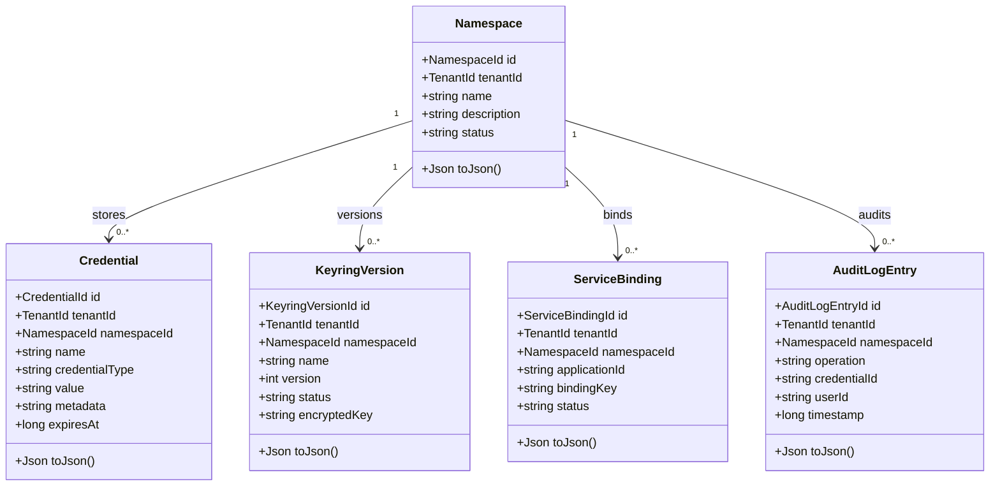
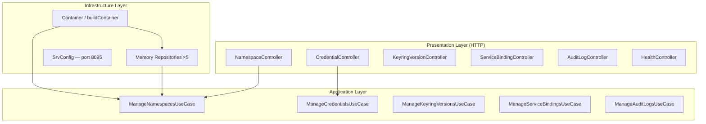
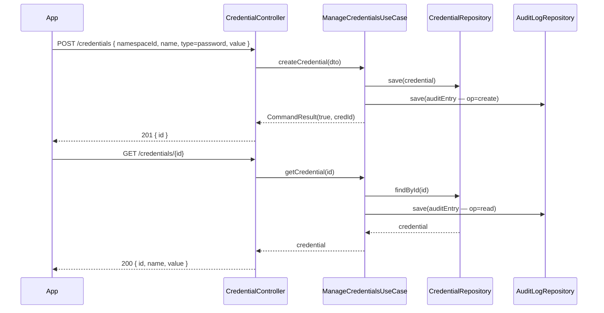

# UML — Credential Store Service

## Class Diagram — Domain Entities

```mermaid
classDiagram
    class Namespace {
        +NamespaceId id
        +TenantId tenantId
        +string name
        +string description
        +string status
        +Json toJson()
    }
    class Credential {
        +CredentialId id
        +TenantId tenantId
        +NamespaceId namespaceId
        +string name
        +string credentialType
        +string value
        +string metadata
        +long expiresAt
        +Json toJson()
    }
    class KeyringVersion {
        +KeyringVersionId id
        +TenantId tenantId
        +NamespaceId namespaceId
        +string name
        +int version
        +string status
        +string encryptedKey
        +Json toJson()
    }
    class ServiceBinding {
        +ServiceBindingId id
        +TenantId tenantId
        +NamespaceId namespaceId
        +string applicationId
        +string bindingKey
        +string status
        +Json toJson()
    }
    class AuditLogEntry {
        +AuditLogEntryId id
        +TenantId tenantId
        +NamespaceId namespaceId
        +string operation
        +string credentialId
        +string userId
        +long timestamp
        +Json toJson()
    }

    Namespace "1" --> "0..*" Credential : stores
    Namespace "1" --> "0..*" KeyringVersion : versions
    Namespace "1" --> "0..*" ServiceBinding : binds
    Namespace "1" --> "0..*" AuditLogEntry : audits
```

---

## Component Diagram

```mermaid
flowchart TB
    subgraph Presentation["Presentation Layer (HTTP)"]
        C1[NamespaceController]
        C2[CredentialController]
        C3[KeyringVersionController]
        C4[ServiceBindingController]
        C5[AuditLogController]
        HC[HealthController]
    end
    subgraph Application["Application Layer"]
        UC1[ManageNamespacesUseCase]
        UC2[ManageCredentialsUseCase]
        UC3[ManageKeyringVersionsUseCase]
        UC4[ManageServiceBindingsUseCase]
        UC5[ManageAuditLogsUseCase]
    end
    subgraph Infrastructure["Infrastructure Layer"]
        MEM[Memory Repositories ×5]
        CFG[SrvConfig — port 8095]
        CTR[Container / buildContainer]
    end
    C1 --> UC1
    C2 --> UC2
    MEM --> UC1
    CTR --> UC1
    CTR --> MEM
```

---

## Sequence Diagram — Store and Retrieve Credential

```mermaid
sequenceDiagram
    participant App
    participant CC as CredentialController
    participant CUC as ManageCredentialsUseCase
    participant CR as CredentialRepository
    participant AR as AuditLogRepository

    App->>CC: POST /credentials { namespaceId, name, type=password, value }
    CC->>CUC: createCredential(dto)
    CUC->>CR: save(credential)
    CUC->>AR: save(auditEntry — op=create)
    CUC-->>CC: CommandResult(true, credId)
    CC-->>App: 201 { id }

    App->>CC: GET /credentials/{id}
    CC->>CUC: getCredential(id)
    CUC->>CR: findById(id)
    CUC->>AR: save(auditEntry — op=read)
    CR-->>CUC: credential
    CUC-->>CC: credential
    CC-->>App: 200 { id, name, value }
```
