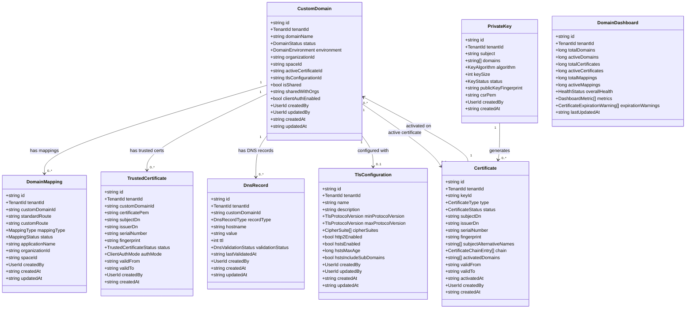
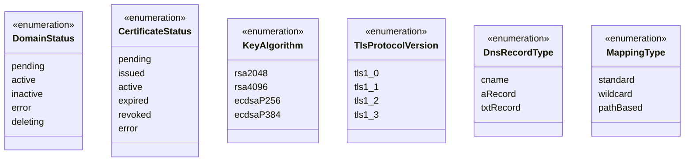
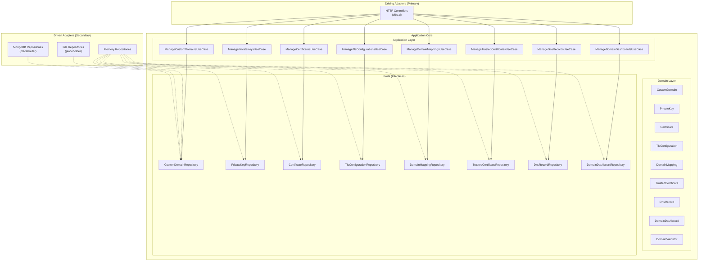
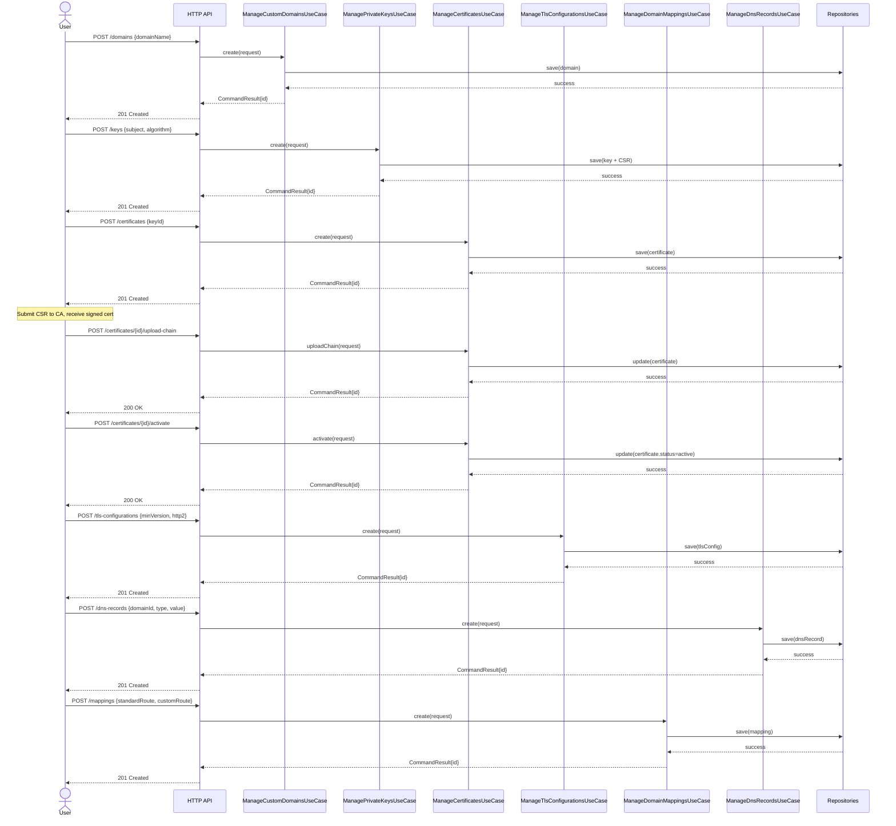
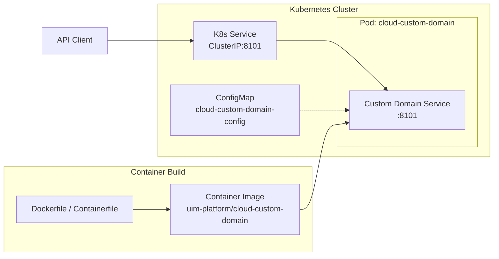
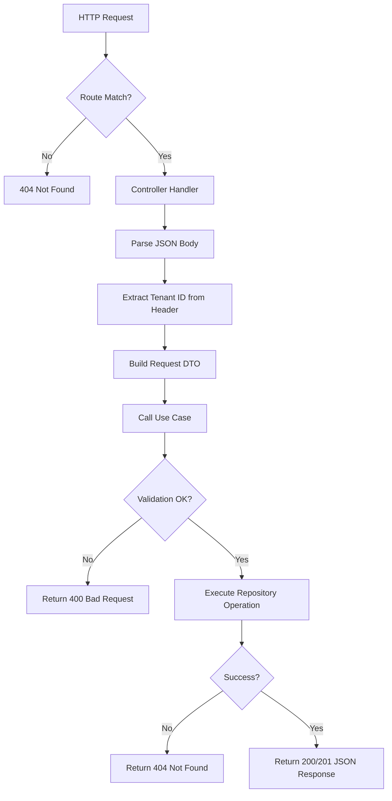

# Custom Domain Service - UML Diagrams

## Domain Model (Class Diagram)

## Enumerations

## Hexagonal Architecture (Component Diagram)

## Certificate Lifecycle (Sequence Diagram)

## Deployment (Component Diagram)

## Request Processing Flow (Activity Diagram)

