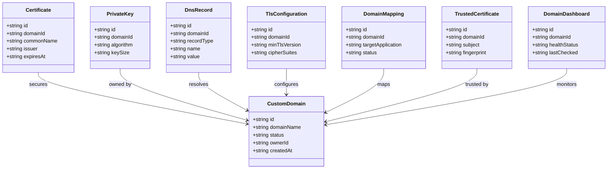
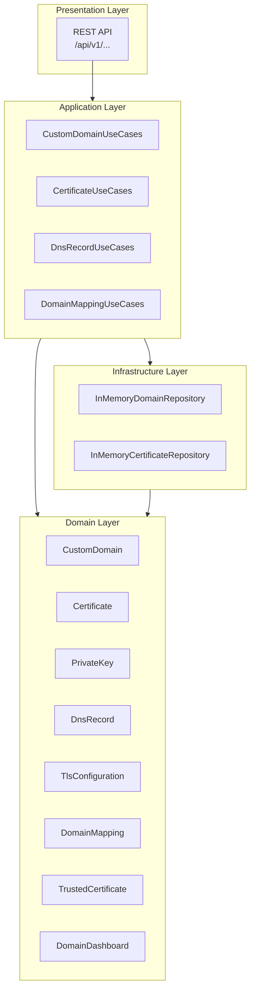
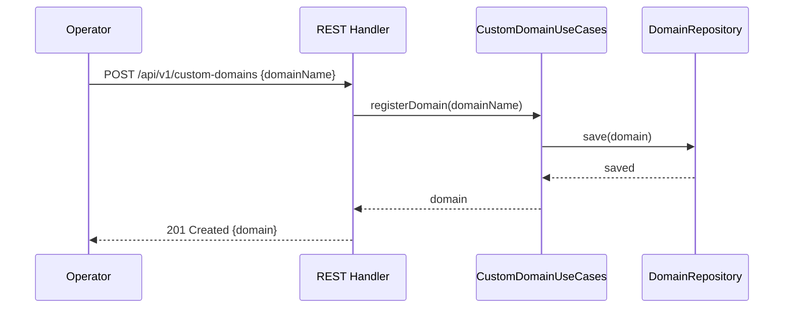

# UML Diagrams — Custom Domain Service

## Class Diagram

```mermaid
classDiagram
    class CustomDomain {
        +string id
        +string domainName
        +string status
        +string ownerId
        +string createdAt
    }
    class Certificate {
        +string id
        +string domainId
        +string commonName
        +string issuer
        +string expiresAt
    }
    class PrivateKey {
        +string id
        +string domainId
        +string algorithm
        +string keySize
    }
    class DnsRecord {
        +string id
        +string domainId
        +string recordType
        +string name
        +string value
    }
    class TlsConfiguration {
        +string id
        +string domainId
        +string minTlsVersion
        +string cipherSuites
    }
    class DomainMapping {
        +string id
        +string domainId
        +string targetApplication
        +string status
    }
    class TrustedCertificate {
        +string id
        +string domainId
        +string subject
        +string fingerprint
    }
    class DomainDashboard {
        +string id
        +string domainId
        +string healthStatus
        +string lastChecked
    }

    Certificate --> CustomDomain : secures
    PrivateKey --> CustomDomain : owned by
    DnsRecord --> CustomDomain : resolves
    TlsConfiguration --> CustomDomain : configures
    DomainMapping --> CustomDomain : maps
    TrustedCertificate --> CustomDomain : trusted by
    DomainDashboard --> CustomDomain : monitors
```

## Component Diagram

```mermaid
flowchart TB
    subgraph Presentation["Presentation Layer"]
        REST["REST API\n/api/v1/..."]
    end
    subgraph Application["Application Layer"]
        DOM_UC["CustomDomainUseCases"]
        CERT_UC["CertificateUseCases"]
        DNS_UC["DnsRecordUseCases"]
        MAP_UC["DomainMappingUseCases"]
    end
    subgraph Domain["Domain Layer"]
        DOM["CustomDomain"]
        CERT["Certificate"]
        KEY["PrivateKey"]
        DNS["DnsRecord"]
        TLS["TlsConfiguration"]
        MAP["DomainMapping"]
        TC["TrustedCertificate"]
        DASH["DomainDashboard"]
    end
    subgraph Infrastructure["Infrastructure Layer"]
        DOM_REPO["InMemoryDomainRepository"]
        CERT_REPO["InMemoryCertificateRepository"]
    end

    REST --> Application
    Application --> Domain
    Infrastructure --> Domain
    Application --> Infrastructure
```

## Sequence Diagram — Register Custom Domain

```mermaid
sequenceDiagram
    participant O as Operator
    participant R as REST Handler
    participant UC as CustomDomainUseCases
    participant DR as DomainRepository

    O->>R: POST /api/v1/custom-domains {domainName}
    R->>UC: registerDomain(domainName)
    UC->>DR: save(domain)
    DR-->>UC: saved
    UC-->>R: domain
    R-->>O: 201 Created {domain}
```
