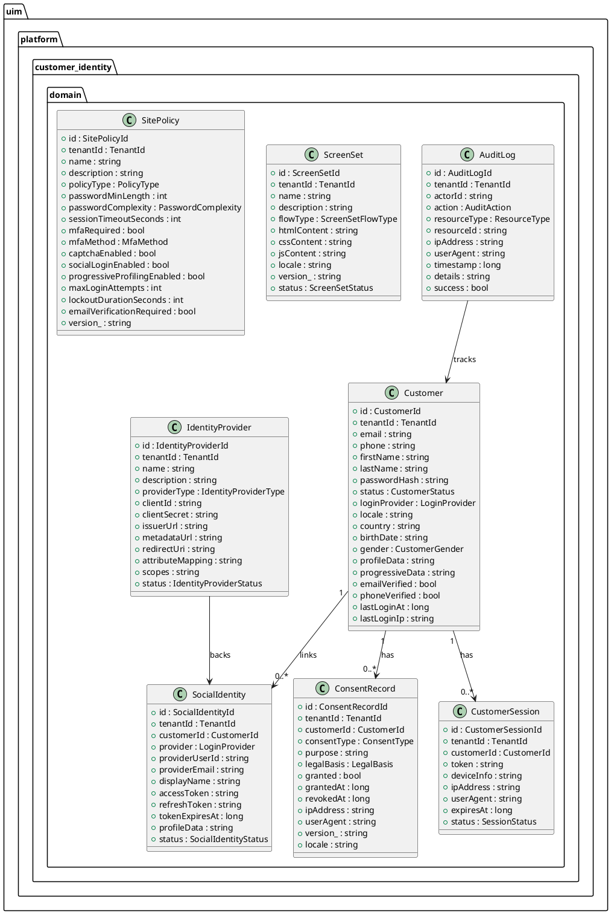
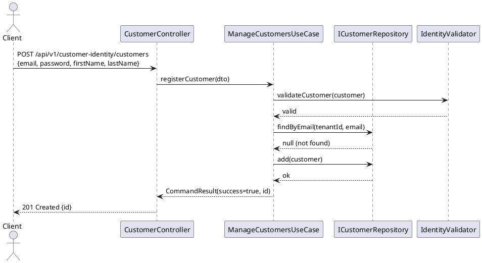
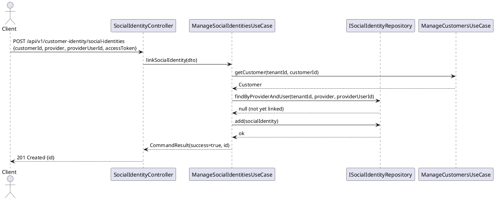
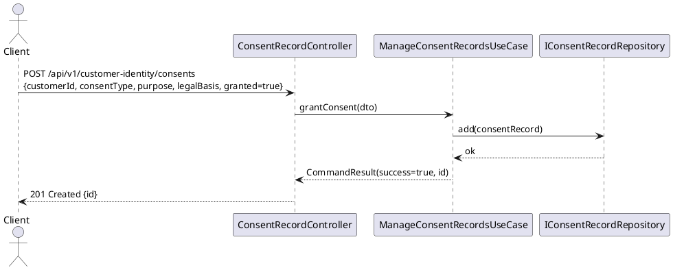
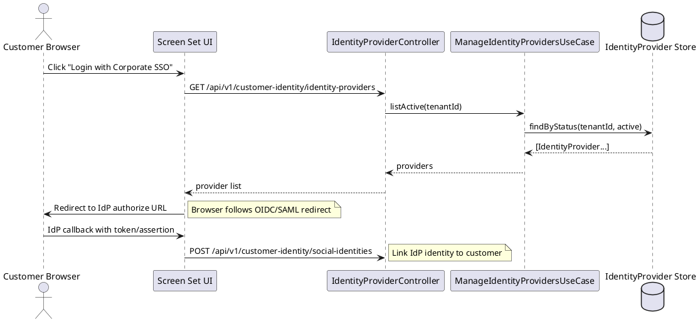

# Customer Identity Service — UML Diagrams

## Domain Entity Class Diagram

## Sequence Diagrams

### Customer Registration Flow

### Social Login / Account Linking Flow

### Consent Grant Flow

### Identity Provider Federation (OIDC/SAML)

