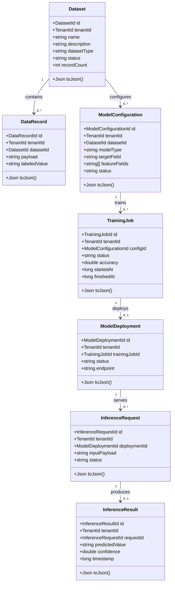
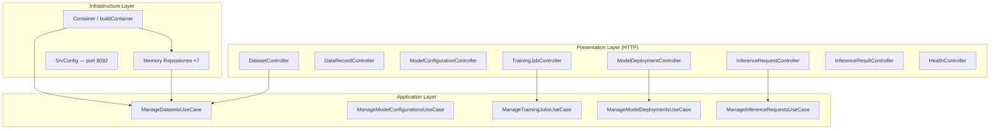
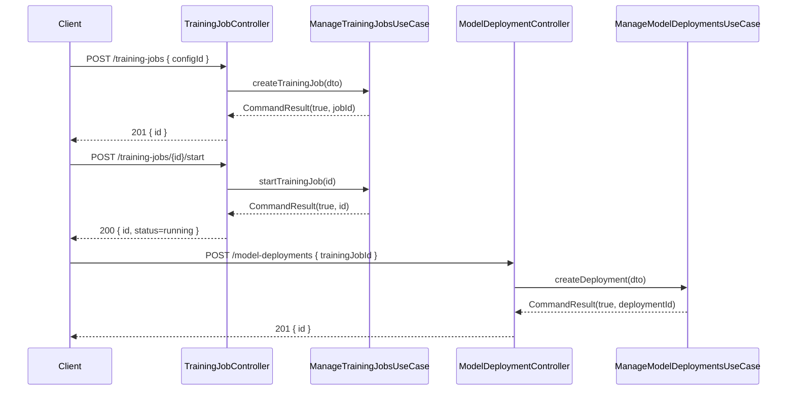

# UML — Data Attribute Recommendation Service

## Class Diagram — Domain Entities

```mermaid
classDiagram
    class Dataset {
        +DatasetId id
        +TenantId tenantId
        +string name
        +string description
        +string datasetType
        +string status
        +int recordCount
        +Json toJson()
    }
    class DataRecord {
        +DataRecordId id
        +TenantId tenantId
        +DatasetId datasetId
        +string payload
        +string labeledValue
        +Json toJson()
    }
    class ModelConfiguration {
        +ModelConfigurationId id
        +TenantId tenantId
        +DatasetId datasetId
        +string modelType
        +string targetField
        +string[] featureFields
        +string status
        +Json toJson()
    }
    class TrainingJob {
        +TrainingJobId id
        +TenantId tenantId
        +ModelConfigurationId configId
        +string status
        +double accuracy
        +long startedAt
        +long finishedAt
        +Json toJson()
    }
    class ModelDeployment {
        +ModelDeploymentId id
        +TenantId tenantId
        +TrainingJobId trainingJobId
        +string status
        +string endpoint
        +Json toJson()
    }
    class InferenceRequest {
        +InferenceRequestId id
        +TenantId tenantId
        +ModelDeploymentId deploymentId
        +string inputPayload
        +string status
        +Json toJson()
    }
    class InferenceResult {
        +InferenceResultId id
        +TenantId tenantId
        +InferenceRequestId requestId
        +string predictedValue
        +double confidence
        +long timestamp
        +Json toJson()
    }

    Dataset "1" --> "0..*" DataRecord : contains
    Dataset "1" --> "0..*" ModelConfiguration : configures
    ModelConfiguration "1" --> "0..*" TrainingJob : trains
    TrainingJob "1" --> "0..1" ModelDeployment : deploys
    ModelDeployment "1" --> "0..*" InferenceRequest : serves
    InferenceRequest "1" --> "0..1" InferenceResult : produces
```

---

## Component Diagram

```mermaid
flowchart TB
    subgraph Presentation["Presentation Layer (HTTP)"]
        C1[DatasetController]
        C2[DataRecordController]
        C3[ModelConfigurationController]
        C4[TrainingJobController]
        C5[ModelDeploymentController]
        C6[InferenceRequestController]
        C7[InferenceResultController]
        HC[HealthController]
    end
    subgraph Application["Application Layer"]
        UC1[ManageDatasetsUseCase]
        UC2[ManageModelConfigurationsUseCase]
        UC3[ManageTrainingJobsUseCase]
        UC4[ManageModelDeploymentsUseCase]
        UC5[ManageInferenceRequestsUseCase]
    end
    subgraph Infrastructure["Infrastructure Layer"]
        MEM[Memory Repositories ×7]
        CFG[SrvConfig — port 8092]
        CTR[Container / buildContainer]
    end
    C1 --> UC1
    C4 --> UC3
    C5 --> UC4
    C6 --> UC5
    MEM --> UC1
    CTR --> UC1
    CTR --> MEM
```

---

## Sequence Diagram — Train and Deploy Model

```mermaid
sequenceDiagram
    participant Client
    participant TJC as TrainingJobController
    participant TUC as ManageTrainingJobsUseCase
    participant MDC as ModelDeploymentController
    participant DUC as ManageModelDeploymentsUseCase

    Client->>TJC: POST /training-jobs { configId }
    TJC->>TUC: createTrainingJob(dto)
    TUC-->>TJC: CommandResult(true, jobId)
    TJC-->>Client: 201 { id }

    Client->>TJC: POST /training-jobs/{id}/start
    TJC->>TUC: startTrainingJob(id)
    TUC-->>TJC: CommandResult(true, id)
    TJC-->>Client: 200 { id, status=running }

    Client->>MDC: POST /model-deployments { trainingJobId }
    MDC->>DUC: createDeployment(dto)
    DUC-->>MDC: CommandResult(true, deploymentId)
    MDC-->>Client: 201 { id }
```
