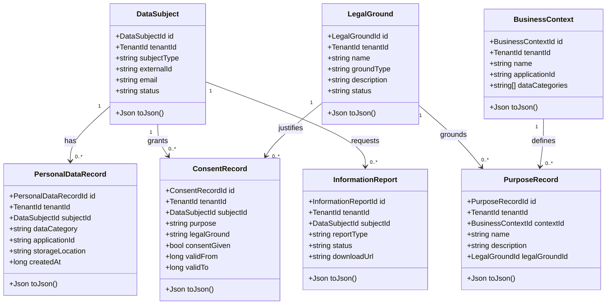
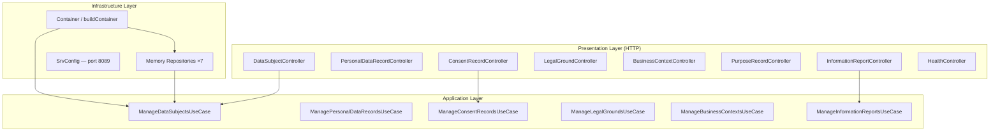
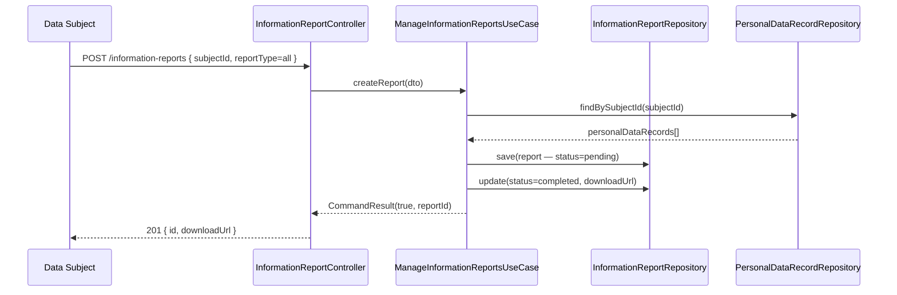

# UML — Data Privacy Integration Service

## Class Diagram — Domain Entities

```mermaid
classDiagram
    class DataSubject {
        +DataSubjectId id
        +TenantId tenantId
        +string subjectType
        +string externalId
        +string email
        +string status
        +Json toJson()
    }
    class PersonalDataRecord {
        +PersonalDataRecordId id
        +TenantId tenantId
        +DataSubjectId subjectId
        +string dataCategory
        +string applicationId
        +string storageLocation
        +long createdAt
        +Json toJson()
    }
    class ConsentRecord {
        +ConsentRecordId id
        +TenantId tenantId
        +DataSubjectId subjectId
        +string purpose
        +string legalGround
        +bool consentGiven
        +long validFrom
        +long validTo
        +Json toJson()
    }
    class LegalGround {
        +LegalGroundId id
        +TenantId tenantId
        +string name
        +string groundType
        +string description
        +string status
        +Json toJson()
    }
    class BusinessContext {
        +BusinessContextId id
        +TenantId tenantId
        +string name
        +string applicationId
        +string[] dataCategories
        +Json toJson()
    }
    class PurposeRecord {
        +PurposeRecordId id
        +TenantId tenantId
        +BusinessContextId contextId
        +string name
        +string description
        +LegalGroundId legalGroundId
        +Json toJson()
    }
    class InformationReport {
        +InformationReportId id
        +TenantId tenantId
        +DataSubjectId subjectId
        +string reportType
        +string status
        +string downloadUrl
        +Json toJson()
    }

    DataSubject "1" --> "0..*" PersonalDataRecord : has
    DataSubject "1" --> "0..*" ConsentRecord : grants
    DataSubject "1" --> "0..*" InformationReport : requests
    LegalGround "1" --> "0..*" ConsentRecord : justifies
    LegalGround "1" --> "0..*" PurposeRecord : grounds
    BusinessContext "1" --> "0..*" PurposeRecord : defines
```

---

## Component Diagram

```mermaid
flowchart TB
    subgraph Presentation["Presentation Layer (HTTP)"]
        C1[DataSubjectController]
        C2[PersonalDataRecordController]
        C3[ConsentRecordController]
        C4[LegalGroundController]
        C5[BusinessContextController]
        C6[PurposeRecordController]
        C7[InformationReportController]
        HC[HealthController]
    end
    subgraph Application["Application Layer"]
        UC1[ManageDataSubjectsUseCase]
        UC2[ManagePersonalDataRecordsUseCase]
        UC3[ManageConsentRecordsUseCase]
        UC4[ManageLegalGroundsUseCase]
        UC5[ManageBusinessContextsUseCase]
        UC7[ManageInformationReportsUseCase]
    end
    subgraph Infrastructure["Infrastructure Layer"]
        MEM[Memory Repositories ×7]
        CFG[SrvConfig — port 8089]
        CTR[Container / buildContainer]
    end
    C1 --> UC1
    C3 --> UC3
    C7 --> UC7
    MEM --> UC1
    CTR --> UC1
    CTR --> MEM
```

---

## Sequence Diagram — GDPR Information Request

```mermaid
sequenceDiagram
    participant DataSubject as Data Subject
    participant IC as InformationReportController
    participant IUC as ManageInformationReportsUseCase
    participant IR as InformationReportRepository
    participant PDR as PersonalDataRecordRepository

    DataSubject->>IC: POST /information-reports { subjectId, reportType=all }
    IC->>IUC: createReport(dto)
    IUC->>PDR: findBySubjectId(subjectId)
    PDR-->>IUC: personalDataRecords[]
    IUC->>IR: save(report — status=pending)
    IUC->>IR: update(status=completed, downloadUrl)
    IUC-->>IC: CommandResult(true, reportId)
    IC-->>DataSubject: 201 { id, downloadUrl }
```
