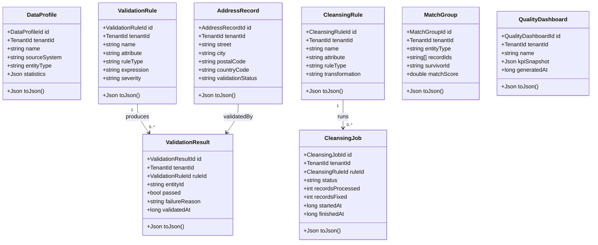
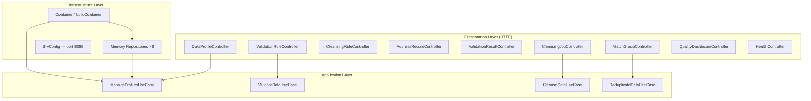
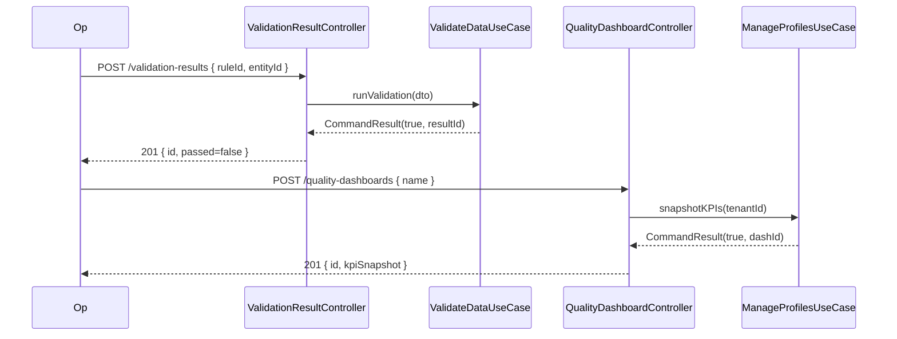

# UML — Data Quality Service

## Class Diagram — Domain Entities

```mermaid
classDiagram
    class DataProfile {
        +DataProfileId id
        +TenantId tenantId
        +string name
        +string sourceSystem
        +string entityType
        +Json statistics
        +Json toJson()
    }
    class ValidationRule {
        +ValidationRuleId id
        +TenantId tenantId
        +string name
        +string attribute
        +string ruleType
        +string expression
        +string severity
        +Json toJson()
    }
    class CleansingRule {
        +CleansingRuleId id
        +TenantId tenantId
        +string name
        +string attribute
        +string ruleType
        +string transformation
        +Json toJson()
    }
    class AddressRecord {
        +AddressRecordId id
        +TenantId tenantId
        +string street
        +string city
        +string postalCode
        +string countryCode
        +string validationStatus
        +Json toJson()
    }
    class ValidationResult {
        +ValidationResultId id
        +TenantId tenantId
        +ValidationRuleId ruleId
        +string entityId
        +bool passed
        +string failureReason
        +long validatedAt
        +Json toJson()
    }
    class CleansingJob {
        +CleansingJobId id
        +TenantId tenantId
        +CleansingRuleId ruleId
        +string status
        +int recordsProcessed
        +int recordsFixed
        +long startedAt
        +long finishedAt
        +Json toJson()
    }
    class MatchGroup {
        +MatchGroupId id
        +TenantId tenantId
        +string entityType
        +string[] recordIds
        +string survivorId
        +double matchScore
        +Json toJson()
    }
    class QualityDashboard {
        +QualityDashboardId id
        +TenantId tenantId
        +string name
        +Json kpiSnapshot
        +long generatedAt
        +Json toJson()
    }

    ValidationRule "1" --> "0..*" ValidationResult : produces
    CleansingRule "1" --> "0..*" CleansingJob : runs
    AddressRecord --> ValidationResult : validatedBy
```

---

## Component Diagram

```mermaid
flowchart TB
    subgraph Presentation["Presentation Layer (HTTP)"]
        C1[DataProfileController]
        C2[ValidationRuleController]
        C3[CleansingRuleController]
        C4[AddressRecordController]
        C5[ValidationResultController]
        C6[CleansingJobController]
        C7[MatchGroupController]
        C8[QualityDashboardController]
        HC[HealthController]
    end
    subgraph Application["Application Layer"]
        UC1[ManageProfilesUseCase]
        UC2[ValidateDataUseCase]
        UC3[CleanseDataUseCase]
        UC4[DeduplicateDataUseCase]
    end
    subgraph Infrastructure["Infrastructure Layer"]
        MEM[Memory Repositories ×8]
        CFG[SrvConfig — port 8086]
        CTR[Container / buildContainer]
    end
    C1 --> UC1
    C2 --> UC2
    C6 --> UC3
    C7 --> UC4
    MEM --> UC1
    CTR --> UC1
    CTR --> MEM
```

---

## Sequence Diagram — Run Validation and Generate Dashboard

```mermaid
sequenceDiagram
    participant Op
    participant VRC as ValidationResultController
    participant VUC as ValidateDataUseCase
    participant DBC as QualityDashboardController
    participant DUC as ManageProfilesUseCase

    Op->>VRC: POST /validation-results { ruleId, entityId }
    VRC->>VUC: runValidation(dto)
    VUC-->>VRC: CommandResult(true, resultId)
    VRC-->>Op: 201 { id, passed=false }

    Op->>DBC: POST /quality-dashboards { name }
    DBC->>DUC: snapshotKPIs(tenantId)
    DUC-->>DBC: CommandResult(true, dashId)
    DBC-->>Op: 201 { id, kpiSnapshot }
```
