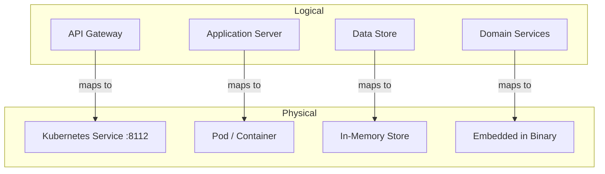
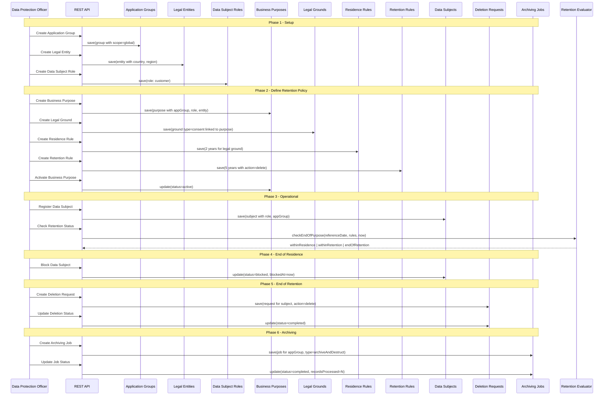
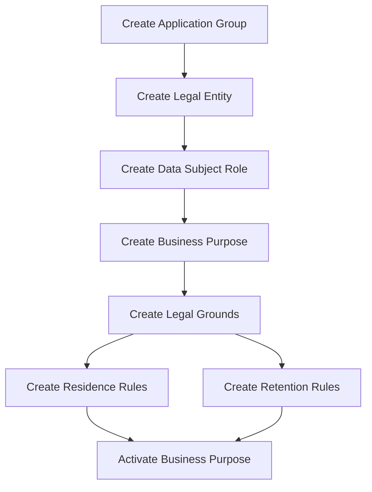
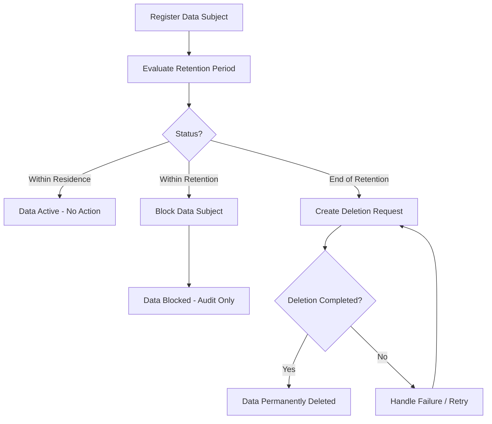
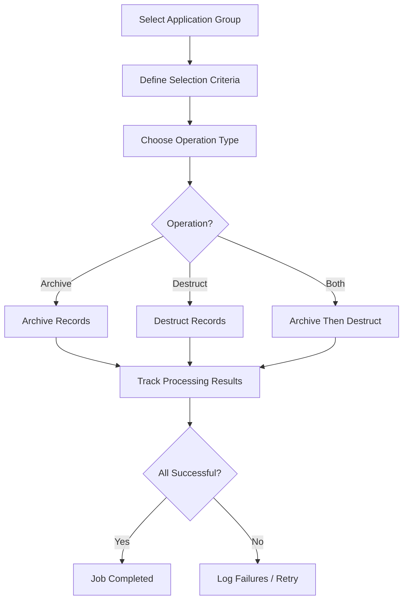
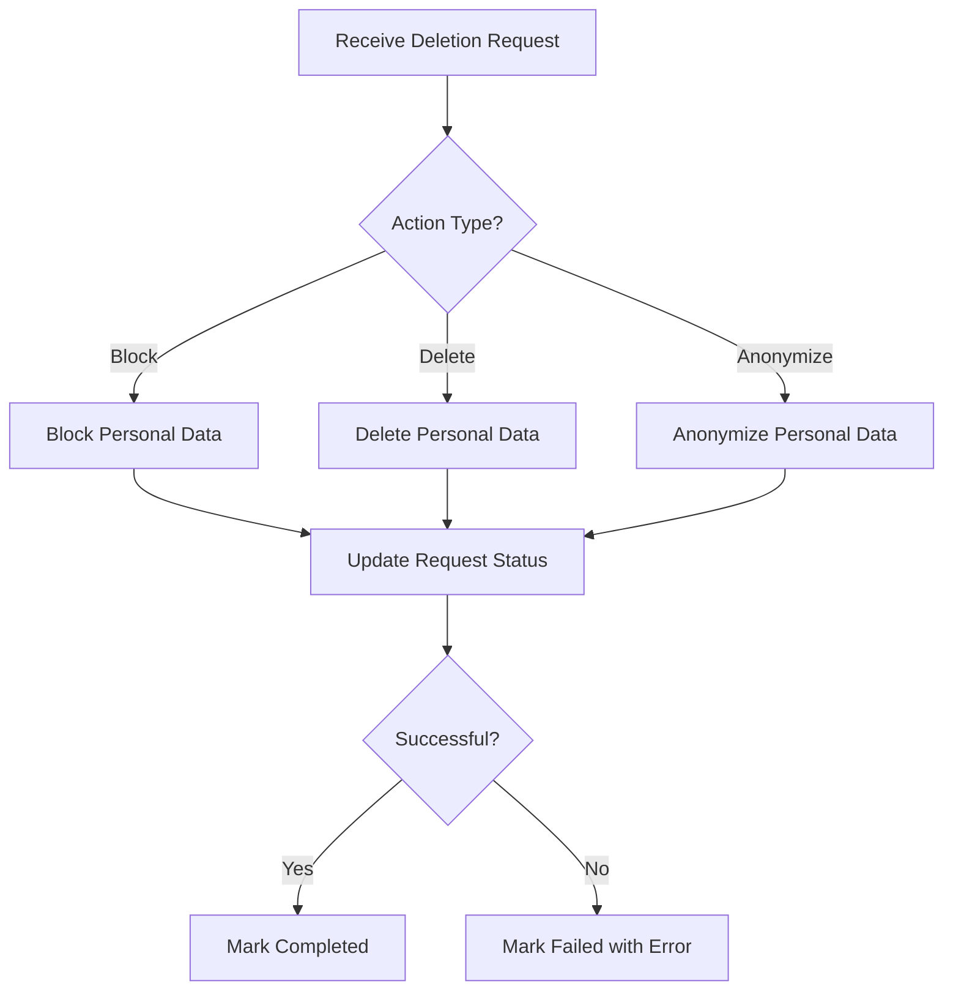
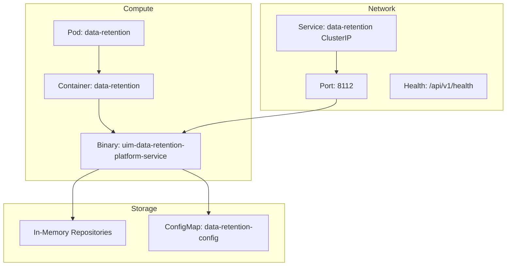
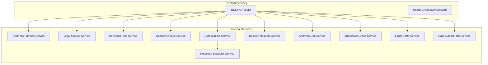

# Data Retention Manager Service -- NATO Architecture Framework v4 (NAFv4)

## C1 -- Capability Taxonomy

```mermaid
graph TD
    ROOT[Data Retention Manager Capabilities]

    ROOT --> C1[Business Purpose Management]
    C1 --> C1a[Create Business Purpose Rules]
    C1b[Associate Legal Grounds]
    C1c[Activate/Deactivate Business Purpose]
    C1d[Calculate End-of-Purpose Date]
    C1 --> C1b
    C1 --> C1c
    C1 --> C1d

    ROOT --> C2[Legal Ground Management]
    C2 --> C2a[Define Legal Bases for Processing]
    C2 --> C2b[Map Legal Grounds to Business Purposes]
    C2 --> C2c[Support GDPR Article 6 Ground Types]
    C2 --> C2d[Track Reference Dates]

    ROOT --> C3[Retention Rules Handling]
    C3 --> C3a[Define Retention Periods per Legal Ground]
    C3 --> C3b[Configure Period Duration and Unit]
    C3 --> C3c[Set Action on Expiry]
    C3 --> C3d[Enable/Disable Retention Rules]

    ROOT --> C4[Residence Rules Handling]
    C4 --> C4a[Define Residence Periods per Legal Ground]
    C4 --> C4b[Configure Period Duration and Unit]
    C4 --> C4c[Link to Business Purpose]
    C4 --> C4d[Enable/Disable Residence Rules]

    ROOT --> C5[Data Subject Lifecycle]
    C5 --> C5a[Register Data Subjects]
    C5 --> C5b[Track Lifecycle Status]
    C5 --> C5c[Block Data Subject at End of Residence]
    C5 --> C5d[Mark for Deletion at End of Retention]

    ROOT --> C6[Deletion Request Processing]
    C6 --> C6a[Create Block/Delete/Anonymize Requests]
    C6 --> C6b[Track Request Status Lifecycle]
    C6 --> C6c[Handle Request Completion and Failure]
    C6 --> C6d[Scope Requests by Application Group]

    ROOT --> C7[Archiving and Destruction]
    C7 --> C7a[Schedule Archiving Jobs]
    C7 --> C7b[Execute Archive/Destruct Operations]
    C7 --> C7c[Track Records Processed and Failed]
    C7 --> C7d[Support Selection Criteria]

    ROOT --> C8[Application Group Organization]
    C8 --> C8a[Group Applications by Scope]
    C8 --> C8b[Associate Applications to Groups]
    C8 --> C8c[Support Global/Regional/Local Scopes]
    C8 --> C8d[Manage Group Lifecycle]

    ROOT --> C9[Legal Entity Management]
    C9 --> C9a[Define Legal Entities per Jurisdiction]
    C9 --> C9b[Track Country and Region]
    C9 --> C9c[Associate with Business Purposes]
    C9 --> C9d[Manage Entity Lifecycle]

    ROOT --> C10[Retention Period Evaluation]
    C10 --> C10a[Check End-of-Purpose Status]
    C10 --> C10b[Evaluate Residence Expiry]
    C10 --> C10c[Evaluate Retention Expiry]
    C10 --> C10d[Calculate Period Boundaries]
```

## C2 -- Enterprise Vision

The Data Retention Manager Service provides a comprehensive platform for managing the lifecycle of personal data in compliance with data protection regulations such as GDPR.

**Business Purpose Management** enables Data Protection Officers to define business purposes that group legal grounds and determine residence and retention periods. Business purposes are associated with application groups, data subject roles, and legal entities to establish the regulatory context.

**Legal Ground Management** supports all six GDPR Article 6 legal bases: consent, contract performance, legal obligation, vital interest, public interest, and legitimate interest. Each legal ground is linked to a business purpose and carries its own reference date.

**Retention and Residence Rules** define the temporal boundaries for data processing. Residence rules specify how long data may be actively used; retention rules define how long blocked data must be retained for legal compliance. Both support configurable durations in days, weeks, months, or years.

**Data Subject Lifecycle Management** tracks individuals through their data lifecycle from active through blocked, marked-for-deletion, deleted, and archived states. The system supports explicit blocking at end-of-residence and deletion at end-of-retention.

**Deletion Request Processing** orchestrates the actual blocking, deletion, or anonymization of data subjects. Requests track their processing lifecycle from pending through in-progress to completion or failure, with error tracking for failed operations.

**Archiving and Destruction** enables bulk operations on application data. Jobs can archive, destruct, or do both, with selection criteria to target specific data ranges. Job execution tracking includes records processed, failed, and timing.

**Application Group Organization** provides the structural foundation by grouping applications at global, regional, or local scope. All retention policies, data subjects, and operations reference application groups for scoping.

**Legal Entity and Role Management** complete the regulatory model by defining the jurisdictional context (country, region) and the categorization of data subjects (customer, employee, vendor, etc.).

**Retention Period Evaluation** is the core domain service that computes whether data is within residence, within retention, or past end-of-retention based on the configured rules and reference dates.

## L1 -- Node Types

## L2 -- Logical Scenario

## L4 -- Logical Activity

### Activity 1: Retention Policy Setup

### Activity 2: Data Subject Processing

### Activity 3: Archiving Workflow

### Activity 4: Deletion Request Processing

## P1 -- Resource Types

## S1 -- Service Taxonomy

## Sv-1 -- Service Interface Parameters

| # | Method | Endpoint | Request Body | Response |
|---|--------|----------|-------------|----------|
| 1 | GET | `/api/v1/health` | - | `{status, service}` |
| 2 | POST | `/api/v1/data-retention/business-purposes` | `{name, description, applicationGroupId, dataSubjectRoleId, legalEntityId, referenceDate, createdBy}` | `{id}` 201 |
| 3 | GET | `/api/v1/data-retention/business-purposes` | - | `{items[], totalCount}` 200 |
| 4 | GET | `/api/v1/data-retention/business-purposes/{id}` | - | `{id, name, description, applicationGroupId, dataSubjectRoleId, legalEntityId, status, referenceDate}` 200 |
| 5 | PUT | `/api/v1/data-retention/business-purposes/{id}` | `{name, description, applicationGroupId, dataSubjectRoleId, legalEntityId, referenceDate}` | `{id}` 200 |
| 6 | POST | `/api/v1/data-retention/business-purposes/{id}/activate` | - | `{id, status}` 200 |
| 7 | DELETE | `/api/v1/data-retention/business-purposes/{id}` | - | `{}` 204 |
| 8 | POST | `/api/v1/data-retention/legal-grounds` | `{name, description, businessPurposeId, type, referenceDate, createdBy}` | `{id}` 201 |
| 9 | GET | `/api/v1/data-retention/legal-grounds` | - | `{items[], totalCount}` 200 |
| 10 | GET | `/api/v1/data-retention/legal-grounds/{id}` | - | `{id, name, description, businessPurposeId, type, referenceDate, isActive}` 200 |
| 11 | PUT | `/api/v1/data-retention/legal-grounds/{id}` | `{name, description, type, referenceDate}` | `{id}` 200 |
| 12 | DELETE | `/api/v1/data-retention/legal-grounds/{id}` | - | `{}` 204 |
| 13 | POST | `/api/v1/data-retention/retention-rules` | `{businessPurposeId, legalGroundId, duration, periodUnit, actionOnExpiry, createdBy}` | `{id}` 201 |
| 14 | GET | `/api/v1/data-retention/retention-rules` | - | `{items[], totalCount}` 200 |
| 15 | GET | `/api/v1/data-retention/retention-rules/{id}` | - | `{id, businessPurposeId, legalGroundId, duration, periodUnit, actionOnExpiry, isActive}` 200 |
| 16 | PUT | `/api/v1/data-retention/retention-rules/{id}` | `{duration, periodUnit, actionOnExpiry, isActive}` | `{id}` 200 |
| 17 | DELETE | `/api/v1/data-retention/retention-rules/{id}` | - | `{}` 204 |
| 18 | POST | `/api/v1/data-retention/residence-rules` | `{businessPurposeId, legalGroundId, duration, periodUnit, createdBy}` | `{id}` 201 |
| 19 | GET | `/api/v1/data-retention/residence-rules` | - | `{items[], totalCount}` 200 |
| 20 | GET | `/api/v1/data-retention/residence-rules/{id}` | - | `{id, businessPurposeId, legalGroundId, duration, periodUnit, isActive}` 200 |
| 21 | PUT | `/api/v1/data-retention/residence-rules/{id}` | `{duration, periodUnit, isActive}` | `{id}` 200 |
| 22 | DELETE | `/api/v1/data-retention/residence-rules/{id}` | - | `{}` 204 |
| 23 | POST | `/api/v1/data-retention/data-subjects` | `{roleId, applicationGroupId, externalId, createdBy}` | `{id}` 201 |
| 24 | GET | `/api/v1/data-retention/data-subjects` | - | `{items[], totalCount}` 200 |
| 25 | GET | `/api/v1/data-retention/data-subjects/{id}` | - | `{id, externalId, roleId, applicationGroupId, lifecycleStatus, endOfPurposeDate, endOfRetentionDate}` 200 |
| 26 | PUT | `/api/v1/data-retention/data-subjects/{id}` | `{lifecycleStatus, roleId}` | `{id}` 200 |
| 27 | POST | `/api/v1/data-retention/data-subjects/{id}/block` | - | `{id, lifecycleStatus}` 200 |
| 28 | DELETE | `/api/v1/data-retention/data-subjects/{id}` | - | `{}` 204 |
| 29 | POST | `/api/v1/data-retention/deletion-requests` | `{dataSubjectId, applicationGroupId, actionType, reason, requestedBy}` | `{id}` 201 |
| 30 | GET | `/api/v1/data-retention/deletion-requests` | - | `{items[], totalCount}` 200 |
| 31 | GET | `/api/v1/data-retention/deletion-requests/{id}` | - | `{id, dataSubjectId, applicationGroupId, actionType, status, reason, requestedBy}` 200 |
| 32 | PUT | `/api/v1/data-retention/deletion-requests/{id}` | `{status, errorMessage}` | `{id}` 200 |
| 33 | DELETE | `/api/v1/data-retention/deletion-requests/{id}` | - | `{}` 204 |
| 34 | POST | `/api/v1/data-retention/archiving-jobs` | `{applicationGroupId, operationType, selectionCriteria, scheduledAt, createdBy}` | `{id}` 201 |
| 35 | GET | `/api/v1/data-retention/archiving-jobs` | - | `{items[], totalCount}` 200 |
| 36 | GET | `/api/v1/data-retention/archiving-jobs/{id}` | - | `{id, applicationGroupId, operationType, status, scheduledAt, recordsProcessed, recordsFailed}` 200 |
| 37 | PUT | `/api/v1/data-retention/archiving-jobs/{id}` | `{status, recordsProcessed, recordsFailed, errorMessage}` | `{id}` 200 |
| 38 | DELETE | `/api/v1/data-retention/archiving-jobs/{id}` | - | `{}` 204 |
| 39 | POST | `/api/v1/data-retention/application-groups` | `{name, description, scope, applicationIds, createdBy}` | `{id}` 201 |
| 40 | GET | `/api/v1/data-retention/application-groups` | - | `{items[], totalCount}` 200 |
| 41 | GET | `/api/v1/data-retention/application-groups/{id}` | - | `{id, name, description, scope, applicationIds, isActive}` 200 |
| 42 | PUT | `/api/v1/data-retention/application-groups/{id}` | `{name, description, scope, applicationIds, isActive}` | `{id}` 200 |
| 43 | DELETE | `/api/v1/data-retention/application-groups/{id}` | - | `{}` 204 |
| 44 | POST | `/api/v1/data-retention/legal-entities` | `{name, description, country, region, createdBy}` | `{id}` 201 |
| 45 | GET | `/api/v1/data-retention/legal-entities` | - | `{items[], totalCount}` 200 |
| 46 | GET | `/api/v1/data-retention/legal-entities/{id}` | - | `{id, name, description, country, region, isActive}` 200 |
| 47 | PUT | `/api/v1/data-retention/legal-entities/{id}` | `{name, description, country, region, isActive}` | `{id}` 200 |
| 48 | DELETE | `/api/v1/data-retention/legal-entities/{id}` | - | `{}` 204 |
| 49 | POST | `/api/v1/data-retention/data-subject-roles` | `{name, description, createdBy}` | `{id}` 201 |
| 50 | GET | `/api/v1/data-retention/data-subject-roles` | - | `{items[], totalCount}` 200 |
| 51 | GET | `/api/v1/data-retention/data-subject-roles/{id}` | - | `{id, name, description, isActive}` 200 |
| 52 | PUT | `/api/v1/data-retention/data-subject-roles/{id}` | `{name, description, isActive}` | `{id}` 200 |
| 53 | DELETE | `/api/v1/data-retention/data-subject-roles/{id}` | - | `{}` 204 |
