# Data Retention Manager Service -- UML Diagrams

## Class Diagram -- Domain Entities

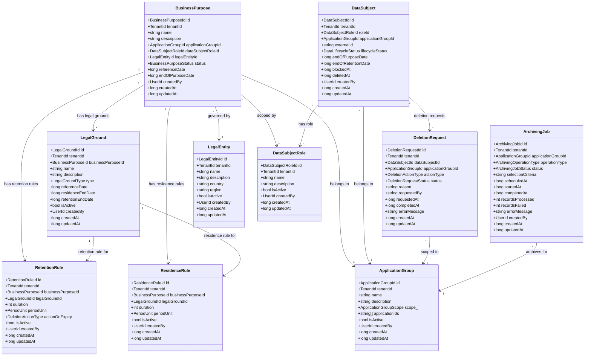

## Class Diagram -- Repository Interfaces

```mermaid
classDiagram
    class BusinessPurposeRepository {
        <<interface>>
        +existsById(BusinessPurposeId) bool
        +findById(BusinessPurposeId) BusinessPurpose
        +findAll(TenantId) BusinessPurpose[]
        +findByApplicationGroup(TenantId, ApplicationGroupId) BusinessPurpose[]
        +findByStatus(TenantId, BusinessPurposeStatus) BusinessPurpose[]
        +save(BusinessPurpose)
        +update(BusinessPurpose)
    }

    class LegalGroundRepository {
        <<interface>>
        +existsById(LegalGroundId) bool
        +findById(LegalGroundId) LegalGround
        +findAll(TenantId) LegalGround[]
        +findByBusinessPurpose(TenantId, BusinessPurposeId) LegalGround[]
        +findByType(TenantId, LegalGroundType) LegalGround[]
        +save(LegalGround)
        +update(LegalGround)
    }

    class RetentionRuleRepository {
        <<interface>>
        +existsById(RetentionRuleId) bool
        +findById(RetentionRuleId) RetentionRule
        +findAll(TenantId) RetentionRule[]
        +findByBusinessPurpose(TenantId, BusinessPurposeId) RetentionRule[]
        +findByLegalGround(TenantId, LegalGroundId) RetentionRule[]
        +save(RetentionRule)
        +update(RetentionRule)
    }

    class ResidenceRuleRepository {
        <<interface>>
        +existsById(ResidenceRuleId) bool
        +findById(ResidenceRuleId) ResidenceRule
        +findAll(TenantId) ResidenceRule[]
        +findByBusinessPurpose(TenantId, BusinessPurposeId) ResidenceRule[]
        +findByLegalGround(TenantId, LegalGroundId) ResidenceRule[]
        +save(ResidenceRule)
        +update(ResidenceRule)
    }

    class DataSubjectRepository {
        <<interface>>
        +existsById(DataSubjectId) bool
        +findById(DataSubjectId) DataSubject
        +findAll(TenantId) DataSubject[]
        +findByApplicationGroup(TenantId, ApplicationGroupId) DataSubject[]
        +findByLifecycleStatus(TenantId, DataLifecycleStatus) DataSubject[]
        +findByRole(TenantId, DataSubjectRoleId) DataSubject[]
        +save(DataSubject)
        +update(DataSubject)
    }

    class DeletionRequestRepository {
        <<interface>>
        +existsById(DeletionRequestId) bool
        +findById(DeletionRequestId) DeletionRequest
        +findAll(TenantId) DeletionRequest[]
        +findByDataSubject(TenantId, DataSubjectId) DeletionRequest[]
        +findByStatus(TenantId, DeletionRequestStatus) DeletionRequest[]
        +findByApplicationGroup(TenantId, ApplicationGroupId) DeletionRequest[]
        +save(DeletionRequest)
        +update(DeletionRequest)
    }

    class ArchivingJobRepository {
        <<interface>>
        +existsById(ArchivingJobId) bool
        +findById(ArchivingJobId) ArchivingJob
        +findAll(TenantId) ArchivingJob[]
        +findByApplicationGroup(TenantId, ApplicationGroupId) ArchivingJob[]
        +findByStatus(TenantId, ArchivingJobStatus) ArchivingJob[]
        +save(ArchivingJob)
        +update(ArchivingJob)
    }

    class ApplicationGroupRepository {
        <<interface>>
        +existsById(ApplicationGroupId) bool
        +findById(ApplicationGroupId) ApplicationGroup
        +findAll(TenantId) ApplicationGroup[]
        +findActive(TenantId) ApplicationGroup[]
        +save(ApplicationGroup)
        +update(ApplicationGroup)
    }

    class LegalEntityRepository {
        <<interface>>
        +existsById(LegalEntityId) bool
        +findById(LegalEntityId) LegalEntity
        +findAll(TenantId) LegalEntity[]
        +findActive(TenantId) LegalEntity[]
        +save(LegalEntity)
        +update(LegalEntity)
    }

    class DataSubjectRoleRepository {
        <<interface>>
        +existsById(DataSubjectRoleId) bool
        +findById(DataSubjectRoleId) DataSubjectRole
        +findAll(TenantId) DataSubjectRole[]
        +findActive(TenantId) DataSubjectRole[]
        +save(DataSubjectRole)
        +update(DataSubjectRole)
    }
```

## Class Diagram -- Domain Service

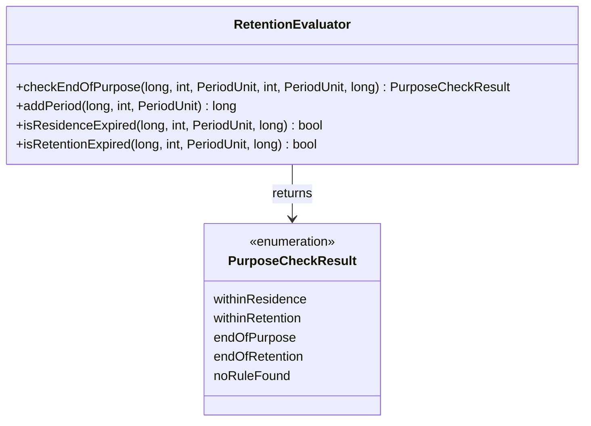

## Use Case Diagram

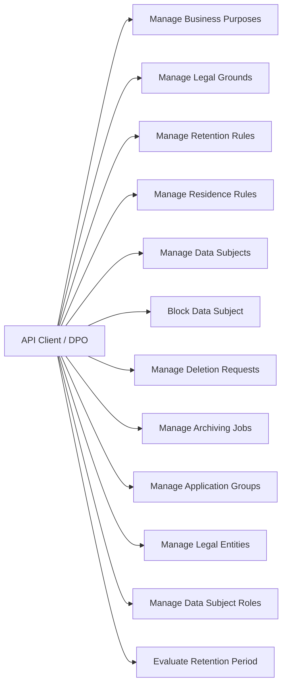

## Component Diagram

```mermaid
graph TB
    subgraph Presentation["Presentation Layer (Driving Adapters)"]
        BPC[BusinessPurposeController]
        LGC[LegalGroundController]
        RRC[RetentionRuleController]
        RSC[ResidenceRuleController]
        DSC[DataSubjectController]
        DRC[DeletionRequestController]
        AJC[ArchivingJobController]
        AGC[ApplicationGroupController]
        LEC[LegalEntityController]
        DSRC[DataSubjectRoleController]
        HC[HealthController]
    end

    subgraph Application["Application Layer (Use Cases)"]
        MBPUC[ManageBusinessPurposesUC]
        MLGUC[ManageLegalGroundsUC]
        MRRUC[ManageRetentionRulesUC]
        MRSUC[ManageResidenceRulesUC]
        MDSUC[ManageDataSubjectsUC]
        MDRUC[ManageDeletionRequestsUC]
        MAJUC[ManageArchivingJobsUC]
        MAGUC[ManageApplicationGroupsUC]
        MLEUC[ManageLegalEntitiesUC]
        MDSRUC[ManageDataSubjectRolesUC]
    end

    subgraph Domain["Domain Layer"]
        E[Entities]
        RI[Repository Interfaces]
        DS[RetentionEvaluator]
        EN[Enumerations]
        VT[Value Types]
    end

    subgraph Infrastructure["Infrastructure Layer (Driven Adapters)"]
        MR[Memory Repositories]
        AC[AppConfig]
        CO[Container / DI]
    end

    BPC --> MBPUC
    LGC --> MLGUC
    RRC --> MRRUC
    RSC --> MRSUC
    DSC --> MDSUC
    DRC --> MDRUC
    AJC --> MAJUC
    AGC --> MAGUC
    LEC --> MLEUC
    DSRC --> MDSRUC

    MBPUC --> RI
    MLGUC --> RI
    MRRUC --> RI
    MRSUC --> RI
    MDSUC --> RI
    MDRUC --> RI
    MAJUC --> RI
    MAGUC --> RI
    MLEUC --> RI
    MDSRUC --> RI

    MR -.->|implements| RI
```

## Sequence Diagram -- Business Purpose Lifecycle

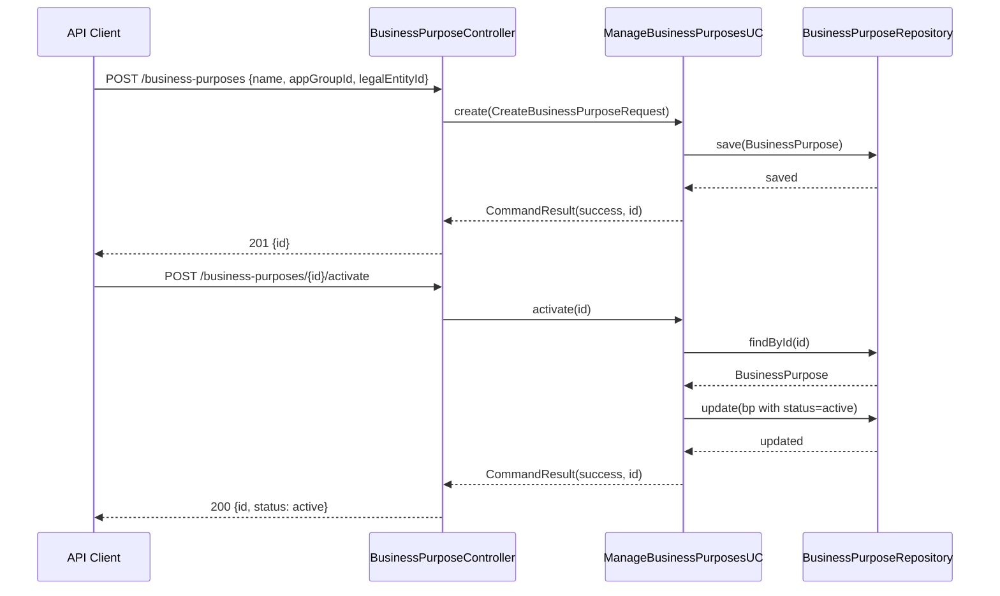

## Sequence Diagram -- Data Subject Blocking Workflow

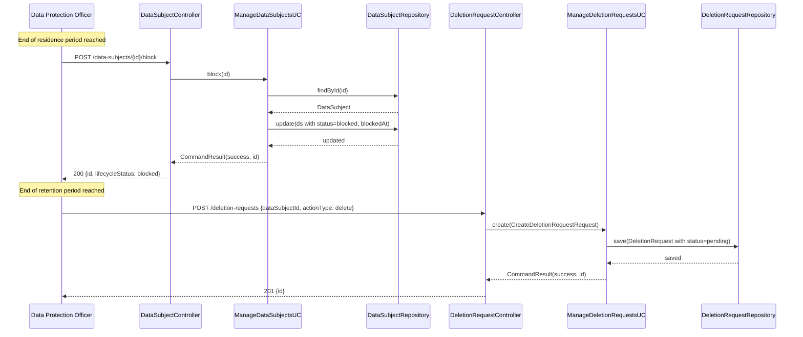

## Sequence Diagram -- Archiving and Destruction Workflow

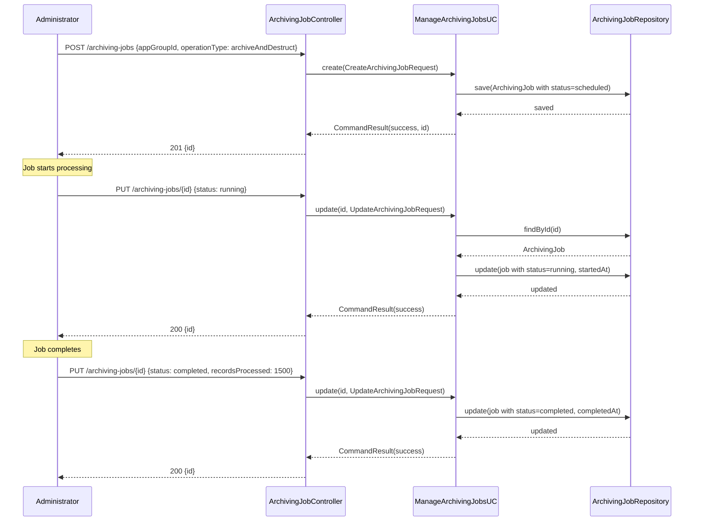

## Sequence Diagram -- Retention Period Evaluation

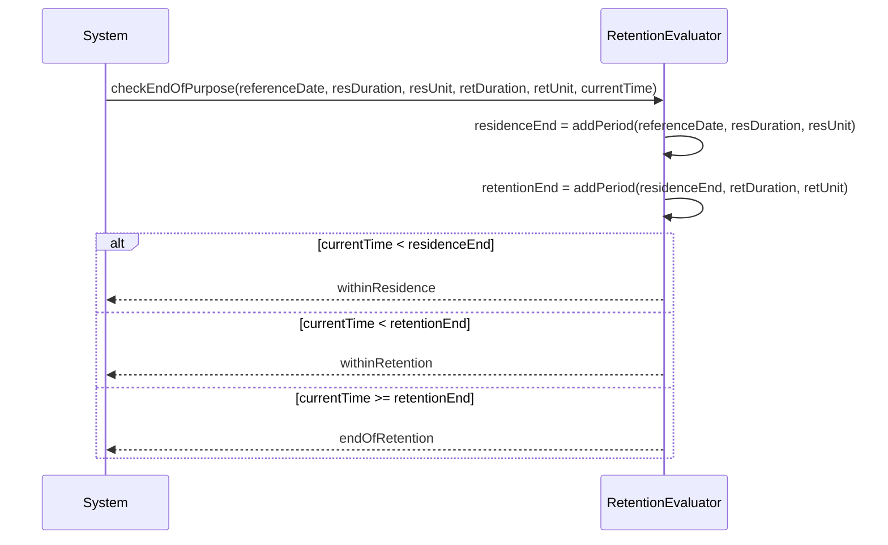

## State Diagram -- Data Subject Lifecycle

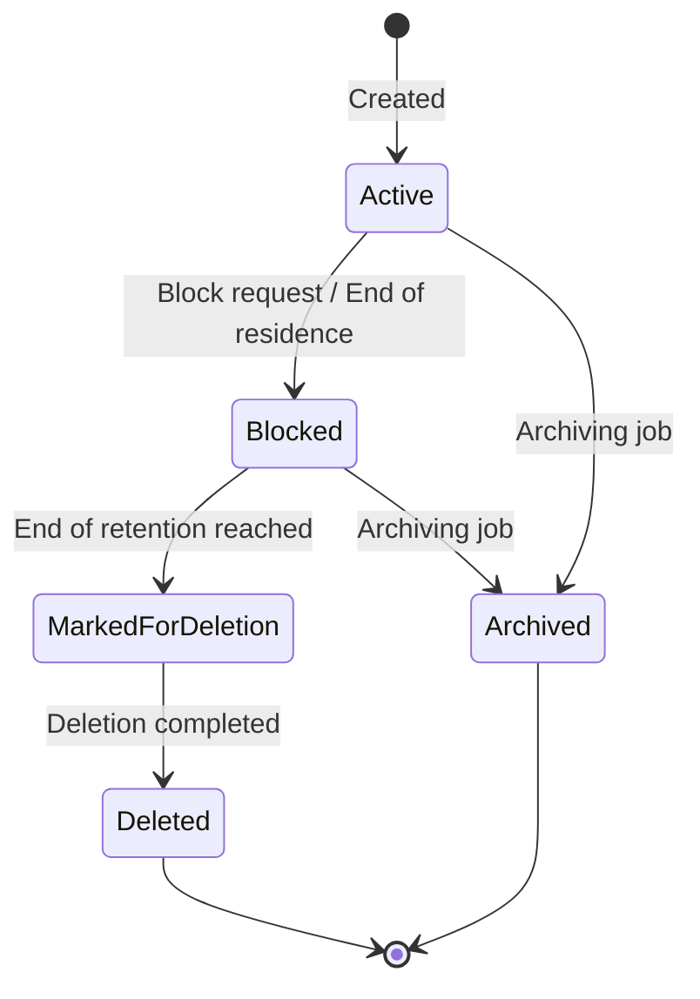

## State Diagram -- Deletion Request Lifecycle

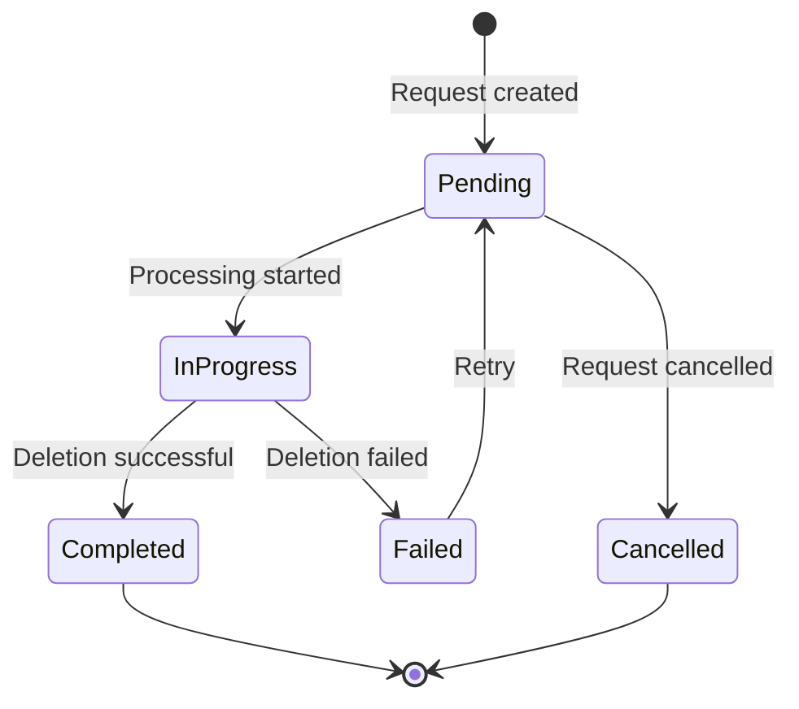

## State Diagram -- Archiving Job Lifecycle

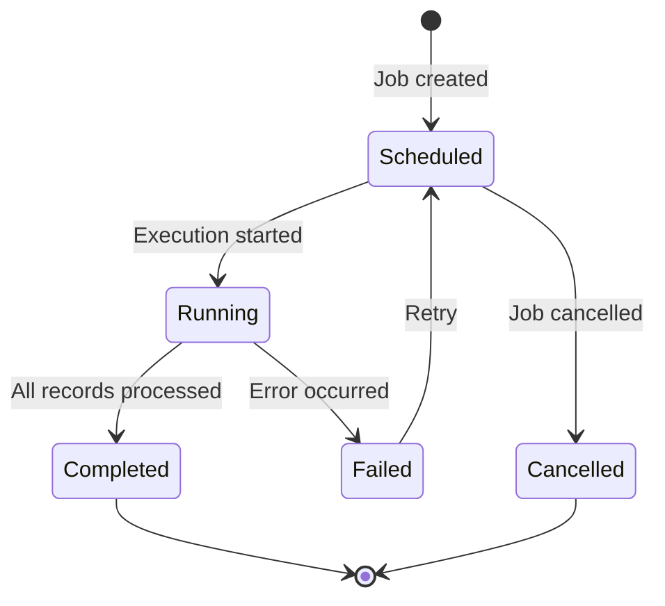
