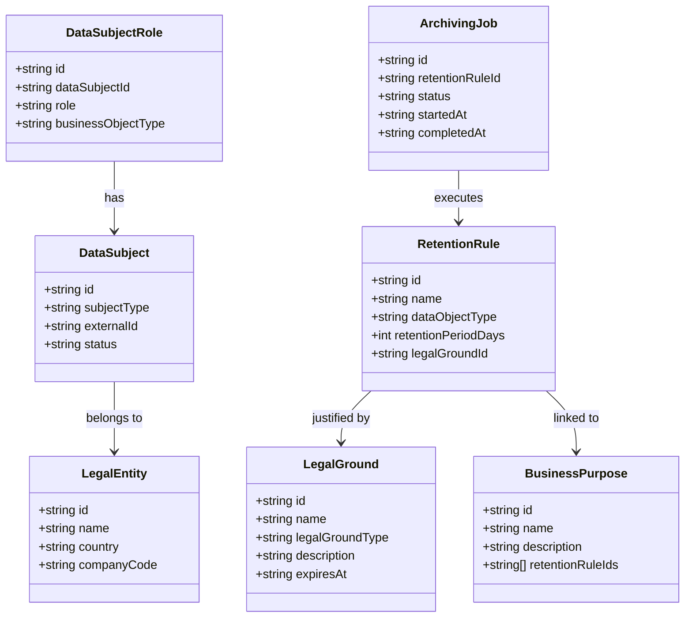
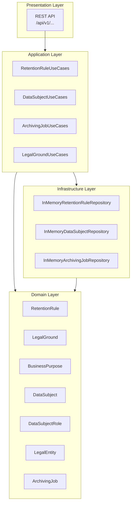
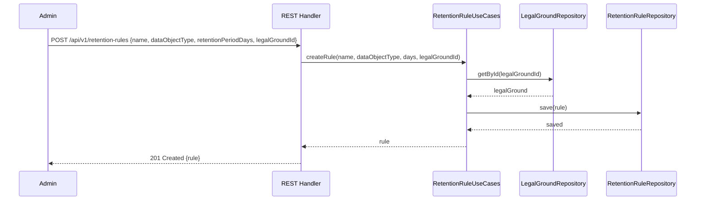

# UML Diagrams — Data Retention Service

## Class Diagram

```mermaid
classDiagram
    class RetentionRule {
        +string id
        +string name
        +string dataObjectType
        +int retentionPeriodDays
        +string legalGroundId
    }
    class LegalGround {
        +string id
        +string name
        +string legalGroundType
        +string description
        +string expiresAt
    }
    class BusinessPurpose {
        +string id
        +string name
        +string description
        +string[] retentionRuleIds
    }
    class DataSubject {
        +string id
        +string subjectType
        +string externalId
        +string status
    }
    class DataSubjectRole {
        +string id
        +string dataSubjectId
        +string role
        +string businessObjectType
    }
    class LegalEntity {
        +string id
        +string name
        +string country
        +string companyCode
    }
    class ArchivingJob {
        +string id
        +string retentionRuleId
        +string status
        +string startedAt
        +string completedAt
    }

    RetentionRule --> LegalGround : justified by
    RetentionRule --> BusinessPurpose : linked to
    DataSubjectRole --> DataSubject : has
    ArchivingJob --> RetentionRule : executes
    DataSubject --> LegalEntity : belongs to
```

## Component Diagram

```mermaid
flowchart TB
    subgraph Presentation["Presentation Layer"]
        REST["REST API\n/api/v1/..."]
    end
    subgraph Application["Application Layer"]
        RR_UC["RetentionRuleUseCases"]
        DS_UC["DataSubjectUseCases"]
        JOB_UC["ArchivingJobUseCases"]
        LG_UC["LegalGroundUseCases"]
    end
    subgraph Domain["Domain Layer"]
        RR["RetentionRule"]
        LG["LegalGround"]
        BP["BusinessPurpose"]
        DS["DataSubject"]
        DSR["DataSubjectRole"]
        LE["LegalEntity"]
        JOB["ArchivingJob"]
    end
    subgraph Infrastructure["Infrastructure Layer"]
        RR_REPO["InMemoryRetentionRuleRepository"]
        DS_REPO["InMemoryDataSubjectRepository"]
        JOB_REPO["InMemoryArchivingJobRepository"]
    end

    REST --> Application
    Application --> Domain
    Infrastructure --> Domain
    Application --> Infrastructure
```

## Sequence Diagram — Create Retention Rule

```mermaid
sequenceDiagram
    participant A as Admin
    participant R as REST Handler
    participant UC as RetentionRuleUseCases
    participant LGR as LegalGroundRepository
    participant RRR as RetentionRuleRepository

    A->>R: POST /api/v1/retention-rules {name, dataObjectType, retentionPeriodDays, legalGroundId}
    R->>UC: createRule(name, dataObjectType, days, legalGroundId)
    UC->>LGR: getById(legalGroundId)
    LGR-->>UC: legalGround
    UC->>RRR: save(rule)
    RRR-->>UC: saved
    UC-->>R: rule
    R-->>A: 201 Created {rule}
```
