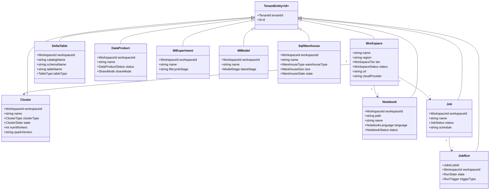
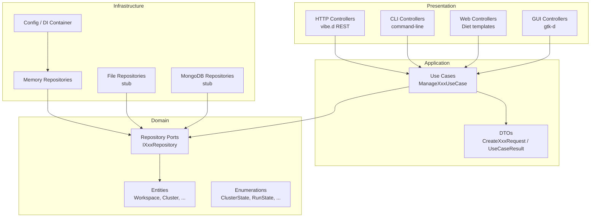
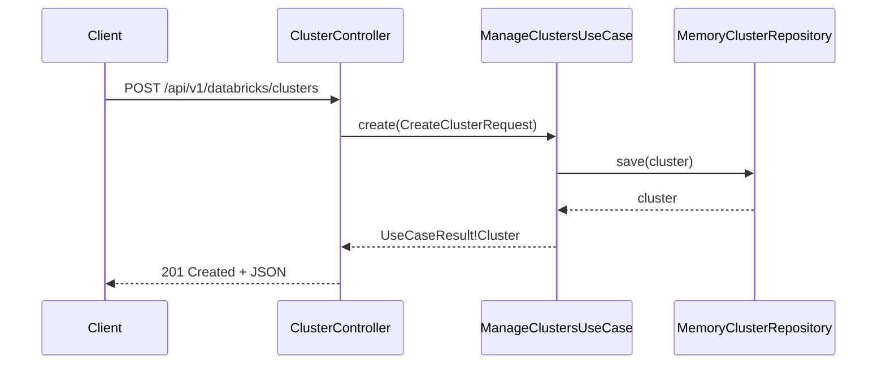
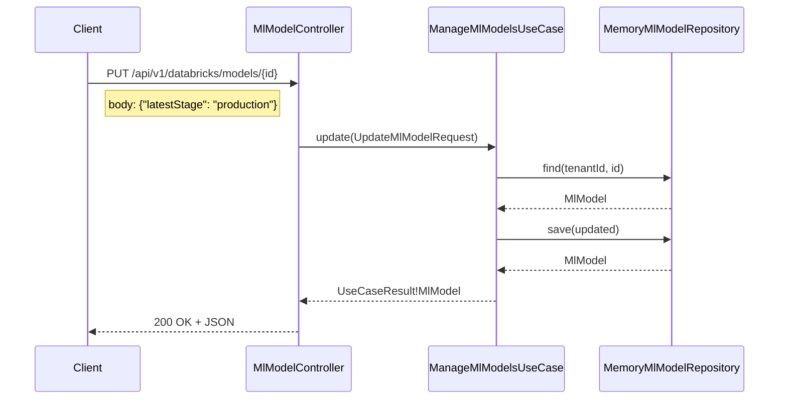

# UIM Databricks — UML Diagrams

## Class Diagram — Domain Layer

## Component Diagram — Architecture Layers

## Sequence Diagram — Create Cluster

## Sequence Diagram — ML Model Stage Promotion

