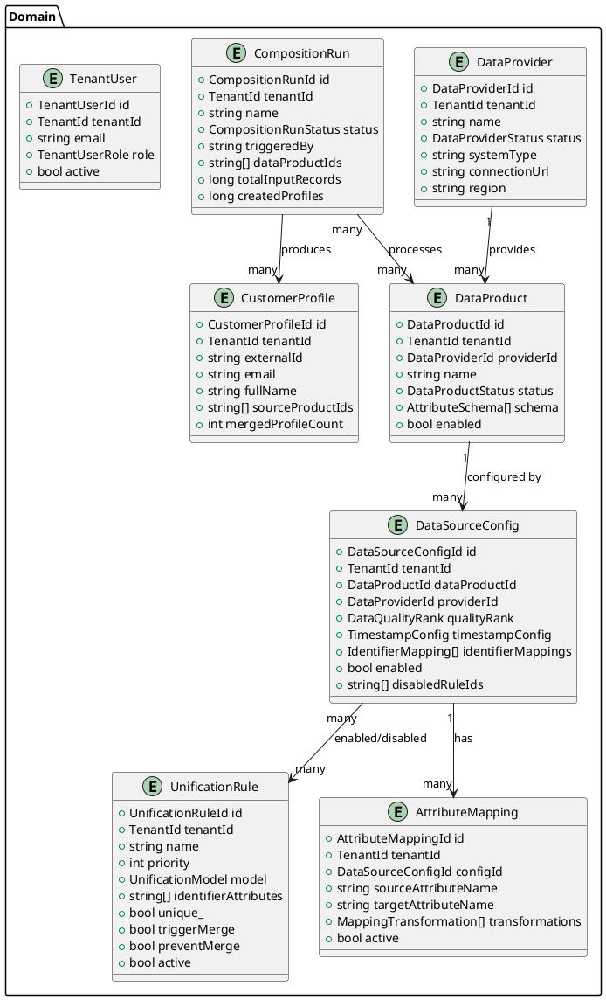
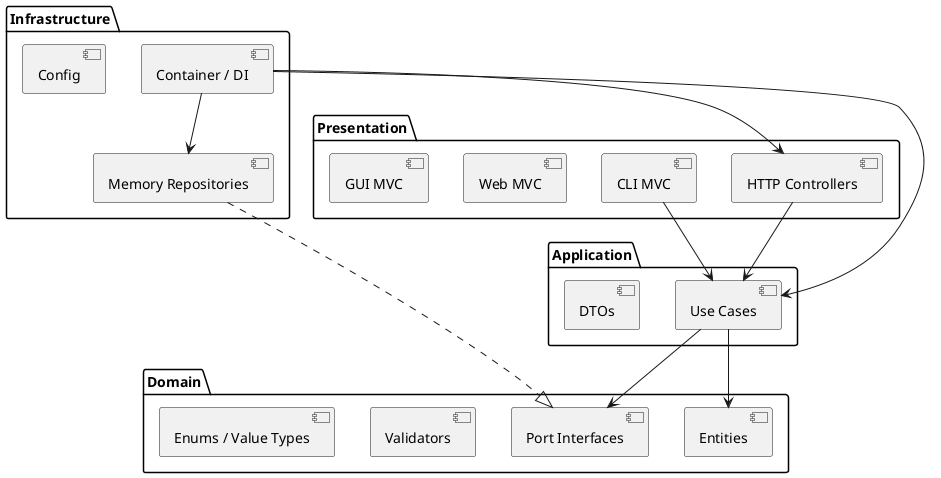
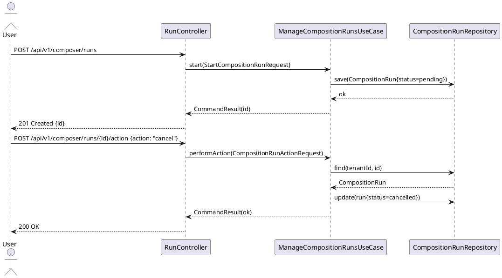

# UML — Datasphere Data Composer

## Domain Entity Relationships

```plantuml
@startuml
package "Domain" {
  entity DataProvider {
    + DataProviderId id
    + TenantId tenantId
    + string name
    + DataProviderStatus status
    + string systemType
    + string connectionUrl
    + string region
  }

  entity DataProduct {
    + DataProductId id
    + TenantId tenantId
    + DataProviderId providerId
    + string name
    + DataProductStatus status
    + AttributeSchema[] schema
    + bool enabled
  }

  entity UnificationRule {
    + UnificationRuleId id
    + TenantId tenantId
    + string name
    + int priority
    + UnificationModel model
    + string[] identifierAttributes
    + bool unique_
    + bool triggerMerge
    + bool preventMerge
    + bool active
  }

  entity DataSourceConfig {
    + DataSourceConfigId id
    + TenantId tenantId
    + DataProductId dataProductId
    + DataProviderId providerId
    + DataQualityRank qualityRank
    + TimestampConfig timestampConfig
    + IdentifierMapping[] identifierMappings
    + bool enabled
    + string[] disabledRuleIds
  }

  entity AttributeMapping {
    + AttributeMappingId id
    + TenantId tenantId
    + DataSourceConfigId configId
    + string sourceAttributeName
    + string targetAttributeName
    + MappingTransformation[] transformations
    + bool active
  }

  entity CustomerProfile {
    + CustomerProfileId id
    + TenantId tenantId
    + string externalId
    + string email
    + string fullName
    + string[] sourceProductIds
    + int mergedProfileCount
  }

  entity CompositionRun {
    + CompositionRunId id
    + TenantId tenantId
    + string name
    + CompositionRunStatus status
    + string triggeredBy
    + string[] dataProductIds
    + long totalInputRecords
    + long createdProfiles
  }

  entity TenantUser {
    + TenantUserId id
    + TenantId tenantId
    + string email
    + TenantUserRole role
    + bool active
  }

  DataProvider "1" --> "many" DataProduct : provides
  DataProduct "1" --> "many" DataSourceConfig : configured by
  DataSourceConfig "1" --> "many" AttributeMapping : has
  DataSourceConfig "many" --> "many" UnificationRule : enabled/disabled
  CompositionRun "many" --> "many" DataProduct : processes
  CompositionRun --> "many" CustomerProfile : produces
}
@enduml
```

## Hexagonal Architecture

```plantuml
@startuml
package "Presentation" {
  [HTTP Controllers]
  [CLI MVC]
  [Web MVC]
  [GUI MVC]
}

package "Application" {
  [Use Cases]
  [DTOs]
}

package "Domain" {
  [Entities]
  [Port Interfaces]
  [Validators]
  [Enums / Value Types]
}

package "Infrastructure" {
  [Memory Repositories]
  [Container / DI]
  [Config]
}

[HTTP Controllers] --> [Use Cases]
[CLI MVC] --> [Use Cases]
[Use Cases] --> [Entities]
[Use Cases] --> [Port Interfaces]
[Memory Repositories] ..|> [Port Interfaces]
[Container / DI] --> [Memory Repositories]
[Container / DI] --> [Use Cases]
[Container / DI] --> [HTTP Controllers]
@enduml
```

## Composition Run Sequence

```plantuml
@startuml
actor User
participant "RunController" as C
participant "ManageCompositionRunsUseCase" as UC
participant "CompositionRunRepository" as R

User -> C : POST /api/v1/composer/runs
C -> UC : start(StartCompositionRunRequest)
UC -> R : save(CompositionRun{status=pending})
R --> UC : ok
UC --> C : CommandResult(id)
C --> User : 201 Created {id}

User -> C : POST /api/v1/composer/runs/{id}/action {action: "cancel"}
C -> UC : performAction(CompositionRunActionRequest)
UC -> R : find(tenantId, id)
R --> UC : CompositionRun
UC -> R : update(run{status=cancelled})
UC --> C : CommandResult(ok)
C --> User : 200 OK
@enduml
```
