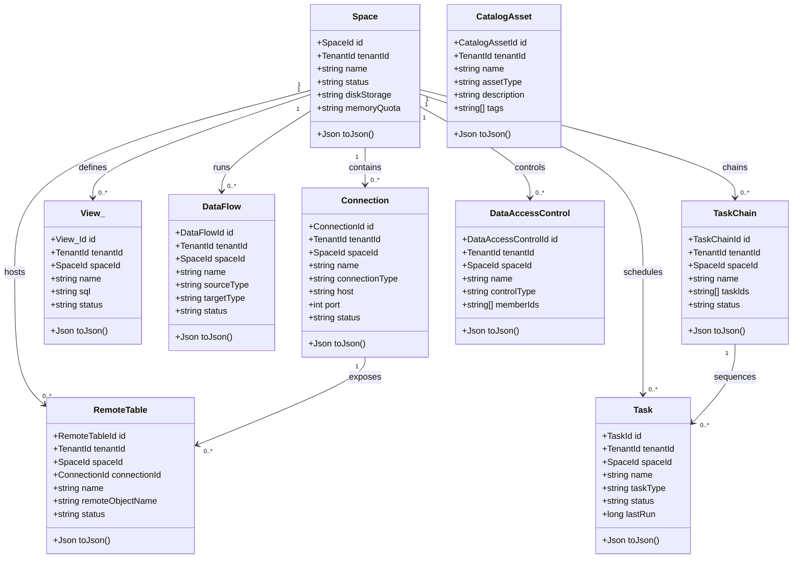
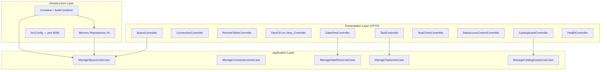
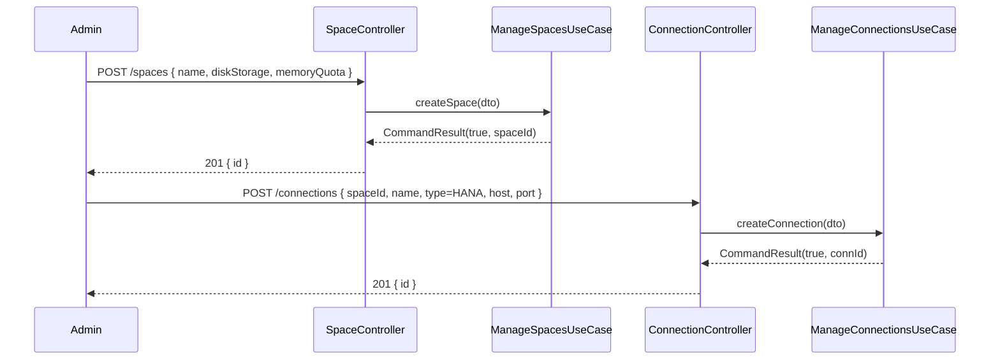

# UML — Datasphere Service

## Class Diagram — Domain Entities

```mermaid
classDiagram
    class Space {
        +SpaceId id
        +TenantId tenantId
        +string name
        +string status
        +string diskStorage
        +string memoryQuota
        +Json toJson()
    }
    class Connection {
        +ConnectionId id
        +TenantId tenantId
        +SpaceId spaceId
        +string name
        +string connectionType
        +string host
        +int port
        +string status
        +Json toJson()
    }
    class RemoteTable {
        +RemoteTableId id
        +TenantId tenantId
        +SpaceId spaceId
        +ConnectionId connectionId
        +string name
        +string remoteObjectName
        +string status
        +Json toJson()
    }
    class View_ {
        +View_Id id
        +TenantId tenantId
        +SpaceId spaceId
        +string name
        +string sql
        +string status
        +Json toJson()
    }
    class DataFlow {
        +DataFlowId id
        +TenantId tenantId
        +SpaceId spaceId
        +string name
        +string sourceType
        +string targetType
        +string status
        +Json toJson()
    }
    class Task {
        +TaskId id
        +TenantId tenantId
        +SpaceId spaceId
        +string name
        +string taskType
        +string status
        +long lastRun
        +Json toJson()
    }
    class TaskChain {
        +TaskChainId id
        +TenantId tenantId
        +SpaceId spaceId
        +string name
        +string[] taskIds
        +string status
        +Json toJson()
    }
    class DataAccessControl {
        +DataAccessControlId id
        +TenantId tenantId
        +SpaceId spaceId
        +string name
        +string controlType
        +string[] memberIds
        +Json toJson()
    }
    class CatalogAsset {
        +CatalogAssetId id
        +TenantId tenantId
        +string name
        +string assetType
        +string description
        +string[] tags
        +Json toJson()
    }

    Space "1" --> "0..*" Connection : contains
    Space "1" --> "0..*" RemoteTable : hosts
    Space "1" --> "0..*" View_ : defines
    Space "1" --> "0..*" DataFlow : runs
    Space "1" --> "0..*" Task : schedules
    Space "1" --> "0..*" TaskChain : chains
    Space "1" --> "0..*" DataAccessControl : controls
    Connection "1" --> "0..*" RemoteTable : exposes
    TaskChain "1" --> "0..*" Task : sequences
```

---

## Component Diagram

```mermaid
flowchart TB
    subgraph Presentation["Presentation Layer (HTTP)"]
        C1[SpaceController]
        C2[ConnectionController]
        C3[RemoteTableController]
        C4[ViewCtrl as View_Controller]
        C5[DataFlowController]
        C6[TaskController]
        C7[TaskChainController]
        C8[DataAccessControlController]
        C9[CatalogAssetController]
        HC[HealthController]
    end
    subgraph Application["Application Layer"]
        UC1[ManageSpacesUseCase]
        UC2[ManageConnectionsUseCase]
        UC3[ManageDataFlowsUseCase]
        UC4[ManageTasksUseCase]
        UC5[ManageCatalogAssetsUseCase]
    end
    subgraph Infrastructure["Infrastructure Layer"]
        MEM[Memory Repositories ×9]
        CFG[SrvConfig — port 8095]
        CTR[Container / buildContainer]
    end
    C1 --> UC1
    C5 --> UC3
    C6 --> UC4
    C9 --> UC5
    MEM --> UC1
    CTR --> UC1
    CTR --> MEM
```

---

## Sequence Diagram — Create Space and Add Connection

```mermaid
sequenceDiagram
    participant Admin
    participant SC as SpaceController
    participant SUC as ManageSpacesUseCase
    participant CC as ConnectionController
    participant CUC as ManageConnectionsUseCase

    Admin->>SC: POST /spaces { name, diskStorage, memoryQuota }
    SC->>SUC: createSpace(dto)
    SUC-->>SC: CommandResult(true, spaceId)
    SC-->>Admin: 201 { id }

    Admin->>CC: POST /connections { spaceId, name, type=HANA, host, port }
    CC->>CUC: createConnection(dto)
    CUC-->>CC: CommandResult(true, connId)
    CC-->>Admin: 201 { id }
```
