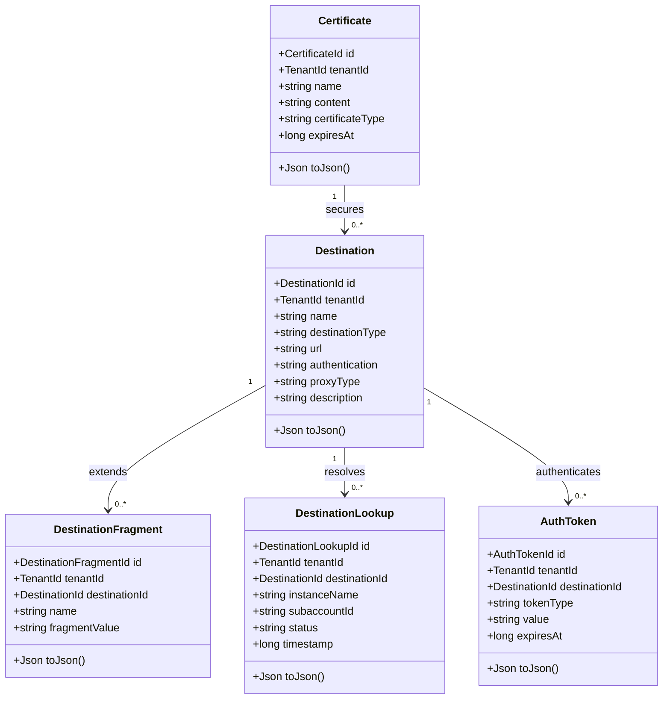
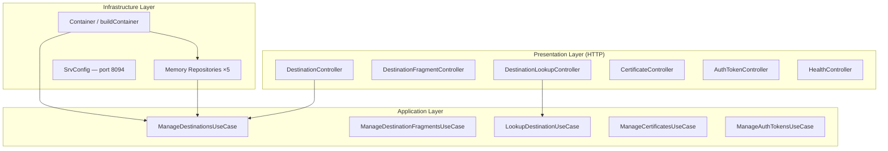
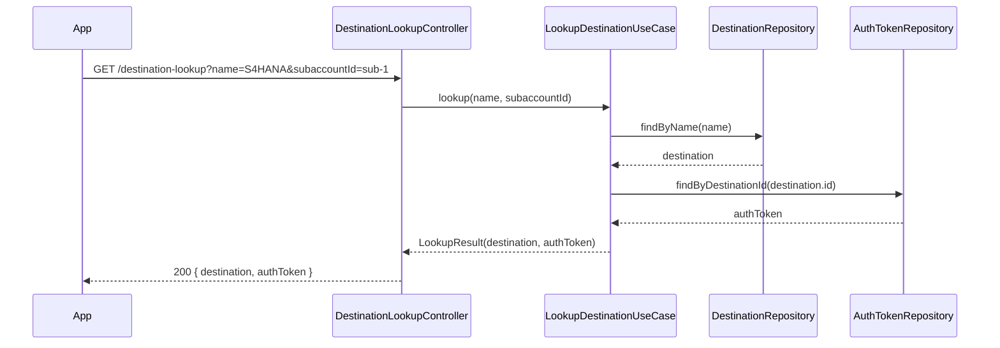

# UML — Destination Service

## Class Diagram — Domain Entities

```mermaid
classDiagram
    class Destination {
        +DestinationId id
        +TenantId tenantId
        +string name
        +string destinationType
        +string url
        +string authentication
        +string proxyType
        +string description
        +Json toJson()
    }
    class DestinationFragment {
        +DestinationFragmentId id
        +TenantId tenantId
        +DestinationId destinationId
        +string name
        +string fragmentValue
        +Json toJson()
    }
    class DestinationLookup {
        +DestinationLookupId id
        +TenantId tenantId
        +DestinationId destinationId
        +string instanceName
        +string subaccountId
        +string status
        +long timestamp
        +Json toJson()
    }
    class Certificate {
        +CertificateId id
        +TenantId tenantId
        +string name
        +string content
        +string certificateType
        +long expiresAt
        +Json toJson()
    }
    class AuthToken {
        +AuthTokenId id
        +TenantId tenantId
        +DestinationId destinationId
        +string tokenType
        +string value
        +long expiresAt
        +Json toJson()
    }

    Destination "1" --> "0..*" DestinationFragment : extends
    Destination "1" --> "0..*" DestinationLookup : resolves
    Destination "1" --> "0..*" AuthToken : authenticates
    Certificate "1" --> "0..*" Destination : secures
```

---

## Component Diagram

```mermaid
flowchart TB
    subgraph Presentation["Presentation Layer (HTTP)"]
        C1[DestinationController]
        C2[DestinationFragmentController]
        C3[DestinationLookupController]
        C4[CertificateController]
        C5[AuthTokenController]
        HC[HealthController]
    end
    subgraph Application["Application Layer"]
        UC1[ManageDestinationsUseCase]
        UC2[ManageDestinationFragmentsUseCase]
        UC3[LookupDestinationUseCase]
        UC4[ManageCertificatesUseCase]
        UC5[ManageAuthTokensUseCase]
    end
    subgraph Infrastructure["Infrastructure Layer"]
        MEM[Memory Repositories ×5]
        CFG[SrvConfig — port 8094]
        CTR[Container / buildContainer]
    end
    C1 --> UC1
    C3 --> UC3
    MEM --> UC1
    CTR --> UC1
    CTR --> MEM
```

---

## Sequence Diagram — Destination Lookup and Token Retrieval

```mermaid
sequenceDiagram
    participant App
    participant DLC as DestinationLookupController
    participant DLUC as LookupDestinationUseCase
    participant DR as DestinationRepository
    participant ATR as AuthTokenRepository

    App->>DLC: GET /destination-lookup?name=S4HANA&subaccountId=sub-1
    DLC->>DLUC: lookup(name, subaccountId)
    DLUC->>DR: findByName(name)
    DR-->>DLUC: destination
    DLUC->>ATR: findByDestinationId(destination.id)
    ATR-->>DLUC: authToken
    DLUC-->>DLC: LookupResult(destination, authToken)
    DLC-->>App: 200 { destination, authToken }
```
