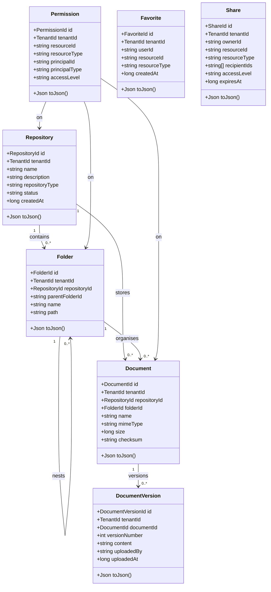
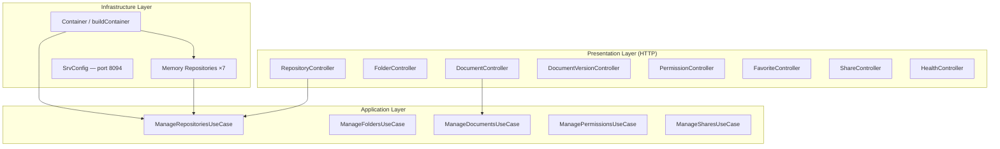
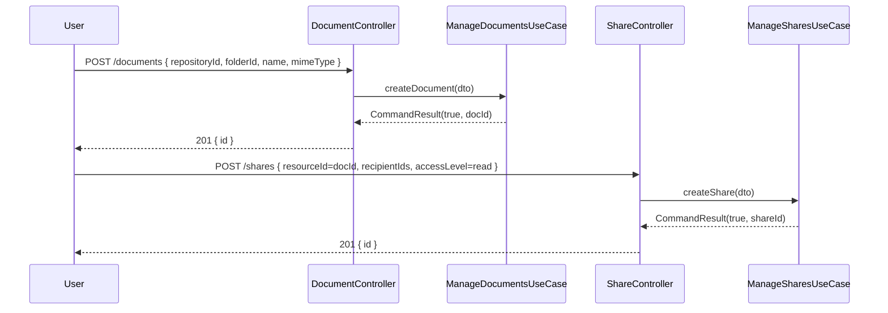

# UML — DMS Application Service

## Class Diagram — Domain Entities

```mermaid
classDiagram
    class Repository {
        +RepositoryId id
        +TenantId tenantId
        +string name
        +string description
        +string repositoryType
        +string status
        +long createdAt
        +Json toJson()
    }
    class Folder {
        +FolderId id
        +TenantId tenantId
        +RepositoryId repositoryId
        +string parentFolderId
        +string name
        +string path
        +Json toJson()
    }
    class Document {
        +DocumentId id
        +TenantId tenantId
        +RepositoryId repositoryId
        +FolderId folderId
        +string name
        +string mimeType
        +long size
        +string checksum
        +Json toJson()
    }
    class DocumentVersion {
        +DocumentVersionId id
        +TenantId tenantId
        +DocumentId documentId
        +int versionNumber
        +string content
        +string uploadedBy
        +long uploadedAt
        +Json toJson()
    }
    class Permission {
        +PermissionId id
        +TenantId tenantId
        +string resourceId
        +string resourceType
        +string principalId
        +string principalType
        +string accessLevel
        +Json toJson()
    }
    class Favorite {
        +FavoriteId id
        +TenantId tenantId
        +string userId
        +string resourceId
        +string resourceType
        +long createdAt
        +Json toJson()
    }
    class Share {
        +ShareId id
        +TenantId tenantId
        +string ownerId
        +string resourceId
        +string resourceType
        +string[] recipientIds
        +string accessLevel
        +long expiresAt
        +Json toJson()
    }

    Repository "1" --> "0..*" Folder : contains
    Repository "1" --> "0..*" Document : stores
    Folder "1" --> "0..*" Folder : nests
    Folder "1" --> "0..*" Document : organises
    Document "1" --> "0..*" DocumentVersion : versions
    Permission --> Repository : on
    Permission --> Folder : on
    Permission --> Document : on
```

---

## Component Diagram

```mermaid
flowchart TB
    subgraph Presentation["Presentation Layer (HTTP)"]
        C1[RepositoryController]
        C2[FolderController]
        C3[DocumentController]
        C4[DocumentVersionController]
        C5[PermissionController]
        C6[FavoriteController]
        C7[ShareController]
        HC[HealthController]
    end
    subgraph Application["Application Layer"]
        UC1[ManageRepositoriesUseCase]
        UC2[ManageFoldersUseCase]
        UC3[ManageDocumentsUseCase]
        UC4[ManagePermissionsUseCase]
        UC5[ManageSharesUseCase]
    end
    subgraph Infrastructure["Infrastructure Layer"]
        MEM[Memory Repositories ×7]
        CFG[SrvConfig — port 8094]
        CTR[Container / buildContainer]
    end
    C1 --> UC1
    C3 --> UC3
    MEM --> UC1
    CTR --> UC1
    CTR --> MEM
```

---

## Sequence Diagram — Upload Document and Share

```mermaid
sequenceDiagram
    participant User
    participant DC as DocumentController
    participant DUC as ManageDocumentsUseCase
    participant SC as ShareController
    participant SUC as ManageSharesUseCase

    User->>DC: POST /documents { repositoryId, folderId, name, mimeType }
    DC->>DUC: createDocument(dto)
    DUC-->>DC: CommandResult(true, docId)
    DC-->>User: 201 { id }

    User->>SC: POST /shares { resourceId=docId, recipientIds, accessLevel=read }
    SC->>SUC: createShare(dto)
    SUC-->>SC: CommandResult(true, shareId)
    SC-->>User: 201 { id }
```
