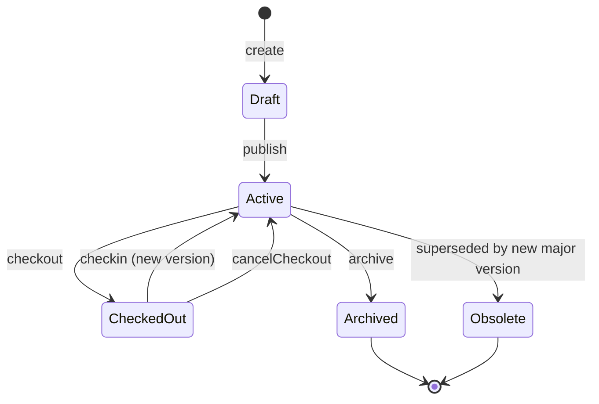
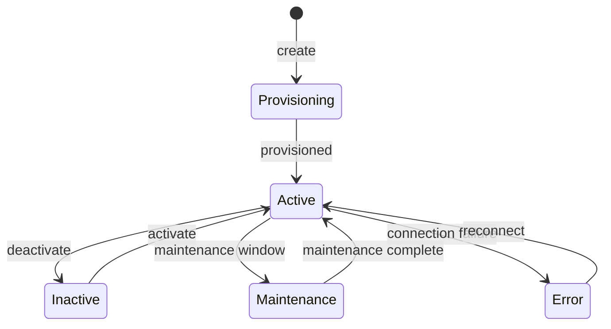
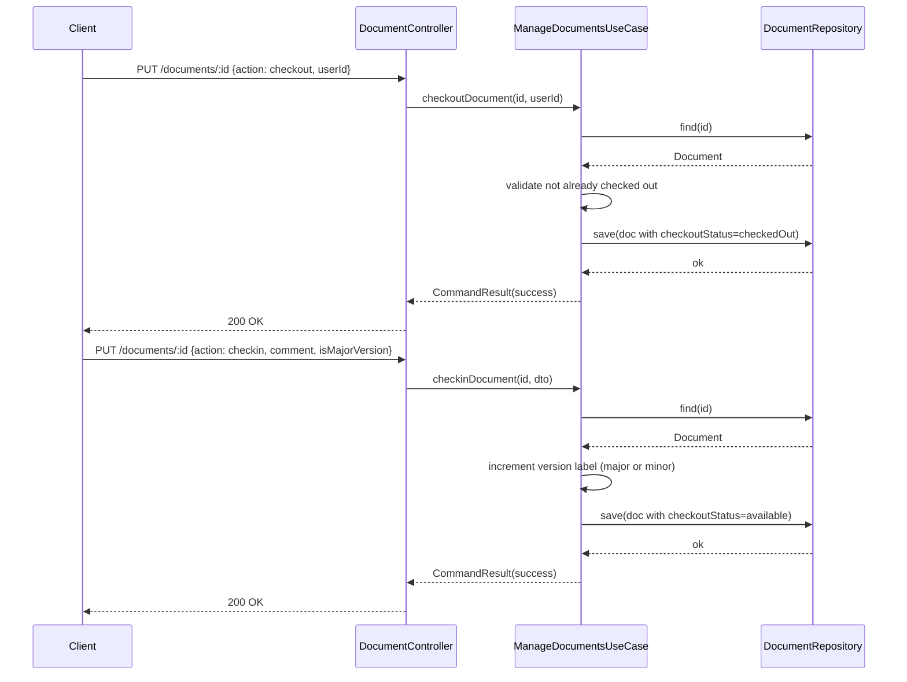

# UML — DMS Integration Platform Service

## Class Diagram

```mermaid
classDiagram
    direction TB

    %% Domain Value Objects / IDs
    class RepositoryId { +string value }
    class DocumentId { +string value }
    class FolderId { +string value }
    class DocumentVersionId { +string value }
    class PermissionId { +string value }

    %% Domain Entities
    class Repository_ {
        +RepositoryId id
        +string tenantId
        +string name
        +string description
        +RepositoryType repositoryType
        +RepositoryStatus status
        +bool isDefault
        +string externalUrl
        +string cmisVersion
        +bool encryptionEnabled
        +long capacityLimitBytes
        +long usedCapacityBytes
        +string connectionStatus
        +string repositoryKey
        +string region
        +bool isReadOnly
        +bool versioningEnabled
        +bool fullTextSearchEnabled
        +toJson() Json
    }

    class Document {
        +DocumentId id
        +string tenantId
        +RepositoryId repositoryId
        +FolderId folderId
        +string name
        +string mimeType
        +long fileSizeBytes
        +DocumentStatus documentStatus
        +LifecycleStatus lifecycleStatus
        +VersioningState versioningState
        +CheckoutStatus checkoutStatus
        +string versionLabel
        +bool isMajorVersion
        +bool isLatestVersion
        +string checkedOutBy
        +string checkedOutAt
        +string[] tags
        +toJson() Json
    }

    class Folder {
        +FolderId id
        +string tenantId
        +RepositoryId repositoryId
        +FolderId parentFolderId
        +string name
        +string path
        +int depth
        +FolderType folderType
        +bool isSystemFolder
        +int documentCount
        +int subFolderCount
        +toJson() Json
    }

    class DocumentVersion {
        +DocumentVersionId id
        +string tenantId
        +DocumentId documentId
        +RepositoryId repositoryId
        +string versionLabel
        +bool isMajorVersion
        +bool isLatestVersion
        +string comment
        +long fileSizeBytes
        +string mimeType
        +toJson() Json
    }

    class Permission {
        +PermissionId id
        +string tenantId
        +RepositoryId repositoryId
        +DocumentId documentId
        +FolderId folderId
        +string principalId
        +PrincipalType principalType
        +PermissionType permissionType
        +bool isInherited
        +bool isDirect
        +string grantedAt
        +string grantedBy
        +string expiresAt
        +toJson() Json
    }

    %% Repository Interfaces (Ports)
    class RepositoryRepository {
        <<interface>>
        +countByStatus(tenantId, status) size_t
        +findByStatus(tenantId, status) Repository_[]
        +countByType(tenantId, type) size_t
        +findByType(tenantId, type) Repository_[]
        +findDefault(tenantId) Repository_[]
    }

    class DocumentRepository {
        <<interface>>
        +findByRepository(tenantId, repositoryId) Document[]
        +findByFolder(tenantId, folderId) Document[]
        +findByStatus(tenantId, status) Document[]
        +findCheckedOut(tenantId) Document[]
        +findCheckedOutBy(tenantId, userId) Document[]
        +searchByName(tenantId, term) Document[]
    }

    class FolderRepository {
        <<interface>>
        +findByRepository(tenantId, repositoryId) Folder[]
        +findByParent(tenantId, parentId) Folder[]
        +findByPath(tenantId, repositoryId, path) Folder[]
        +findRootFolders(tenantId, repositoryId) Folder[]
    }

    class DocumentVersionRepository {
        <<interface>>
        +findByDocument(tenantId, documentId) DocumentVersion[]
        +findLatestVersions(tenantId, documentId) DocumentVersion[]
        +findMajorVersions(tenantId, documentId) DocumentVersion[]
    }

    class PermissionRepository {
        <<interface>>
        +findByDocument(tenantId, documentId) Permission[]
        +findByFolder(tenantId, folderId) Permission[]
        +findByPrincipal(tenantId, principalId) Permission[]
        +findByRepository(tenantId, repositoryId) Permission[]
    }

    %% Use Cases
    class ManageRepositoriesUseCase {
        -RepositoryRepository repo
        +get(id) Repository_
        +listRepositories(tenantId) Repository_[]
        +create(tenantId, dto) CommandResult
        +update(id, dto) CommandResult
        +activateRepository(id) CommandResult
        +deactivateRepository(id) CommandResult
        +delete(id) CommandResult
    }

    class ManageDocumentsUseCase {
        -DocumentRepository repo
        +get(id) Document
        +listByRepository(tenantId, repositoryId) Document[]
        +listByFolder(tenantId, folderId) Document[]
        +searchByName(tenantId, term) Document[]
        +create(tenantId, dto) CommandResult
        +checkoutDocument(id, userId) CommandResult
        +checkinDocument(id, dto) CommandResult
        +cancelCheckout(id) CommandResult
        +moveDocument(id, folderId) CommandResult
        +publishDocument(id) CommandResult
        +archiveDocument(id) CommandResult
        +delete(id) CommandResult
    }

    class ManageFoldersUseCase {
        -FolderRepository repo
        +get(id) Folder
        +listByRepository(tenantId, repositoryId) Folder[]
        +listSubFolders(tenantId, parentId) Folder[]
        +listRootFolders(tenantId, repositoryId) Folder[]
        +create(tenantId, dto) CommandResult
        +update(id, dto) CommandResult
        +moveFolder(id, parentId) CommandResult
        +deleteFolder(id) CommandResult
    }

    class ManageDocumentVersionsUseCase {
        -DocumentVersionRepository repo
        +get(id) DocumentVersion
        +listByDocument(tenantId, documentId) DocumentVersion[]
        +listMajorVersions(tenantId, documentId) DocumentVersion[]
        +listLatestVersions(tenantId, documentId) DocumentVersion[]
        +create(tenantId, dto) CommandResult
        +deleteDocumentVersion(id) CommandResult
    }

    class ManagePermissionsUseCase {
        -PermissionRepository repo
        +get(id) Permission
        +listByDocument(tenantId, documentId) Permission[]
        +listByFolder(tenantId, folderId) Permission[]
        +listByPrincipal(tenantId, principalId) Permission[]
        +grantPermission(tenantId, dto) CommandResult
        +revokePermission(id) CommandResult
        +deletePermission(id) CommandResult
    }

    %% HTTP Controllers
    class RepositoryController {
        -ManageRepositoriesUseCase useCase
        +registerRoutes(router)
        +list(req, res)
        +get(req, res)
        +create(req, res)
        +update(req, res)
        +delete_(req, res)
    }

    class DocumentController {
        -ManageDocumentsUseCase useCase
        +registerRoutes(router)
        +list(req, res)
        +get(req, res)
        +create(req, res)
        +update(req, res)
        +delete_(req, res)
    }

    class FolderController {
        -ManageFoldersUseCase useCase
        +registerRoutes(router)
        +list(req, res)
        +get(req, res)
        +create(req, res)
        +update(req, res)
        +delete_(req, res)
    }

    class DocumentVersionController {
        -ManageDocumentVersionsUseCase useCase
        +registerRoutes(router)
        +list(req, res)
        +get(req, res)
        +create(req, res)
        +delete_(req, res)
    }

    class PermissionController {
        -ManagePermissionsUseCase useCase
        +registerRoutes(router)
        +list(req, res)
        +get(req, res)
        +grant(req, res)
        +revoke(req, res)
    }

    %% In-Memory Adapters
    class MemoryRepositoryRepository { +TenantRepository~Repository_~ }
    class MemoryDocumentRepository { +TenantRepository~Document~ }
    class MemoryFolderRepository { +TenantRepository~Folder~ }
    class MemoryDocumentVersionRepository { +TenantRepository~DocumentVersion~ }
    class MemoryPermissionRepository { +TenantRepository~Permission~ }

    %% Relationships
    RepositoryRepository <|.. MemoryRepositoryRepository
    DocumentRepository <|.. MemoryDocumentRepository
    FolderRepository <|.. MemoryFolderRepository
    DocumentVersionRepository <|.. MemoryDocumentVersionRepository
    PermissionRepository <|.. MemoryPermissionRepository

    ManageRepositoriesUseCase --> RepositoryRepository
    ManageDocumentsUseCase --> DocumentRepository
    ManageFoldersUseCase --> FolderRepository
    ManageDocumentVersionsUseCase --> DocumentVersionRepository
    ManagePermissionsUseCase --> PermissionRepository

    RepositoryController --> ManageRepositoriesUseCase
    DocumentController --> ManageDocumentsUseCase
    FolderController --> ManageFoldersUseCase
    DocumentVersionController --> ManageDocumentVersionsUseCase
    PermissionController --> ManagePermissionsUseCase
```

## Document Lifecycle State Machine

```mermaid
stateDiagram-v2
    [*] --> Draft : create
    Draft --> Active : publish
    Active --> CheckedOut : checkout
    CheckedOut --> Active : checkin (new version)
    CheckedOut --> Active : cancelCheckout
    Active --> Archived : archive
    Active --> Obsolete : superseded by new major version
    Archived --> [*]
    Obsolete --> [*]
```

## Repository Status State Machine

```mermaid
stateDiagram-v2
    [*] --> Provisioning : create
    Provisioning --> Active : provisioned
    Active --> Inactive : deactivate
    Inactive --> Active : activate
    Active --> Maintenance : maintenance window
    Maintenance --> Active : maintenance complete
    Active --> Error : connection failure
    Error --> Active : reconnect
```

## Sequence Diagram — Document Checkout/Checkin

```mermaid
sequenceDiagram
    participant Client
    participant DocumentController
    participant ManageDocumentsUseCase
    participant DocumentRepository

    Client->>DocumentController: PUT /documents/:id  {action: checkout, userId}
    DocumentController->>ManageDocumentsUseCase: checkoutDocument(id, userId)
    ManageDocumentsUseCase->>DocumentRepository: find(id)
    DocumentRepository-->>ManageDocumentsUseCase: Document
    ManageDocumentsUseCase->>ManageDocumentsUseCase: validate not already checked out
    ManageDocumentsUseCase->>DocumentRepository: save(doc with checkoutStatus=checkedOut)
    DocumentRepository-->>ManageDocumentsUseCase: ok
    ManageDocumentsUseCase-->>DocumentController: CommandResult(success)
    DocumentController-->>Client: 200 OK

    Client->>DocumentController: PUT /documents/:id  {action: checkin, comment, isMajorVersion}
    DocumentController->>ManageDocumentsUseCase: checkinDocument(id, dto)
    ManageDocumentsUseCase->>DocumentRepository: find(id)
    DocumentRepository-->>ManageDocumentsUseCase: Document
    ManageDocumentsUseCase->>ManageDocumentsUseCase: increment version label (major or minor)
    ManageDocumentsUseCase->>DocumentRepository: save(doc with checkoutStatus=available)
    DocumentRepository-->>ManageDocumentsUseCase: ok
    ManageDocumentsUseCase-->>DocumentController: CommandResult(success)
    DocumentController-->>Client: 200 OK
```
